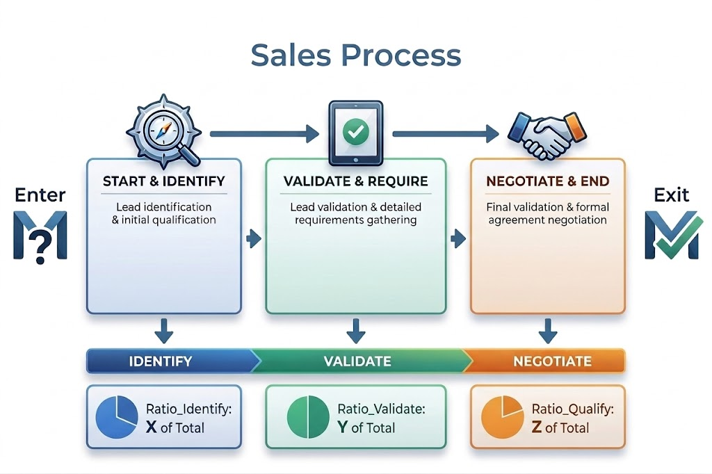

# MIB Cars Analysis

The goal of the sales process is to identify and communicate with potential leads, and explore opportunities to convert them into customers. For this project, the database contains records of every sales opportunity with information about the client, product.

## How to start
1. Clone the repository and set up your Python environment.
2. Install the required libraries using `pip install -e .` or more easily with uv: `uv sync`
3. Run notebooks using VS Code or Jupyter Lab. Start with notebooks in order.

## Dataset description

This dataset consists of 78,025 rows and 19 columns (9 numerical, 10 categorical). The columns include the following:

- Amount - Estimated total revenue of opportunities in USD. (Goal 1)
- Result - Outcome of opportunity. (Goal 2)
- Id - A uniquely generated number assigned to the opportunity.
- Supplies - Category for each supplies group.
- Supplies_Sub - Sub group of each supplies group.
- Region - Name of the region.
- Market - The opportunities' route to market.
- Client_Revenue - Client size based on annual revenue.
- Client_Employee - Client size by number of employees.
- Client_Past - Revenue identified from this client in the past two years.
- Competitor - An indicator if a competitor has been identified.
- Size - Categorical grouping of the opportunity amount.
- Elapsed_Days - The number of days between the change in sales stages. Each change resets the counter.
- Stage_Change - The number of times an opportunity changes sales stage. Includes backward and forward changes.
- Total_Days - Total days spent in Sales Stages from Identified/Validating to Gained Agreement/Closing.
- Total_Siebel - Total days spent in Siebel Stages from Identified/Validating to Qualified/Gaining Agreement.
- Ratio_Identify - Ratio of total days spent in the Identified/Validating stage over total days in sales process.
- Ratio_Validate - Ratio of total days spent in the Validated/Qualifying stage over total days in sales process.
- Ratio_Qualify - Ratio of total days spent in Qualified/Gaining Agreement stage over total days in sales process.

# Process

The process status focuses on 3 key stages:

- Start State (no duration): Unnamed
- Identified/Qualifying
- Qualified/Validating
- Validated/Gaining Agreement
- End State (no duration): Gained Agreement/Closing

From this it can be observed that the sales process is not linear, and there are many opportunities that go back and forth between stages. This is a key aspect to consider when analyzing the data and building predictive models.

> NOTE: From the 01_basic_validation.ipynb notebook, it seems that the dataset is mostly a snapshot of the most updated record per opportunity, with some duplicates. This means that we cannot leverage temporal dynamics in the sales process, and we need to be careful with potential data leakage when building models.

## A priori business opportunities

Right now we have identified the following opportunities for applying predictive models to drive business value:

1. **Process prioritization:** Straight focus on high propensity and/or what-ifs about changing priorities (days to closing) with certain customers.  
2. **Forecasting:** Predict expected total sales  
3. **Channel optimization:** Simulate what-if scenarios for changing channel approaches / routing on specific customers  
4. **Secondary market segmentations** over predicted insights  
5. **Others:** Early warning systems, budget allocation (over sales processes or product category/lines).  

## Modelling approaches and concerns

We see two ways to make models based on the dataset, with different use cases and limitations:

1) Predicting from initial data (static, enter-stage)
A traditional approach that uses only early-stage information to predict final outcomes (e.g., win/loss, deal size). Useful for opportunity sizing, forecasting, prioritization (focus on high-propensity deals).
   - Limitations: Data only captures aggregated stage durations (one record per opportunity), introducing bias and missing process dynamics. Possibly fixed focusing on Identified/Qualifying stage only, which may not capture all relevant early signals.
   - Data to be used: Client size variables, market, region, competitor info, supplies category.

2) Predicting dynamically at each stage (dynamic, stage-aware)
A stage-aware approach that updates predictions using information available as the opportunity progresses. Useful for process optimization, forecasting, channel strategy, and what-if simulations (e.g., reducing time-to-close, rerouting leads).
   - Limitations: Same data constraint, lack of full stage transition history leads to biased estimates.
   - Data to be used: Same as above, plus all process related information.

# Current slides proposal

1. **Intro & assumptions**  
2. **Business framing:** Define a business framework over the dataset  
   1. Business process description  
   2. Strategic client segmentation (based on client size variables)  
   3. Two-phase funnel split  
      1. (Re)acquisition: clients with **no revenue in last 2 years**  
      2. Engagement / upselling: clients with **revenue in last 2 years**  
   4. Detected opportunities for making the process better  
      1. **Process prioritization:** Straight focus on high propensity and/or what-ifs about changing priorities (days to closing) with certain customers.  
      2. **Forecasting:** Predict expected total sales  
      3. **Channel optimization:** Simulate what-if scenarios for changing channel approaches / routing on specific customers  
      4. **Secondary market segmentations** over predicted insights  
      5. **Others:** Early warning systems, budget allocation (over sales processes or product category/lines).  
3. **Exploratory Data Analysis:**   
   1. Insights about leads by funnel phases × client segments  
   2. Target analysis  
      1. **Supervised analysis:** Covariate relationships vs targets using Weight of Evidence or similar  
   3. Other variables distribution analysis  
4. **Modelling**  
   1. **Model estimation:** Details about the Actual predictive modelling  
   2. **Model results:** Metrics + feature importance  
5. **Application simulation:** Show one or two examples of the detected opportunities being applied for decisions (i.e. a simulation of the application.)
   1. **Process prioritization**  
   2. **Channel optimization**  
6. **Conclusions**

# Annex - Map between business opportunities and modelling approaches

### 1. Process Improvement Detection
- **Static (early-stage):**  
  Identifies structural inefficiencies across segments (e.g., regions, client sizes, product categories), but cannot localize where in the process issues occur.

- **Dynamic (stage-aware):**  
  Pinpoints bottlenecks at specific stages (e.g., delays, drop-offs), enabling targeted process fixes within the funnel.

---

### 2. Process Prioritization
- **Static (early-stage):**  
  Front-loaded prioritization using early signals (lead scoring), focusing resources on high-propensity opportunities from the start.

- **Dynamic (stage-aware):**  
  Adaptive prioritization that evolves with the deal, reallocating effort based on updated probabilities and time-to-close.

---

### 3. Forecasting (Revenue, Win Rates)
- **Static (early-stage):**  
  Baseline forecasts early in the pipeline, useful for planning but sensitive to noise and missing process evolution.

- **Dynamic (stage-aware):**  
  Continuously updated forecasts using real-time process data, improving short-term accuracy and reducing forecast error.

---

### 4. Channel Optimization
- **Static (early-stage):**  
  Evaluates which acquisition channels generate higher-quality opportunities at entry.

- **Dynamic (stage-aware):**  
  Simulates mid-process routing decisions (e.g., rep assignment, engagement model changes) and their impact on conversion and cycle time.

---

### 5. Secondary Segmentation (Post-hoc Insights)
- **Static (early-stage):**  
  Segments customers based on predicted potential (e.g., high vs low value leads) for targeting and marketing.

- **Dynamic (stage-aware):**  
  Segments based on behavioral trajectories (e.g., fast vs stalled deals), enabling process-specific playbooks.

---

### 6. Early Warning Systems
- **Static (early-stage):**  
  Flags inherently risky opportunities at creation, but cannot detect evolving risks.

- **Dynamic (stage-aware):**  
  Detects real-time deterioration signals (e.g., inactivity, delays), enabling proactive intervention.

---

### 7. Budget Allocation (Sales Effort, Product Focus)
- **Static (early-stage):**  
  Guides strategic allocation across segments, regions, or product lines based on expected value.

- **Dynamic (stage-aware):**  
  Enables tactical reallocation within the pipeline, shifting effort toward improving deals and away from stagnating ones.

---

### 8. What-if Simulation & Scenario Planning
- **Static (early-stage):**  
  Supports ex-ante scenarios (e.g., targeting different segments), without modeling process evolution.

- **Dynamic (stage-aware):**  
  Enables process-level simulations (e.g., reducing stage duration, changing sequencing), linking operational changes to outcomes.