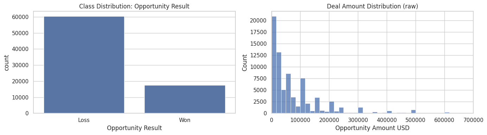
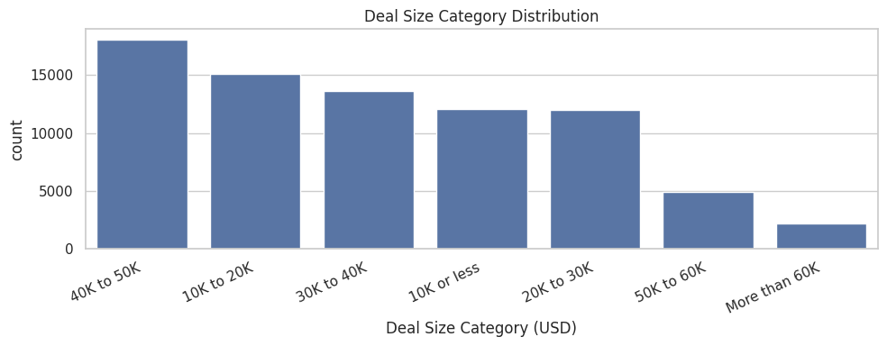
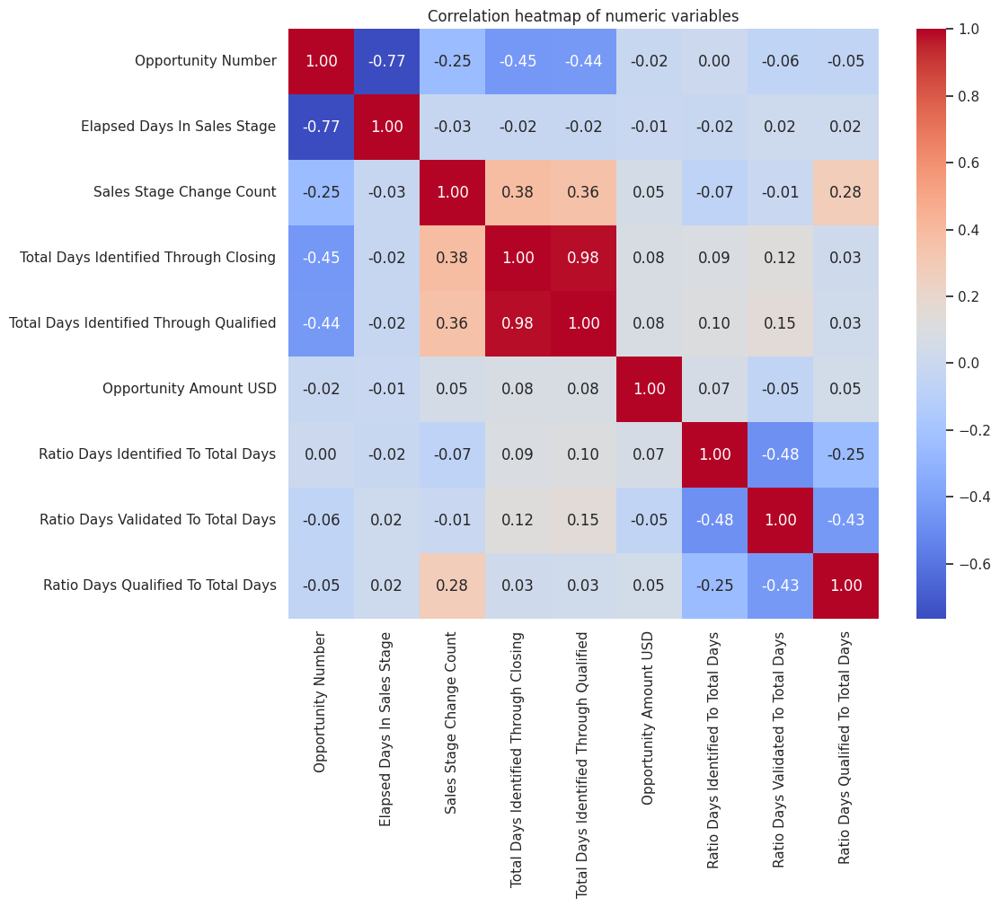
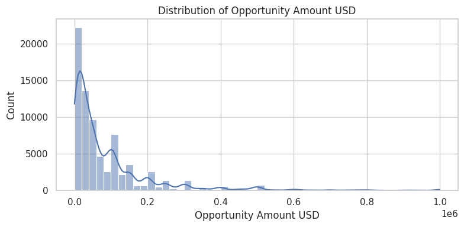
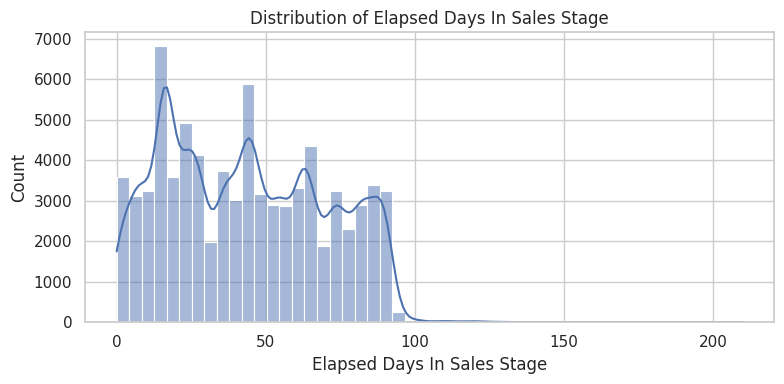
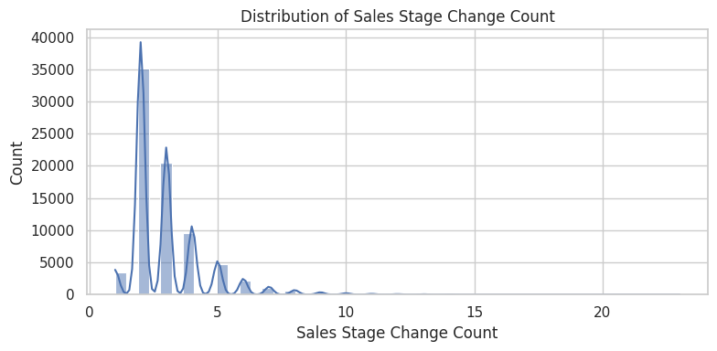
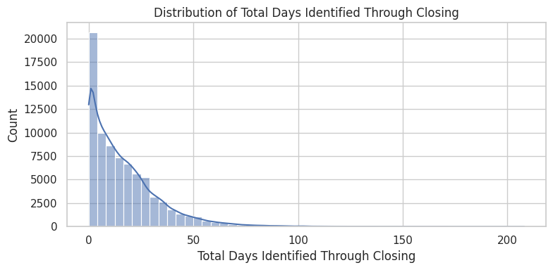
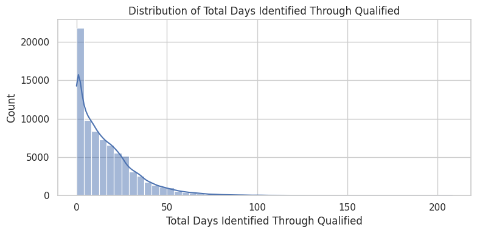
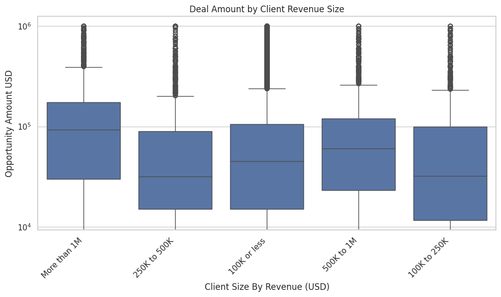

# 01 - EDA and Data Cleansing

This notebook starts the project with:
- Exploratory Data Analysis (EDA)
- Common-sense data cleansing
- Outlier review and practical treatment
- Initial modeling-ready export


```python
import pandas as pd
import numpy as np
import seaborn as sns
import matplotlib.pyplot as plt

pd.set_option('display.max_columns', 100)
sns.set_theme(style='whitegrid')
```


```python
DATA_PATH = '../cars.xlsx'
df = pd.read_excel(DATA_PATH)
print('shape:', df.shape)
df.head(3)
```

    shape: (78025, 19)


<div>
<style scoped>
    .dataframe tbody tr th:only-of-type {
        vertical-align: middle;
    }

    .dataframe tbody tr th {
        vertical-align: top;
    }

    .dataframe thead th {
        text-align: right;
    }
</style>
<table border="1" class="dataframe">
  <thead>
    <tr style="text-align: right;">
      <th></th>
      <th>Opportunity Number</th>
      <th>Supplies Group</th>
      <th>Supplies Subgroup</th>
      <th>Region</th>
      <th>Route To Market</th>
      <th>Elapsed Days In Sales Stage</th>
      <th>Opportunity Result</th>
      <th>Sales Stage Change Count</th>
      <th>Total Days Identified Through Closing</th>
      <th>Total Days Identified Through Qualified</th>
      <th>Opportunity Amount USD</th>
      <th>Client Size By Revenue (USD)</th>
      <th>Client Size By Employee Count</th>
      <th>Revenue From Client Past Two Years (USD)</th>
      <th>Competitor Type</th>
      <th>Ratio Days Identified To Total Days</th>
      <th>Ratio Days Validated To Total Days</th>
      <th>Ratio Days Qualified To Total Days</th>
      <th>Deal Size Category (USD)</th>
    </tr>
  </thead>
  <tbody>
    <tr>
      <th>0</th>
      <td>1641984</td>
      <td>Car Accessories</td>
      <td>Exterior Accessories</td>
      <td>Northwest</td>
      <td>Fields Sales</td>
      <td>76</td>
      <td>Won</td>
      <td>13</td>
      <td>104</td>
      <td>101</td>
      <td>0</td>
      <td>More than 1M</td>
      <td>More than 25K</td>
      <td>0 (No business)</td>
      <td>Unknown</td>
      <td>0.69636</td>
      <td>0.113985</td>
      <td>0.154215</td>
      <td>10K or less</td>
    </tr>
    <tr>
      <th>1</th>
      <td>1658010</td>
      <td>Car Accessories</td>
      <td>Exterior Accessories</td>
      <td>Pacific</td>
      <td>Reseller</td>
      <td>63</td>
      <td>Loss</td>
      <td>2</td>
      <td>163</td>
      <td>163</td>
      <td>0</td>
      <td>250K to 500K</td>
      <td>More than 25K</td>
      <td>0 (No business)</td>
      <td>Unknown</td>
      <td>0.00000</td>
      <td>1.000000</td>
      <td>0.000000</td>
      <td>10K or less</td>
    </tr>
    <tr>
      <th>2</th>
      <td>1674737</td>
      <td>Performance &amp; Non-auto</td>
      <td>Motorcycle Parts</td>
      <td>Pacific</td>
      <td>Reseller</td>
      <td>24</td>
      <td>Won</td>
      <td>7</td>
      <td>82</td>
      <td>82</td>
      <td>7750</td>
      <td>100K or less</td>
      <td>1K or less</td>
      <td>0 (No business)</td>
      <td>Unknown</td>
      <td>1.00000</td>
      <td>0.000000</td>
      <td>0.000000</td>
      <td>10K or less</td>
    </tr>
  </tbody>
</table>
</div>


## 1) Dataset structure and missingness


```python
dtypes = df.dtypes.rename('dtype').to_frame()
missing = df.isna().sum().rename('missing_count').to_frame()
missing['missing_pct'] = (missing['missing_count'] / len(df) * 100).round(2)
profile = dtypes.join(missing).sort_values(['missing_pct', 'missing_count'], ascending=False)
profile
```


<div>
<style scoped>
    .dataframe tbody tr th:only-of-type {
        vertical-align: middle;
    }

    .dataframe tbody tr th {
        vertical-align: top;
    }

    .dataframe thead th {
        text-align: right;
    }
</style>
<table border="1" class="dataframe">
  <thead>
    <tr style="text-align: right;">
      <th></th>
      <th>dtype</th>
      <th>missing_count</th>
      <th>missing_pct</th>
    </tr>
  </thead>
  <tbody>
    <tr>
      <th>Competitor Type</th>
      <td>str</td>
      <td>9257</td>
      <td>11.86</td>
    </tr>
    <tr>
      <th>Opportunity Number</th>
      <td>int64</td>
      <td>0</td>
      <td>0.00</td>
    </tr>
    <tr>
      <th>Supplies Group</th>
      <td>str</td>
      <td>0</td>
      <td>0.00</td>
    </tr>
    <tr>
      <th>Supplies Subgroup</th>
      <td>str</td>
      <td>0</td>
      <td>0.00</td>
    </tr>
    <tr>
      <th>Region</th>
      <td>str</td>
      <td>0</td>
      <td>0.00</td>
    </tr>
    <tr>
      <th>Route To Market</th>
      <td>str</td>
      <td>0</td>
      <td>0.00</td>
    </tr>
    <tr>
      <th>Elapsed Days In Sales Stage</th>
      <td>int64</td>
      <td>0</td>
      <td>0.00</td>
    </tr>
    <tr>
      <th>Opportunity Result</th>
      <td>str</td>
      <td>0</td>
      <td>0.00</td>
    </tr>
    <tr>
      <th>Sales Stage Change Count</th>
      <td>int64</td>
      <td>0</td>
      <td>0.00</td>
    </tr>
    <tr>
      <th>Total Days Identified Through Closing</th>
      <td>int64</td>
      <td>0</td>
      <td>0.00</td>
    </tr>
    <tr>
      <th>Total Days Identified Through Qualified</th>
      <td>int64</td>
      <td>0</td>
      <td>0.00</td>
    </tr>
    <tr>
      <th>Opportunity Amount USD</th>
      <td>int64</td>
      <td>0</td>
      <td>0.00</td>
    </tr>
    <tr>
      <th>Client Size By Revenue (USD)</th>
      <td>str</td>
      <td>0</td>
      <td>0.00</td>
    </tr>
    <tr>
      <th>Client Size By Employee Count</th>
      <td>str</td>
      <td>0</td>
      <td>0.00</td>
    </tr>
    <tr>
      <th>Revenue From Client Past Two Years (USD)</th>
      <td>str</td>
      <td>0</td>
      <td>0.00</td>
    </tr>
    <tr>
      <th>Ratio Days Identified To Total Days</th>
      <td>float64</td>
      <td>0</td>
      <td>0.00</td>
    </tr>
    <tr>
      <th>Ratio Days Validated To Total Days</th>
      <td>float64</td>
      <td>0</td>
      <td>0.00</td>
    </tr>
    <tr>
      <th>Ratio Days Qualified To Total Days</th>
      <td>float64</td>
      <td>0</td>
      <td>0.00</td>
    </tr>
    <tr>
      <th>Deal Size Category (USD)</th>
      <td>str</td>
      <td>0</td>
      <td>0.00</td>
    </tr>
  </tbody>
</table>
</div>


## 2) Target analysis (classification + amount)


```python
target_dist = (df['Opportunity Result']
               .value_counts(normalize=True)
               .mul(100)
               .round(2)
               .rename('pct'))
print('Opportunity Result distribution (%):')
print(target_dist)

amount_summary = df['Opportunity Amount USD'].describe(percentiles=[0.01,0.05,0.5,0.95,0.99])
print('\nOpportunity Amount USD summary:')
print(amount_summary)
```

    Opportunity Result distribution (%):
    Opportunity Result
    Loss    77.41
    Won     22.59
    Name: pct, dtype: float64
    
    Opportunity Amount USD summary:
    count      78025.000000
    mean       91637.260750
    std       133161.029156
    min            0.000000
    1%             0.000000
    5%          1192.800000
    50%        49000.000000
    95%       350000.000000
    99%       700000.000000
    max      1000000.000000
    Name: Opportunity Amount USD, dtype: float64


```python
fig, axes = plt.subplots(1, 2, figsize=(14, 4))

sns.countplot(data=df, x='Opportunity Result', order=df['Opportunity Result'].value_counts().index, ax=axes[0])
axes[0].set_title('Class Distribution: Opportunity Result')

sns.histplot(df['Opportunity Amount USD'], bins=60, kde=False, ax=axes[1])
axes[1].set_title('Deal Amount Distribution (raw)')
axes[1].set_xlim(0, df['Opportunity Amount USD'].quantile(0.99))
plt.tight_layout()
```


    

    


### Deal size category as additional target

To cover the second task from a categorical perspective, we also profile `Deal Size Category (USD)` as a target-like variable (classification framing).


```python
deal_size_dist = (df['Deal Size Category (USD)']
    .value_counts(dropna=False)
    .rename('count')
    .to_frame())
deal_size_dist['pct'] = (deal_size_dist['count'] / len(df) * 100).round(2)
print('Deal Size Category (USD) distribution:')
display(deal_size_dist)

print('\nDeal Size Category x Opportunity Result:')
deal_size_vs_result = pd.crosstab(
    df['Deal Size Category (USD)'],
    df['Opportunity Result'],
    normalize='index'
).round(4)
display(deal_size_vs_result)
```

    Deal Size Category (USD) distribution:


<div>
<style scoped>
    .dataframe tbody tr th:only-of-type {
        vertical-align: middle;
    }

    .dataframe tbody tr th {
        vertical-align: top;
    }

    .dataframe thead th {
        text-align: right;
    }
</style>
<table border="1" class="dataframe">
  <thead>
    <tr style="text-align: right;">
      <th></th>
      <th>count</th>
      <th>pct</th>
    </tr>
    <tr>
      <th>Deal Size Category (USD)</th>
      <th></th>
      <th></th>
    </tr>
  </thead>
  <tbody>
    <tr>
      <th>40K to 50K</th>
      <td>18074</td>
      <td>23.16</td>
    </tr>
    <tr>
      <th>10K to 20K</th>
      <td>15123</td>
      <td>19.38</td>
    </tr>
    <tr>
      <th>30K to 40K</th>
      <td>13628</td>
      <td>17.47</td>
    </tr>
    <tr>
      <th>10K or less</th>
      <td>12095</td>
      <td>15.50</td>
    </tr>
    <tr>
      <th>20K to 30K</th>
      <td>11968</td>
      <td>15.34</td>
    </tr>
    <tr>
      <th>50K to 60K</th>
      <td>4934</td>
      <td>6.32</td>
    </tr>
    <tr>
      <th>More than 60K</th>
      <td>2203</td>
      <td>2.82</td>
    </tr>
  </tbody>
</table>
</div>


    
    Deal Size Category x Opportunity Result:


<div>
<style scoped>
    .dataframe tbody tr th:only-of-type {
        vertical-align: middle;
    }

    .dataframe tbody tr th {
        vertical-align: top;
    }

    .dataframe thead th {
        text-align: right;
    }
</style>
<table border="1" class="dataframe">
  <thead>
    <tr style="text-align: right;">
      <th>Opportunity Result</th>
      <th>Loss</th>
      <th>Won</th>
    </tr>
    <tr>
      <th>Deal Size Category (USD)</th>
      <th></th>
      <th></th>
    </tr>
  </thead>
  <tbody>
    <tr>
      <th>10K or less</th>
      <td>0.6006</td>
      <td>0.3994</td>
    </tr>
    <tr>
      <th>10K to 20K</th>
      <td>0.7326</td>
      <td>0.2674</td>
    </tr>
    <tr>
      <th>20K to 30K</th>
      <td>0.7533</td>
      <td>0.2467</td>
    </tr>
    <tr>
      <th>30K to 40K</th>
      <td>0.8264</td>
      <td>0.1736</td>
    </tr>
    <tr>
      <th>40K to 50K</th>
      <td>0.8827</td>
      <td>0.1173</td>
    </tr>
    <tr>
      <th>50K to 60K</th>
      <td>0.8273</td>
      <td>0.1727</td>
    </tr>
    <tr>
      <th>More than 60K</th>
      <td>0.7903</td>
      <td>0.2097</td>
    </tr>
  </tbody>
</table>
</div>


```python
plt.figure(figsize=(10, 4))
order = df['Deal Size Category (USD)'].value_counts().index
sns.countplot(data=df, x='Deal Size Category (USD)', order=order)
plt.xticks(rotation=25, ha='right')
plt.title('Deal Size Category Distribution')
plt.tight_layout()
```


    

    


## 3) Funnel x segment insights


```python
segment_win = (df.groupby(['Revenue From Client Past Two Years (USD)', 'Opportunity Result'])['Opportunity Number']
                 .count()
                 .unstack(fill_value=0))
segment_win['win_rate'] = (segment_win.get('Won', 0) / segment_win.sum(axis=1)).round(4)
segment_win.sort_values('win_rate', ascending=False)
```


<div>
<style scoped>
    .dataframe tbody tr th:only-of-type {
        vertical-align: middle;
    }

    .dataframe tbody tr th {
        vertical-align: top;
    }

    .dataframe thead th {
        text-align: right;
    }
</style>
<table border="1" class="dataframe">
  <thead>
    <tr style="text-align: right;">
      <th>Opportunity Result</th>
      <th>Loss</th>
      <th>Won</th>
      <th>win_rate</th>
    </tr>
    <tr>
      <th>Revenue From Client Past Two Years (USD)</th>
      <th></th>
      <th></th>
      <th></th>
    </tr>
  </thead>
  <tbody>
    <tr>
      <th>0 - 25,000</th>
      <td>310</td>
      <td>1472</td>
      <td>0.8260</td>
    </tr>
    <tr>
      <th>25,000 - 50,000</th>
      <td>548</td>
      <td>1535</td>
      <td>0.7369</td>
    </tr>
    <tr>
      <th>50,000 - 100,000</th>
      <td>801</td>
      <td>1291</td>
      <td>0.6171</td>
    </tr>
    <tr>
      <th>More than 100,000</th>
      <td>1520</td>
      <td>1340</td>
      <td>0.4685</td>
    </tr>
    <tr>
      <th>0 (No business)</th>
      <td>57219</td>
      <td>11989</td>
      <td>0.1732</td>
    </tr>
  </tbody>
</table>
</div>


```python
funnel_by_client = (df.groupby(['Client Size By Revenue (USD)', 'Opportunity Result'])['Elapsed Days In Sales Stage']
                    .median()
                    .unstack())
funnel_by_client
```


<div>
<style scoped>
    .dataframe tbody tr th:only-of-type {
        vertical-align: middle;
    }

    .dataframe tbody tr th {
        vertical-align: top;
    }

    .dataframe thead th {
        text-align: right;
    }
</style>
<table border="1" class="dataframe">
  <thead>
    <tr style="text-align: right;">
      <th>Opportunity Result</th>
      <th>Loss</th>
      <th>Won</th>
    </tr>
    <tr>
      <th>Client Size By Revenue (USD)</th>
      <th></th>
      <th></th>
    </tr>
  </thead>
  <tbody>
    <tr>
      <th>100K or less</th>
      <td>34.0</td>
      <td>35.0</td>
    </tr>
    <tr>
      <th>100K to 250K</th>
      <td>66.0</td>
      <td>62.0</td>
    </tr>
    <tr>
      <th>250K to 500K</th>
      <td>65.0</td>
      <td>64.0</td>
    </tr>
    <tr>
      <th>500K to 1M</th>
      <td>66.0</td>
      <td>66.0</td>
    </tr>
    <tr>
      <th>More than 1M</th>
      <td>67.0</td>
      <td>65.0</td>
    </tr>
  </tbody>
</table>
</div>


## 4) Common-sense cleansing decisions


```python
clean = df.copy()

# Normalize text columns
obj_cols = clean.select_dtypes(include='object').columns
for c in obj_cols:
    clean[c] = clean[c].astype(str).str.strip()

# Restore true NaNs that became strings and handle missing competitor type
clean.replace({'nan': np.nan}, inplace=True)
clean['Competitor Type'] = clean['Competitor Type'].fillna('Unknown')

# Add strategic two-phase segment
clean['funnel_segment_2y'] = np.where(
    clean['Revenue From Client Past Two Years (USD)'].eq('0 (No business)'),
    'Reacquisition',
    'Engagement/Upselling'
)

# Binary target for classification
clean['target_win'] = clean['Opportunity Result'].map({'Won': 1, 'Loss': 0})

# Ensure no invalid win labels
invalid_labels = clean['target_win'].isna().sum()
print('invalid target labels:', invalid_labels)

clean.head(2)
```

    invalid target labels: 0


    /tmp/ipykernel_2595642/159904022.py:4: Pandas4Warning: For backward compatibility, 'str' dtypes are included by select_dtypes when 'object' dtype is specified. This behavior is deprecated and will be removed in a future version. Explicitly pass 'str' to `include` to select them, or to `exclude` to remove them and silence this warning.
    See https://pandas.pydata.org/docs/user_guide/migration-3-strings.html#string-migration-select-dtypes for details on how to write code that works with pandas 2 and 3.
      obj_cols = clean.select_dtypes(include='object').columns


<div>
<style scoped>
    .dataframe tbody tr th:only-of-type {
        vertical-align: middle;
    }

    .dataframe tbody tr th {
        vertical-align: top;
    }

    .dataframe thead th {
        text-align: right;
    }
</style>
<table border="1" class="dataframe">
  <thead>
    <tr style="text-align: right;">
      <th></th>
      <th>Opportunity Number</th>
      <th>Supplies Group</th>
      <th>Supplies Subgroup</th>
      <th>Region</th>
      <th>Route To Market</th>
      <th>Elapsed Days In Sales Stage</th>
      <th>Opportunity Result</th>
      <th>Sales Stage Change Count</th>
      <th>Total Days Identified Through Closing</th>
      <th>Total Days Identified Through Qualified</th>
      <th>Opportunity Amount USD</th>
      <th>Client Size By Revenue (USD)</th>
      <th>Client Size By Employee Count</th>
      <th>Revenue From Client Past Two Years (USD)</th>
      <th>Competitor Type</th>
      <th>Ratio Days Identified To Total Days</th>
      <th>Ratio Days Validated To Total Days</th>
      <th>Ratio Days Qualified To Total Days</th>
      <th>Deal Size Category (USD)</th>
      <th>funnel_segment_2y</th>
      <th>target_win</th>
    </tr>
  </thead>
  <tbody>
    <tr>
      <th>0</th>
      <td>1641984</td>
      <td>Car Accessories</td>
      <td>Exterior Accessories</td>
      <td>Northwest</td>
      <td>Fields Sales</td>
      <td>76</td>
      <td>Won</td>
      <td>13</td>
      <td>104</td>
      <td>101</td>
      <td>0</td>
      <td>More than 1M</td>
      <td>More than 25K</td>
      <td>0 (No business)</td>
      <td>Unknown</td>
      <td>0.69636</td>
      <td>0.113985</td>
      <td>0.154215</td>
      <td>10K or less</td>
      <td>Reacquisition</td>
      <td>1</td>
    </tr>
    <tr>
      <th>1</th>
      <td>1658010</td>
      <td>Car Accessories</td>
      <td>Exterior Accessories</td>
      <td>Pacific</td>
      <td>Reseller</td>
      <td>63</td>
      <td>Loss</td>
      <td>2</td>
      <td>163</td>
      <td>163</td>
      <td>0</td>
      <td>250K to 500K</td>
      <td>More than 25K</td>
      <td>0 (No business)</td>
      <td>Unknown</td>
      <td>0.00000</td>
      <td>1.000000</td>
      <td>0.000000</td>
      <td>10K or less</td>
      <td>Reacquisition</td>
      <td>0</td>
    </tr>
  </tbody>
</table>
</div>


## 5) Outlier checks and treatment

## 6) Correlation analysis

Examine pairwise correlations among numeric features to spot multicollinearity and promising predictors.


```python
numeric_cols = df.select_dtypes(include="number").columns.tolist()
corr = df[numeric_cols].corr()
plt.figure(figsize=(12,10))
sns.heatmap(corr, annot=True, fmt=".2f", cmap="coolwarm", square=True)
plt.title("Correlation heatmap of numeric variables")
plt.tight_layout()

```


    

    


## 7) Numeric feature distributions

Visualize distributions and spot skewness/outliers for important metrics.


```python
for col in ["Opportunity Amount USD", "Elapsed Days In Sales Stage", "Sales Stage Change Count", "Total Days Identified Through Closing", "Total Days Identified Through Qualified"]:
    plt.figure(figsize=(8,4))
    sns.histplot(df[col].dropna(), kde=True, bins=50)
    plt.title(f"Distribution of {col}")
    plt.xlabel(col)
    plt.tight_layout()
    plt.show()

```


    

    


    

    


    

    


    

    


    

    


## 8) Deal amount by client segment

Boxplots to compare deal sizes across revenue segments.


```python
plt.figure(figsize=(10,6))
sns.boxplot(data=df, x='Client Size By Revenue (USD)', y='Opportunity Amount USD')
plt.yscale('log')
plt.xticks(rotation=45, ha='right')
plt.title('Deal Amount by Client Revenue Size')
plt.tight_layout()

```


    

    


```python
num_cols = [
    'Opportunity Amount USD',
    'Elapsed Days In Sales Stage',
    'Sales Stage Change Count',
    'Total Days Identified Through Closing',
    'Total Days Identified Through Qualified'
]

outlier_report = []
for c in num_cols:
    q1, q3 = clean[c].quantile([0.25, 0.75])
    iqr = q3 - q1
    low = q1 - 1.5 * iqr
    high = q3 + 1.5 * iqr
    pct = ((clean[c] < low) | (clean[c] > high)).mean() * 100
    outlier_report.append({'column': c, 'iqr_low': low, 'iqr_high': high, 'outlier_pct': round(pct, 2)})

outlier_df = pd.DataFrame(outlier_report).sort_values('outlier_pct', ascending=False)
outlier_df
```


<div>
<style scoped>
    .dataframe tbody tr th:only-of-type {
        vertical-align: middle;
    }

    .dataframe tbody tr th {
        vertical-align: top;
    }

    .dataframe thead th {
        text-align: right;
    }
</style>
<table border="1" class="dataframe">
  <thead>
    <tr style="text-align: right;">
      <th></th>
      <th>column</th>
      <th>iqr_low</th>
      <th>iqr_high</th>
      <th>outlier_pct</th>
    </tr>
  </thead>
  <tbody>
    <tr>
      <th>2</th>
      <td>Sales Stage Change Count</td>
      <td>0.5</td>
      <td>4.5</td>
      <td>11.97</td>
    </tr>
    <tr>
      <th>0</th>
      <td>Opportunity Amount USD</td>
      <td>-120148.5</td>
      <td>240247.5</td>
      <td>9.32</td>
    </tr>
    <tr>
      <th>3</th>
      <td>Total Days Identified Through Closing</td>
      <td>-26.0</td>
      <td>54.0</td>
      <td>3.47</td>
    </tr>
    <tr>
      <th>4</th>
      <td>Total Days Identified Through Qualified</td>
      <td>-26.0</td>
      <td>54.0</td>
      <td>3.29</td>
    </tr>
    <tr>
      <th>1</th>
      <td>Elapsed Days In Sales Stage</td>
      <td>-50.0</td>
      <td>134.0</td>
      <td>0.01</td>
    </tr>
  </tbody>
</table>
</div>


```python
# Winsorize high-tail variables at P99 to reduce sensitivity to extreme values
for c in ['Opportunity Amount USD', 'Elapsed Days In Sales Stage', 'Sales Stage Change Count']:
    p99 = clean[c].quantile(0.99)
    clean[c + '_capped_p99'] = clean[c].clip(upper=p99)

# Add log-transform for amount modeling (handles zeros with log1p)
clean['log_opportunity_amount'] = np.log1p(clean['Opportunity Amount USD'])

clean[['Opportunity Amount USD', 'Opportunity Amount USD_capped_p99', 'log_opportunity_amount']].describe()
```


<div>
<style scoped>
    .dataframe tbody tr th:only-of-type {
        vertical-align: middle;
    }

    .dataframe tbody tr th {
        vertical-align: top;
    }

    .dataframe thead th {
        text-align: right;
    }
</style>
<table border="1" class="dataframe">
  <thead>
    <tr style="text-align: right;">
      <th></th>
      <th>Opportunity Amount USD</th>
      <th>Opportunity Amount USD_capped_p99</th>
      <th>log_opportunity_amount</th>
    </tr>
  </thead>
  <tbody>
    <tr>
      <th>count</th>
      <td>78025.000000</td>
      <td>78025.000000</td>
      <td>78025.000000</td>
    </tr>
    <tr>
      <th>mean</th>
      <td>91637.260750</td>
      <td>89982.785453</td>
      <td>10.314292</td>
    </tr>
    <tr>
      <th>std</th>
      <td>133161.029156</td>
      <td>123820.634989</td>
      <td>2.291696</td>
    </tr>
    <tr>
      <th>min</th>
      <td>0.000000</td>
      <td>0.000000</td>
      <td>0.000000</td>
    </tr>
    <tr>
      <th>25%</th>
      <td>15000.000000</td>
      <td>15000.000000</td>
      <td>9.615872</td>
    </tr>
    <tr>
      <th>50%</th>
      <td>49000.000000</td>
      <td>49000.000000</td>
      <td>10.799596</td>
    </tr>
    <tr>
      <th>75%</th>
      <td>105099.000000</td>
      <td>105099.000000</td>
      <td>11.562668</td>
    </tr>
    <tr>
      <th>max</th>
      <td>1000000.000000</td>
      <td>700000.000000</td>
      <td>13.815512</td>
    </tr>
  </tbody>
</table>
</div>


## 6) Export cleaned dataset and quick recommendation


```python
from pathlib import Path
OUTPUT_PATH = '../data/processed/cars_cleaned.parquet'
Path('../data/processed').mkdir(parents=True, exist_ok=True)
clean.to_parquet(OUTPUT_PATH, index=False)
print('saved:', OUTPUT_PATH)
print('clean shape:', clean.shape)

# Quick operational view
print('\nSegment split:')
print(clean['funnel_segment_2y'].value_counts(normalize=True).mul(100).round(2))

print('\nWin rate by 2-year segment:')
print(clean.groupby('funnel_segment_2y')['target_win'].mean().round(4))
```

    saved: ../data/processed/cars_cleaned.parquet
    clean shape: (78025, 25)
    
    Segment split:
    funnel_segment_2y
    Reacquisition           88.7
    Engagement/Upselling    11.3
    Name: proportion, dtype: float64
    
    Win rate by 2-year segment:
    funnel_segment_2y
    Engagement/Upselling    0.6394
    Reacquisition           0.1732
    Name: target_win, dtype: float64


## Initial proposal from this pass

1. Build a **win/loss classifier** with class balancing and probability calibration.
2. Build a **deal amount regressor** on `log_opportunity_amount` with de-biasing for high-value tails.
3. Prioritize pipeline actions by combining:
   - `P(win)` from classifier
   - expected amount from regressor
   - route/channel constraints for what-if simulations.
4. Start channel optimization with scenario tables by `Route To Market` x `funnel_segment_2y`.
