# 02 - Variable Deep-Dive EDA

This notebook profiles each variable with practical diagnostics:
- type, missingness, uniqueness
- distribution stats
- outlier ratios for numeric features
- top levels for categorical features


```python
import pandas as pd
import numpy as np
import seaborn as sns
import matplotlib.pyplot as plt

pd.set_option('display.max_columns', 200)
sns.set_theme(style='whitegrid')
```


```python
df = pd.read_excel('../cars.xlsx')
print('shape:', df.shape)
df.head(2)
```

    shape: (78025, 19)


<div>
<style scoped>
    .dataframe tbody tr th:only-of-type {
        vertical-align: middle;
    }

    .dataframe tbody tr th {
        vertical-align: top;
    }

    .dataframe thead th {
        text-align: right;
    }
</style>
<table border="1" class="dataframe">
  <thead>
    <tr style="text-align: right;">
      <th></th>
      <th>Opportunity Number</th>
      <th>Supplies Group</th>
      <th>Supplies Subgroup</th>
      <th>Region</th>
      <th>Route To Market</th>
      <th>Elapsed Days In Sales Stage</th>
      <th>Opportunity Result</th>
      <th>Sales Stage Change Count</th>
      <th>Total Days Identified Through Closing</th>
      <th>Total Days Identified Through Qualified</th>
      <th>Opportunity Amount USD</th>
      <th>Client Size By Revenue (USD)</th>
      <th>Client Size By Employee Count</th>
      <th>Revenue From Client Past Two Years (USD)</th>
      <th>Competitor Type</th>
      <th>Ratio Days Identified To Total Days</th>
      <th>Ratio Days Validated To Total Days</th>
      <th>Ratio Days Qualified To Total Days</th>
      <th>Deal Size Category (USD)</th>
    </tr>
  </thead>
  <tbody>
    <tr>
      <th>0</th>
      <td>1641984</td>
      <td>Car Accessories</td>
      <td>Exterior Accessories</td>
      <td>Northwest</td>
      <td>Fields Sales</td>
      <td>76</td>
      <td>Won</td>
      <td>13</td>
      <td>104</td>
      <td>101</td>
      <td>0</td>
      <td>More than 1M</td>
      <td>More than 25K</td>
      <td>0 (No business)</td>
      <td>Unknown</td>
      <td>0.69636</td>
      <td>0.113985</td>
      <td>0.154215</td>
      <td>10K or less</td>
    </tr>
    <tr>
      <th>1</th>
      <td>1658010</td>
      <td>Car Accessories</td>
      <td>Exterior Accessories</td>
      <td>Pacific</td>
      <td>Reseller</td>
      <td>63</td>
      <td>Loss</td>
      <td>2</td>
      <td>163</td>
      <td>163</td>
      <td>0</td>
      <td>250K to 500K</td>
      <td>More than 25K</td>
      <td>0 (No business)</td>
      <td>Unknown</td>
      <td>0.00000</td>
      <td>1.000000</td>
      <td>0.000000</td>
      <td>10K or less</td>
    </tr>
  </tbody>
</table>
</div>


## Variable inventory


```python
rows = []
for c in df.columns:
    s = df[c]
    row = {
        'variable': c,
        'dtype': str(s.dtype),
        'missing_pct': round(s.isna().mean() * 100, 2),
        'n_unique': int(s.nunique(dropna=True)),
        'sample_values': ', '.join(map(str, s.dropna().astype(str).head(3).tolist()))
    }
    if pd.api.types.is_numeric_dtype(s):
        q1, q3 = s.quantile([0.25, 0.75])
        iqr = q3 - q1
        low, high = q1 - 1.5 * iqr, q3 + 1.5 * iqr
        row.update({
            'mean': float(s.mean()),
            'std': float(s.std()),
            'p01': float(s.quantile(0.01)),
            'p50': float(s.quantile(0.50)),
            'p99': float(s.quantile(0.99)),
            'outlier_pct_iqr': round((((s < low) | (s > high)).mean() * 100), 2)
        })
    rows.append(row)

var_profile = pd.DataFrame(rows).sort_values(['missing_pct', 'n_unique'], ascending=[False, False])
var_profile
```


<div>
<style scoped>
    .dataframe tbody tr th:only-of-type {
        vertical-align: middle;
    }

    .dataframe tbody tr th {
        vertical-align: top;
    }

    .dataframe thead th {
        text-align: right;
    }
</style>
<table border="1" class="dataframe">
  <thead>
    <tr style="text-align: right;">
      <th></th>
      <th>variable</th>
      <th>dtype</th>
      <th>missing_pct</th>
      <th>n_unique</th>
      <th>sample_values</th>
      <th>mean</th>
      <th>std</th>
      <th>p01</th>
      <th>p50</th>
      <th>p99</th>
      <th>outlier_pct_iqr</th>
    </tr>
  </thead>
  <tbody>
    <tr>
      <th>14</th>
      <td>Competitor Type</td>
      <td>str</td>
      <td>11.86</td>
      <td>2</td>
      <td>Unknown, Unknown, Unknown</td>
      <td>NaN</td>
      <td>NaN</td>
      <td>NaN</td>
      <td>NaN</td>
      <td>NaN</td>
      <td>NaN</td>
    </tr>
    <tr>
      <th>0</th>
      <td>Opportunity Number</td>
      <td>int64</td>
      <td>0.00</td>
      <td>77829</td>
      <td>1641984, 1658010, 1674737</td>
      <td>7.653429e+06</td>
      <td>1.054848e+06</td>
      <td>5650940.8</td>
      <td>7545569.000</td>
      <td>9952303.76</td>
      <td>0.18</td>
    </tr>
    <tr>
      <th>16</th>
      <td>Ratio Days Validated To Total Days</td>
      <td>float64</td>
      <td>0.00</td>
      <td>13992</td>
      <td>0.113985, 1.0, 0.0</td>
      <td>4.883139e-01</td>
      <td>4.480771e-01</td>
      <td>0.0</td>
      <td>0.448</td>
      <td>1.00</td>
      <td>0.00</td>
    </tr>
    <tr>
      <th>17</th>
      <td>Ratio Days Qualified To Total Days</td>
      <td>float64</td>
      <td>0.00</td>
      <td>10106</td>
      <td>0.154215, 0.0, 0.0</td>
      <td>1.850478e-01</td>
      <td>3.402831e-01</td>
      <td>0.0</td>
      <td>0.000</td>
      <td>1.00</td>
      <td>19.16</td>
    </tr>
    <tr>
      <th>10</th>
      <td>Opportunity Amount USD</td>
      <td>int64</td>
      <td>0.00</td>
      <td>9879</td>
      <td>0, 0, 7750</td>
      <td>9.163726e+04</td>
      <td>1.331610e+05</td>
      <td>0.0</td>
      <td>49000.000</td>
      <td>700000.00</td>
      <td>9.32</td>
    </tr>
    <tr>
      <th>15</th>
      <td>Ratio Days Identified To Total Days</td>
      <td>float64</td>
      <td>0.00</td>
      <td>9786</td>
      <td>0.69636, 0.0, 1.0</td>
      <td>2.030631e-01</td>
      <td>3.649845e-01</td>
      <td>0.0</td>
      <td>0.000</td>
      <td>1.00</td>
      <td>19.20</td>
    </tr>
    <tr>
      <th>8</th>
      <td>Total Days Identified Through Closing</td>
      <td>int64</td>
      <td>0.00</td>
      <td>156</td>
      <td>104, 163, 82</td>
      <td>1.672836e+01</td>
      <td>1.672959e+01</td>
      <td>0.0</td>
      <td>12.000</td>
      <td>74.00</td>
      <td>3.47</td>
    </tr>
    <tr>
      <th>9</th>
      <td>Total Days Identified Through Qualified</td>
      <td>int64</td>
      <td>0.00</td>
      <td>156</td>
      <td>101, 163, 82</td>
      <td>1.631435e+01</td>
      <td>1.656260e+01</td>
      <td>0.0</td>
      <td>12.000</td>
      <td>73.00</td>
      <td>3.29</td>
    </tr>
    <tr>
      <th>5</th>
      <td>Elapsed Days In Sales Stage</td>
      <td>int64</td>
      <td>0.00</td>
      <td>138</td>
      <td>76, 63, 24</td>
      <td>4.359535e+01</td>
      <td>2.658560e+01</td>
      <td>0.0</td>
      <td>43.000</td>
      <td>91.00</td>
      <td>0.01</td>
    </tr>
    <tr>
      <th>7</th>
      <td>Sales Stage Change Count</td>
      <td>int64</td>
      <td>0.00</td>
      <td>22</td>
      <td>13, 2, 7</td>
      <td>2.955732e+00</td>
      <td>1.497242e+00</td>
      <td>1.0</td>
      <td>3.000</td>
      <td>8.00</td>
      <td>11.97</td>
    </tr>
    <tr>
      <th>2</th>
      <td>Supplies Subgroup</td>
      <td>str</td>
      <td>0.00</td>
      <td>11</td>
      <td>Exterior Accessories, Exterior Accessories, Mo...</td>
      <td>NaN</td>
      <td>NaN</td>
      <td>NaN</td>
      <td>NaN</td>
      <td>NaN</td>
      <td>NaN</td>
    </tr>
    <tr>
      <th>3</th>
      <td>Region</td>
      <td>str</td>
      <td>0.00</td>
      <td>7</td>
      <td>Northwest, Pacific, Pacific</td>
      <td>NaN</td>
      <td>NaN</td>
      <td>NaN</td>
      <td>NaN</td>
      <td>NaN</td>
      <td>NaN</td>
    </tr>
    <tr>
      <th>18</th>
      <td>Deal Size Category (USD)</td>
      <td>str</td>
      <td>0.00</td>
      <td>7</td>
      <td>10K or less, 10K or less, 10K or less</td>
      <td>NaN</td>
      <td>NaN</td>
      <td>NaN</td>
      <td>NaN</td>
      <td>NaN</td>
      <td>NaN</td>
    </tr>
    <tr>
      <th>4</th>
      <td>Route To Market</td>
      <td>str</td>
      <td>0.00</td>
      <td>5</td>
      <td>Fields Sales, Reseller, Reseller</td>
      <td>NaN</td>
      <td>NaN</td>
      <td>NaN</td>
      <td>NaN</td>
      <td>NaN</td>
      <td>NaN</td>
    </tr>
    <tr>
      <th>11</th>
      <td>Client Size By Revenue (USD)</td>
      <td>str</td>
      <td>0.00</td>
      <td>5</td>
      <td>More than 1M, 250K to 500K, 100K or less</td>
      <td>NaN</td>
      <td>NaN</td>
      <td>NaN</td>
      <td>NaN</td>
      <td>NaN</td>
      <td>NaN</td>
    </tr>
    <tr>
      <th>12</th>
      <td>Client Size By Employee Count</td>
      <td>str</td>
      <td>0.00</td>
      <td>5</td>
      <td>More than 25K, More than 25K, 1K or less</td>
      <td>NaN</td>
      <td>NaN</td>
      <td>NaN</td>
      <td>NaN</td>
      <td>NaN</td>
      <td>NaN</td>
    </tr>
    <tr>
      <th>13</th>
      <td>Revenue From Client Past Two Years (USD)</td>
      <td>str</td>
      <td>0.00</td>
      <td>5</td>
      <td>0 (No business), 0 (No business), 0 (No business)</td>
      <td>NaN</td>
      <td>NaN</td>
      <td>NaN</td>
      <td>NaN</td>
      <td>NaN</td>
      <td>NaN</td>
    </tr>
    <tr>
      <th>1</th>
      <td>Supplies Group</td>
      <td>str</td>
      <td>0.00</td>
      <td>4</td>
      <td>Car Accessories, Car Accessories, Performance ...</td>
      <td>NaN</td>
      <td>NaN</td>
      <td>NaN</td>
      <td>NaN</td>
      <td>NaN</td>
      <td>NaN</td>
    </tr>
    <tr>
      <th>6</th>
      <td>Opportunity Result</td>
      <td>str</td>
      <td>0.00</td>
      <td>2</td>
      <td>Won, Loss, Won</td>
      <td>NaN</td>
      <td>NaN</td>
      <td>NaN</td>
      <td>NaN</td>
      <td>NaN</td>
      <td>NaN</td>
    </tr>
  </tbody>
</table>
</div>


```python
var_profile.to_csv('../data/processed/variable_profile.csv', index=False)
print('saved: ../data/processed/variable_profile.csv')
```

    saved: ../data/processed/variable_profile.csv


## Numeric distributions


```python
num_cols = df.select_dtypes(include='number').columns.tolist()
for col in num_cols:
    fig, axes = plt.subplots(1, 2, figsize=(12, 3.5))
    sns.histplot(df[col].dropna(), bins=50, kde=True, ax=axes[0])
    axes[0].set_title(f'Hist: {col}')

    sns.boxplot(x=df[col], ax=axes[1])
    axes[1].set_title(f'Box: {col}')

    plt.tight_layout()
    plt.show()
```


    
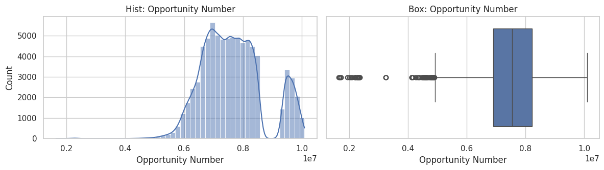
    


    
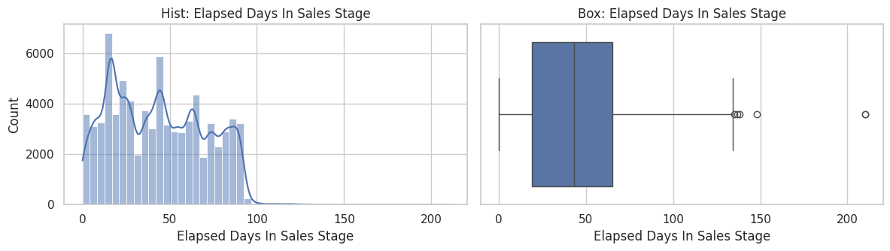
    


    
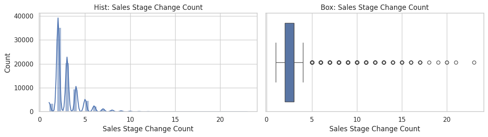
    


    
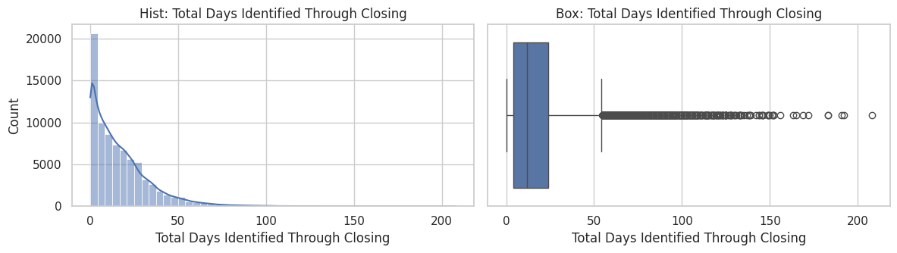
    


    
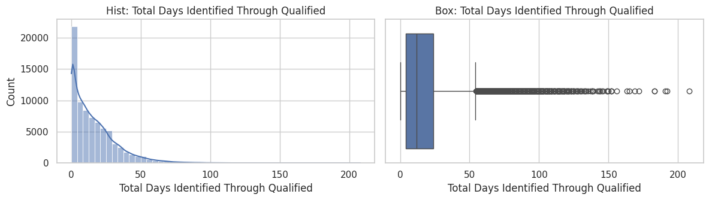
    


    
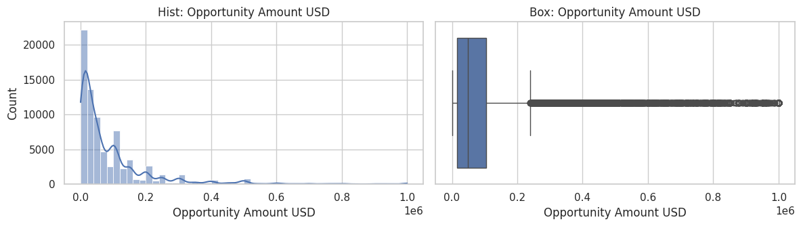
    


    
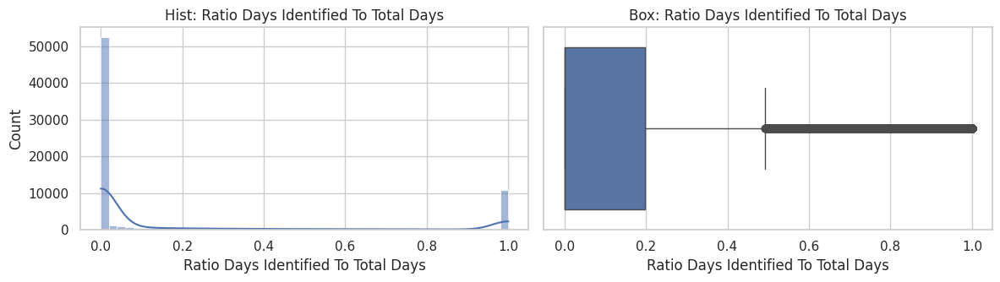
    


    
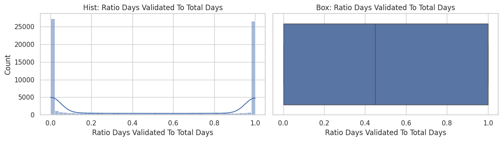
    


    
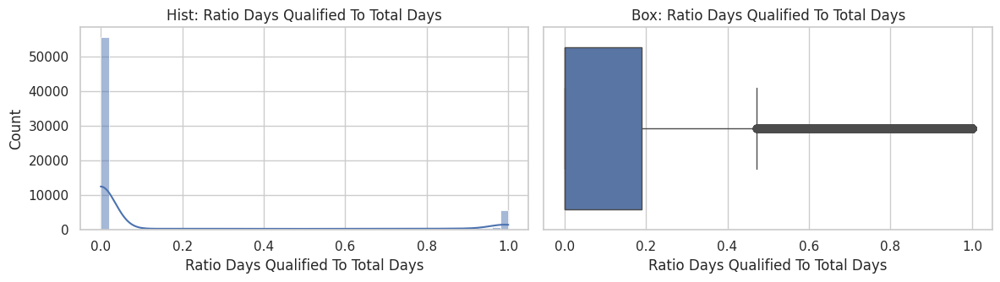
    


## Categorical distributions


```python
cat_cols = df.select_dtypes(exclude='number').columns.tolist()
for col in cat_cols:
    vc = df[col].fillna('MISSING').value_counts().head(12)
    plt.figure(figsize=(10, 3.5))
    sns.barplot(x=vc.index.astype(str), y=vc.values)
    plt.title(f'Top levels: {col}')
    plt.xticks(rotation=30, ha='right')
    plt.tight_layout()
    plt.show()
```


    
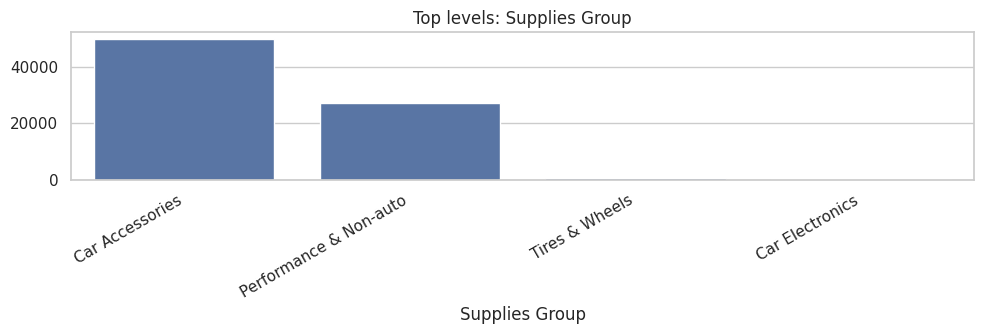
    


    
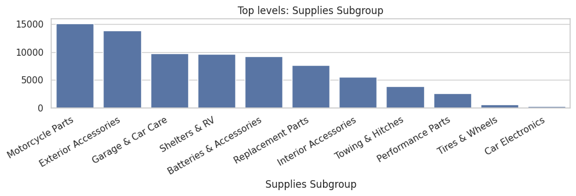
    


    
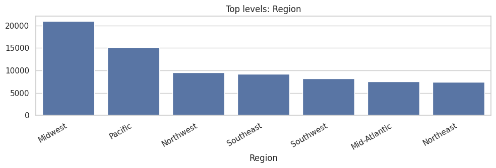
    


    
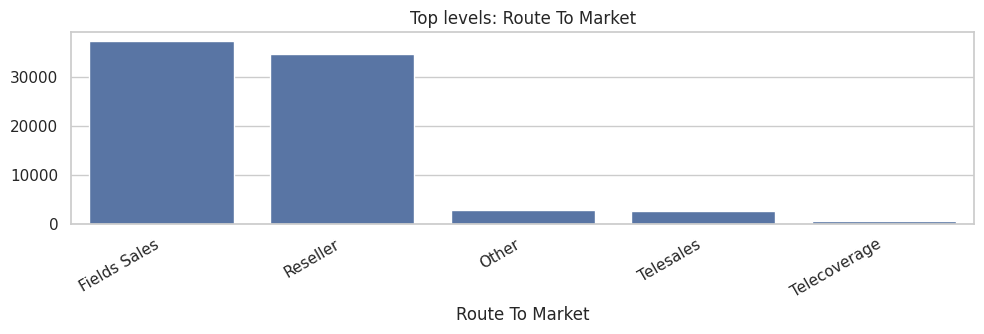
    


    
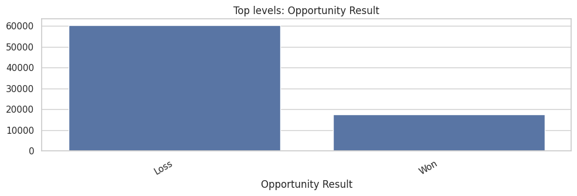
    


    
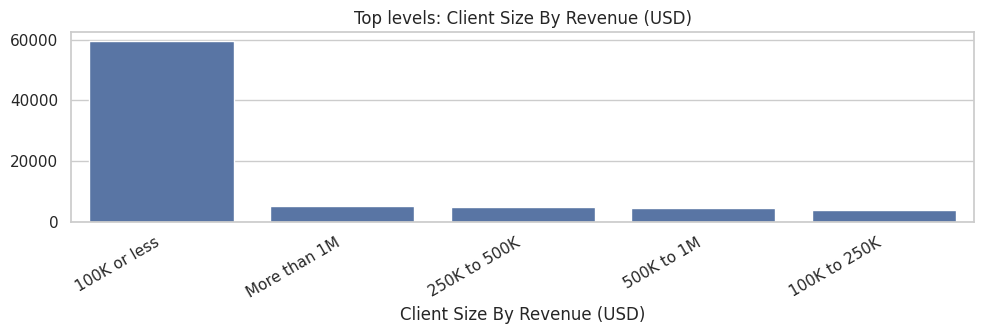
    


    
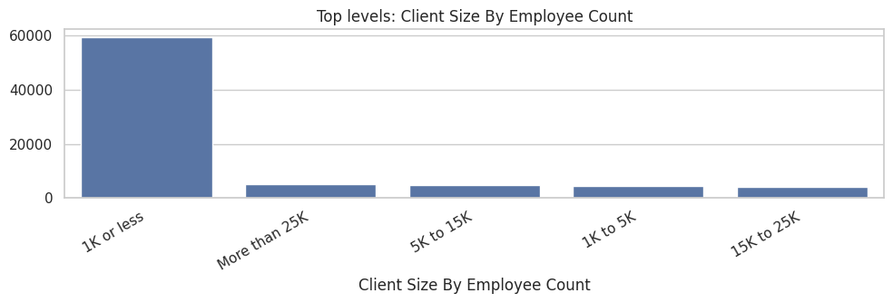
    


    
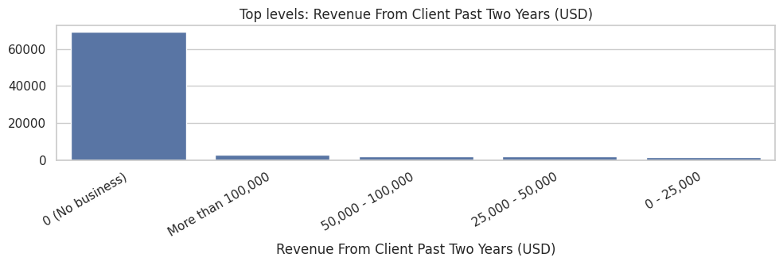
    


    
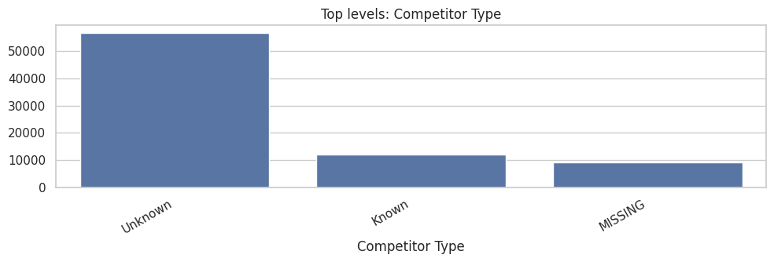
    


    
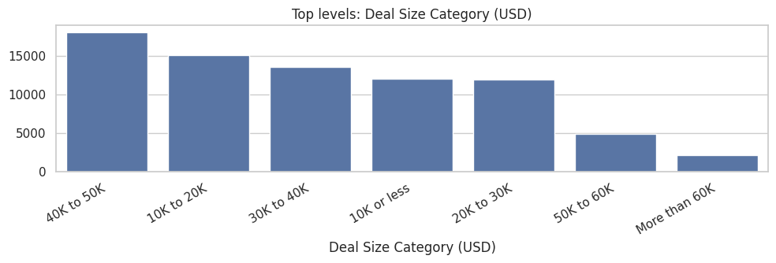
    


## Target-focused quick view


```python
print('Win/Loss distribution (%)')
print((df['Opportunity Result'].value_counts(normalize=True) * 100).round(2))

print('\nDeal Size Category distribution (%)')
print((df['Deal Size Category (USD)'].value_counts(normalize=True) * 100).round(2))

print('\nAmount summary')
print(df['Opportunity Amount USD'].describe(percentiles=[0.01, 0.05, 0.5, 0.95, 0.99]))
```

    Win/Loss distribution (%)
    Opportunity Result
    Loss    77.41
    Won     22.59
    Name: proportion, dtype: float64
    
    Deal Size Category distribution (%)
    Deal Size Category (USD)
    40K to 50K       23.16
    10K to 20K       19.38
    30K to 40K       17.47
    10K or less      15.50
    20K to 30K       15.34
    50K to 60K        6.32
    More than 60K     2.82
    Name: proportion, dtype: float64
    
    Amount summary
    count      78025.000000
    mean       91637.260750
    std       133161.029156
    min            0.000000
    1%             0.000000
    5%          1192.800000
    50%        49000.000000
    95%       350000.000000
    99%       700000.000000
    max      1000000.000000
    Name: Opportunity Amount USD, dtype: float64

