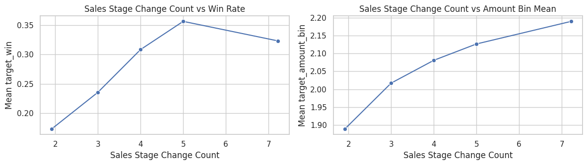
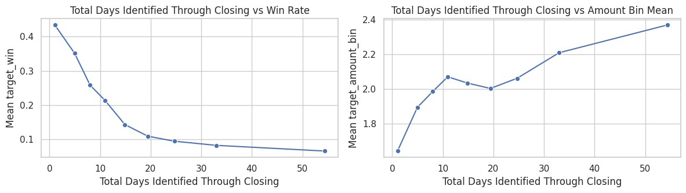
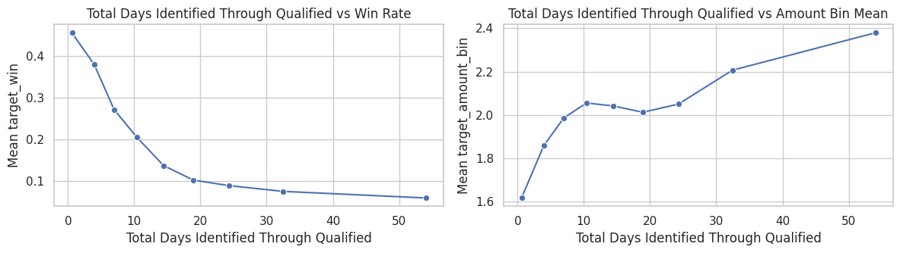

# 03 - Pre-binning EDA: Monotonicity vs Targets

This notebook checks monotonic relationships of numeric predictors against:
1. `Opportunity Result` (Won/Loss)
2. binned deal amount target (quantile bins of `Opportunity Amount USD`)

Purpose: identify variables with stable monotonic signal before WoE/optbinning.


```python
import pandas as pd
import numpy as np
import seaborn as sns
import matplotlib.pyplot as plt
from scipy.stats import spearmanr

pd.set_option('display.max_columns', 200)
sns.set_theme(style='whitegrid')
```


```python
df = pd.read_excel('../cars.xlsx')
df['target_win'] = df['Opportunity Result'].map({'Won': 1, 'Loss': 0})

# binned amount target (ordinal classes)
df['target_amount_bin'] = pd.qcut(
    df['Opportunity Amount USD'],
    q=5,
    labels=False,
    duplicates='drop'
)

print('shape:', df.shape)
print('amount bin distribution:')
print(df['target_amount_bin'].value_counts(dropna=False).sort_index())
```

    shape: (78025, 21)
    amount bin distribution:
    target_amount_bin
    0    15606
    1    17306
    2    13911
    3    15602
    4    15600
    Name: count, dtype: int64


## Monotonicity test function


```python
def monotonicity_report(frame, x_col, y_col, n_bins=10):
    data = frame[[x_col, y_col]].dropna().copy()
    if data[x_col].nunique() < 4:
        return None

    # quantile-based bins for the predictor
    try:
        data['x_bin'] = pd.qcut(data[x_col], q=min(n_bins, data[x_col].nunique()), duplicates='drop')
    except Exception:
        return None

    agg = data.groupby('x_bin', observed=False).agg(
        x_mean=(x_col, 'mean'),
        y_mean=(y_col, 'mean'),
        n=(y_col, 'size')
    ).reset_index(drop=True)

    if len(agg) < 3:
        return None

    agg['bin_idx'] = np.arange(len(agg))
    rho, pval = spearmanr(agg['bin_idx'], agg['y_mean'])

    diffs = np.diff(agg['y_mean'].values)
    inc = np.all(diffs >= 0)
    dec = np.all(diffs <= 0)

    return {
        'variable': x_col,
        'n_bins': len(agg),
        'spearman_rho': float(rho) if pd.notna(rho) else np.nan,
        'spearman_pvalue': float(pval) if pd.notna(pval) else np.nan,
        'strict_monotonic': bool(inc or dec),
        'direction': 'increasing' if inc else ('decreasing' if dec else 'non-monotonic'),
        'curve': agg
    }
```

## Run monotonicity checks for both targets


```python
candidate_num = [
    c for c in df.select_dtypes(include='number').columns
    if c not in {'target_win', 'target_amount_bin', 'Opportunity Amount USD', 'Opportunity Number'}
]

rows = []
curves = {}
for col in candidate_num:
    r_win = monotonicity_report(df, col, 'target_win', n_bins=10)
    r_amt = monotonicity_report(df, col, 'target_amount_bin', n_bins=10)

    if r_win is None and r_amt is None:
        continue

    rows.append({
        'variable': col,
        'win_rho': np.nan if r_win is None else r_win['spearman_rho'],
        'win_pvalue': np.nan if r_win is None else r_win['spearman_pvalue'],
        'win_strict_monotonic': False if r_win is None else r_win['strict_monotonic'],
        'win_direction': 'n/a' if r_win is None else r_win['direction'],
        'amountbin_rho': np.nan if r_amt is None else r_amt['spearman_rho'],
        'amountbin_pvalue': np.nan if r_amt is None else r_amt['spearman_pvalue'],
        'amountbin_strict_monotonic': False if r_amt is None else r_amt['strict_monotonic'],
        'amountbin_direction': 'n/a' if r_amt is None else r_amt['direction']
    })

    if r_win is not None:
        curves[(col, 'target_win')] = r_win['curve']
    if r_amt is not None:
        curves[(col, 'target_amount_bin')] = r_amt['curve']

mono_df = pd.DataFrame(rows)
mono_df['abs_win_rho'] = mono_df['win_rho'].abs()
mono_df['abs_amountbin_rho'] = mono_df['amountbin_rho'].abs()
mono_df['combined_abs_rho'] = mono_df[['abs_win_rho', 'abs_amountbin_rho']].mean(axis=1)
mono_df = mono_df.sort_values('combined_abs_rho', ascending=False).reset_index(drop=True)
mono_df
```


<div>
<style scoped>
    .dataframe tbody tr th:only-of-type {
        vertical-align: middle;
    }

    .dataframe tbody tr th {
        vertical-align: top;
    }

    .dataframe thead th {
        text-align: right;
    }
</style>
<table border="1" class="dataframe">
  <thead>
    <tr style="text-align: right;">
      <th></th>
      <th>variable</th>
      <th>win_rho</th>
      <th>win_pvalue</th>
      <th>win_strict_monotonic</th>
      <th>win_direction</th>
      <th>amountbin_rho</th>
      <th>amountbin_pvalue</th>
      <th>amountbin_strict_monotonic</th>
      <th>amountbin_direction</th>
      <th>abs_win_rho</th>
      <th>abs_amountbin_rho</th>
      <th>combined_abs_rho</th>
    </tr>
  </thead>
  <tbody>
    <tr>
      <th>0</th>
      <td>Sales Stage Change Count</td>
      <td>0.900000</td>
      <td>0.037386</td>
      <td>False</td>
      <td>non-monotonic</td>
      <td>1.000000</td>
      <td>1.404265e-24</td>
      <td>True</td>
      <td>increasing</td>
      <td>0.900000</td>
      <td>1.000000</td>
      <td>0.950000</td>
    </tr>
    <tr>
      <th>1</th>
      <td>Total Days Identified Through Closing</td>
      <td>-1.000000</td>
      <td>0.000000</td>
      <td>True</td>
      <td>decreasing</td>
      <td>0.883333</td>
      <td>1.590500e-03</td>
      <td>False</td>
      <td>non-monotonic</td>
      <td>1.000000</td>
      <td>0.883333</td>
      <td>0.941667</td>
    </tr>
    <tr>
      <th>2</th>
      <td>Total Days Identified Through Qualified</td>
      <td>-1.000000</td>
      <td>0.000000</td>
      <td>True</td>
      <td>decreasing</td>
      <td>0.883333</td>
      <td>1.590500e-03</td>
      <td>False</td>
      <td>non-monotonic</td>
      <td>1.000000</td>
      <td>0.883333</td>
      <td>0.941667</td>
    </tr>
    <tr>
      <th>3</th>
      <td>Ratio Days Qualified To Total Days</td>
      <td>1.000000</td>
      <td>0.000000</td>
      <td>True</td>
      <td>increasing</td>
      <td>-0.500000</td>
      <td>6.666667e-01</td>
      <td>False</td>
      <td>non-monotonic</td>
      <td>1.000000</td>
      <td>0.500000</td>
      <td>0.750000</td>
    </tr>
    <tr>
      <th>4</th>
      <td>Ratio Days Identified To Total Days</td>
      <td>-1.000000</td>
      <td>0.000000</td>
      <td>True</td>
      <td>decreasing</td>
      <td>0.500000</td>
      <td>6.666667e-01</td>
      <td>False</td>
      <td>non-monotonic</td>
      <td>1.000000</td>
      <td>0.500000</td>
      <td>0.750000</td>
    </tr>
    <tr>
      <th>5</th>
      <td>Ratio Days Validated To Total Days</td>
      <td>-1.000000</td>
      <td>0.000000</td>
      <td>True</td>
      <td>decreasing</td>
      <td>-0.400000</td>
      <td>6.000000e-01</td>
      <td>False</td>
      <td>non-monotonic</td>
      <td>1.000000</td>
      <td>0.400000</td>
      <td>0.700000</td>
    </tr>
    <tr>
      <th>6</th>
      <td>Elapsed Days In Sales Stage</td>
      <td>0.030303</td>
      <td>0.933773</td>
      <td>False</td>
      <td>non-monotonic</td>
      <td>-0.115152</td>
      <td>7.514197e-01</td>
      <td>False</td>
      <td>non-monotonic</td>
      <td>0.030303</td>
      <td>0.115152</td>
      <td>0.072727</td>
    </tr>
  </tbody>
</table>
</div>


```python
mono_df.to_csv('../data/processed/monotonicity_report_targets.csv', index=False)
print('saved: ../data/processed/monotonicity_report_targets.csv')
```

    saved: ../data/processed/monotonicity_report_targets.csv


## Strongest monotonic variables (quick view)


```python
top = mono_df.head(8)[['variable', 'win_rho', 'amountbin_rho', 'win_strict_monotonic', 'amountbin_strict_monotonic', 'combined_abs_rho']]
top
```


<div>
<style scoped>
    .dataframe tbody tr th:only-of-type {
        vertical-align: middle;
    }

    .dataframe tbody tr th {
        vertical-align: top;
    }

    .dataframe thead th {
        text-align: right;
    }
</style>
<table border="1" class="dataframe">
  <thead>
    <tr style="text-align: right;">
      <th></th>
      <th>variable</th>
      <th>win_rho</th>
      <th>amountbin_rho</th>
      <th>win_strict_monotonic</th>
      <th>amountbin_strict_monotonic</th>
      <th>combined_abs_rho</th>
    </tr>
  </thead>
  <tbody>
    <tr>
      <th>0</th>
      <td>Sales Stage Change Count</td>
      <td>0.900000</td>
      <td>1.000000</td>
      <td>False</td>
      <td>True</td>
      <td>0.950000</td>
    </tr>
    <tr>
      <th>1</th>
      <td>Total Days Identified Through Closing</td>
      <td>-1.000000</td>
      <td>0.883333</td>
      <td>True</td>
      <td>False</td>
      <td>0.941667</td>
    </tr>
    <tr>
      <th>2</th>
      <td>Total Days Identified Through Qualified</td>
      <td>-1.000000</td>
      <td>0.883333</td>
      <td>True</td>
      <td>False</td>
      <td>0.941667</td>
    </tr>
    <tr>
      <th>3</th>
      <td>Ratio Days Qualified To Total Days</td>
      <td>1.000000</td>
      <td>-0.500000</td>
      <td>True</td>
      <td>False</td>
      <td>0.750000</td>
    </tr>
    <tr>
      <th>4</th>
      <td>Ratio Days Identified To Total Days</td>
      <td>-1.000000</td>
      <td>0.500000</td>
      <td>True</td>
      <td>False</td>
      <td>0.750000</td>
    </tr>
    <tr>
      <th>5</th>
      <td>Ratio Days Validated To Total Days</td>
      <td>-1.000000</td>
      <td>-0.400000</td>
      <td>True</td>
      <td>False</td>
      <td>0.700000</td>
    </tr>
    <tr>
      <th>6</th>
      <td>Elapsed Days In Sales Stage</td>
      <td>0.030303</td>
      <td>-0.115152</td>
      <td>False</td>
      <td>False</td>
      <td>0.072727</td>
    </tr>
  </tbody>
</table>
</div>


## Curves for top 3 variables by combined monotonic signal


```python
top_vars = mono_df.head(3)['variable'].tolist()
for var in top_vars:
    fig, axes = plt.subplots(1, 2, figsize=(12, 3.5))

    c1 = curves.get((var, 'target_win'))
    if c1 is not None:
        sns.lineplot(data=c1, x='x_mean', y='y_mean', marker='o', ax=axes[0])
        axes[0].set_title(f'{var} vs Win Rate')
        axes[0].set_ylabel('Mean target_win')
    else:
        axes[0].set_title(f'{var} vs Win Rate (not available)')

    c2 = curves.get((var, 'target_amount_bin'))
    if c2 is not None:
        sns.lineplot(data=c2, x='x_mean', y='y_mean', marker='o', ax=axes[1])
        axes[1].set_title(f'{var} vs Amount Bin Mean')
        axes[1].set_ylabel('Mean target_amount_bin')
    else:
        axes[1].set_title(f'{var} vs Amount Bin (not available)')

    for ax in axes:
        ax.set_xlabel(var)
    plt.tight_layout()
    plt.show()
```


    

    


    

    


    

    


## Interpretation guide

- `spearman_rho` near `+1/-1` indicates stronger monotonic trend across bins.
- `strict_monotonic=True` means all adjacent bin means move in one direction.
- Variables with good monotonicity in both targets are strong candidates before binning models.
