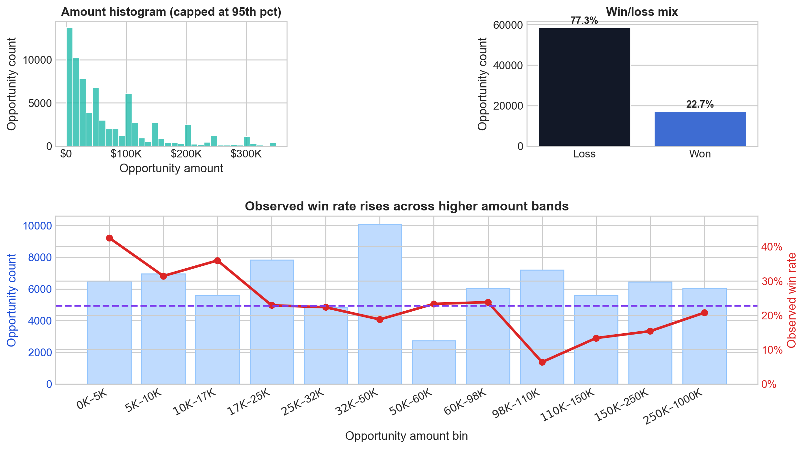
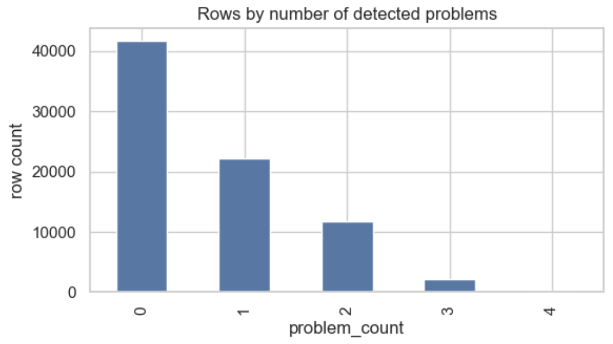
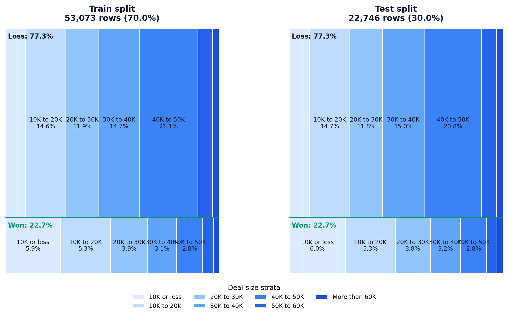
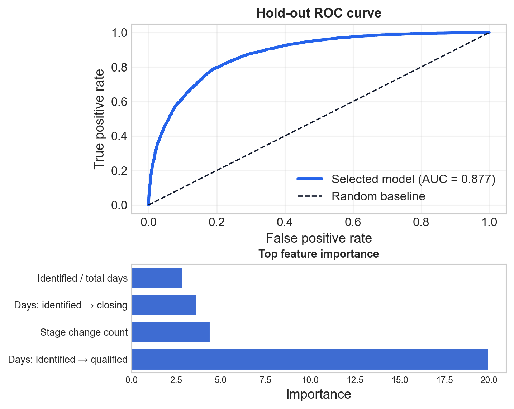
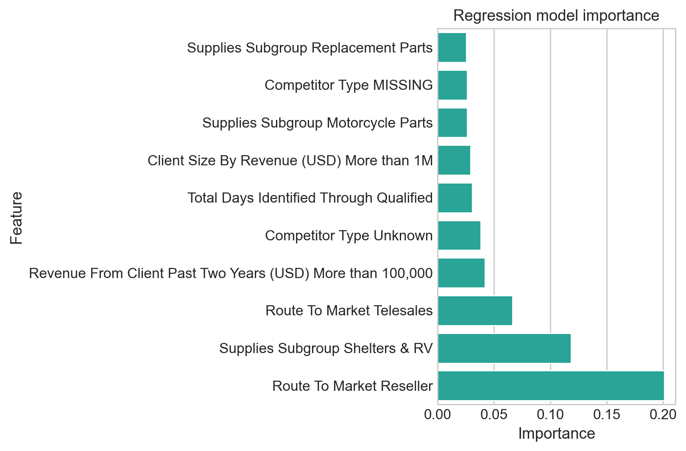
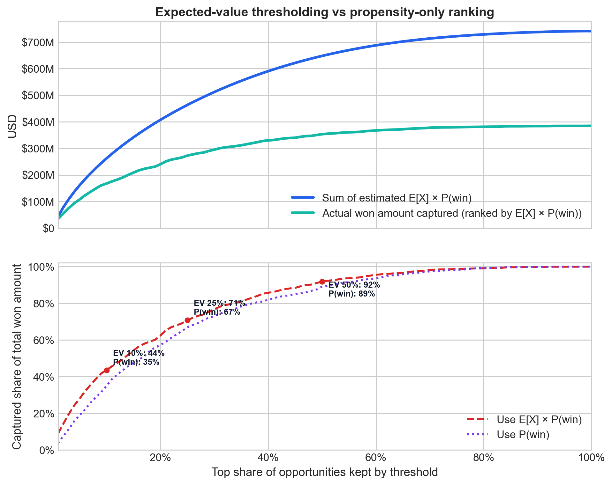

## Executive Summary

- This analysis examines an auto-parts sales opportunity pipeline, identifying structural inefficiencies (i.e. CRM input errors, lack of prioritization, and inaccurate forecasting) that drive a structurally low 22.7% conversion rate.
- We propose two models: a win/loss classifier (AUROC 0.88) for opportunity prioritization, and a regression model for deal sizing and aggregate forecasting (reliable at portfolio level, not per deal).
- Focusing on the top 20% of opportunities lifts conversion from 22.7% to ~67%; the top 10% captures ~44% of total pipeline value.
- We recommend embedding scores in the CRM at opportunity creation, piloting via A/B test, and setting clear thresholds to operationalize prioritization in sales workflows.

## Agenda

1. Business framing and process assumptions
2. Dataset and target overview
3. EDA findings that matter for prioritization and forecasting
4. Modelling approach and model outputs
5. Application simulations
6. Conclusions and next steps

# Business framing {background-color="#0F172A"}

## The sales process is non-linear, and the data captures its current state

::: {.columns}
::: {.column width="56%"}
- The current sales process tracks auto-parts opportunities across both new leads and existing customers.
- Opportunities transition between the stages Data entry → Identified / Qualifying →  Qualified / Validating, and Validated / Gaining Agreement → Closed (Win/Loss). 
  - Opportunities can move between stages in either direction, and they can also stall within a stage for extended periods.
  - Each opportunity ultimately resolves as either a win or a loss.
  - Sales teams maintain an estimated deal value, which is updated as the opportunity progresses.
:::
::: {.column width="44%"}
{width=100%}
:::
:::

## Most value sits in a small share of opportunities making prioritization an important growth lever

::: {.columns}
::: {.column width="56%"}
{width=94%}
:::
::: {.column width="44%"}
- The pipeline is high-volume but low-yield: only 22.7% of opportunities convert, meaning most effort is currently misallocated.
- Value is highly concentrated: the majority of opportunities are low-amount, but win rates increase materially with deal size, signaling where commercial focus should shift.
- This creates a clear opportunity: → Move from volume-driven selling to value-driven prioritization, combining win propensity + deal size.
- The implication is direct: → Not all opportunities should be pursued equally — targeting the right deals can lift conversion and revenue without increasing pipeline size.
:::
:::

## Therefore, we propose two modelling use cases: prioritization and forecasting, plus additional data-driven commercial opportunities.

::: {.columns}
::: {.column width="52%"}
### Selected for this project

- **Process prioritization**: rank opportunities by win propensity and support decisions on where sales effort should focus first.
- **Opportunity sizing & forecasting**: estimate deal value and aggregate expected sales for planning, prioritization, and budget visibility.
:::
::: {.column width="48%"}
### Additional opportunities identified in the data

- **Channel optimization**: test what-if scenarios around route-to-market and engagement model choices.
- **Secondary market segmentation**: create actionable commercial segments from predicted value and conversion potential.
- **Early warning systems**: flag opportunities that are likely to deteriorate or stall.
- **Budget allocation**: guide sales effort and product-focus decisions across segments, regions, and product lines.
:::
:::

# Exploratory data analysis {background-color="#0F172A"}

## The dataset was analyzed and prepared with the two use cases in mind, which shaped the EDA focus and modelling choices

::: {.columns}
::: {.column width="52%"}
- **Scale**: 78,025 sales opportunities and **19 variables**.
- Validation checks flagged duplicates and process-consistency issues before modelling. Key preparation findings:
  - **196 duplicated opportunity IDs** (removed)
  - **2047 zero amount opportunities** (removed)
  - **12,921 rows** where stage ratios do not sum closely to 1 (kept)
  - And other problems such as apparent data input issues, missing values, and outliers that were handled with specific transformations rather than row removal.
- For the modelling experiments shown here, the sample used **75,819 eligible rows** out of **78,025 total rows** with valid targets.
:::
::: {.column width="48%"}
{width=100%}
:::
:::

<!-- - **What the data is good for**: ranking opportunities, understanding portfolio mix, and producing aggregate forecasts.
- **What it is not**: a full event history of every sales-stage movement.
- The dataset should therefore be read as a **current-state commercial view** of the pipeline. -->

## Align coverage and service models to client size, focusing scalable playbooks on small clients and dedicated effort on high-value accounts.

::: {.columns}
::: {.column width="58%"}
{width=100%}
:::
::: {.column width="42%"}
- The portfolio is heavily concentrated in **100K or less** clients, so this segment should drive base operating playbooks and coverage models.
- Conversion is relatively similar across most size bands, which means client size is more useful for **commercial treatment and value management** than for win-rate targeting alone.
- Larger accounts still matter because deal economics improve materially with size, so client-size segmentation should inform account prioritization, service model, and sales effort allocation.
:::
:::

## Treat acquisition and expansion as distinct growth engines, each with its own playbook and resource model.

::: {.columns}
::: {.column width="42%"}
- **(Re)Acquisition** / no business in the past two years: 69,208 opportunities with a **17.3%** observed win rate.
- **Engagement / upselling**: 8,817 opportunities with a **63.9%** observed win rate.
- This is a practical first-layer funnel split for go-to-market operations because it separates low-history acquisition work from higher-propensity expansion opportunities.
:::
::: {.column width="58%"}
{width=100%}
:::
:::

## We ran an automated IV analysis and found that process-time variables carry most of the predictive signal

::: {.columns}
::: {.column width="52%"}
{width=100%}
:::
::: {.column width="48%"}
{width=100%}
:::
:::

- The strongest IV signals for win/loss come from **Total Days Identified Through Qualified**, **Elapsed Days In Sales Stage**, and the stage-ratio variables.
- Both time-to-close and amount distributions are skewed, so the analysis should avoid over-interpreting averages without context.

# Modelling {background-color="#0F172A"}

## For both classification and regression, we used an stratified train/test split to ensure realistic evaluation

::: {.columns}
::: {.column width="50%"}
- **Train / test split**: **70% / 30%**
  - Train: **53,073** rows
  - Test: **22,746** rows
- The split was **stratified jointly** on:
  - win/loss target
  - amount buckets
- This keeps both outcome balance and deal-size mix stable across train and test.
- In the final models, regression uses standardized numeric inputs, while the selected logistic classifier uses supervised binning plus one-hot encoding.
:::
::: {.column width="46%"}
{width=100%}
:::
:::

## Prioritization classification model enables immediate and precise reallocation of sales effort

::: {.columns}
::: {.column width="54%"}
- Target: **Opportunity Result**.
- Business use: **process prioritization** and ranking the pipeline by win propensity.
- Selected final logistic model: **Logistic Regression over supervisedly binned and one-hot encoded features with balanced class weights** (`logit_binned_ohe_balanced`). [^1]

| Model | Split | ROC AUC | PR AUC |
| --- | --- | ---: | ---: |
| Selected | CV | 0.881 | 0.698 |
| Selected | Held-out test | 0.877 | 0.693 |
| Baseline | CV | 0.502 | 0.228 |
| Baseline | Held-out test | 0.505 | 0.229 |

:::
::: {.column width="50%"}
{width=100%}
:::
:::

::: aside
This simulation is based on held-out test-set predictions.
[^1]: We still do not recommend the higher-scoring XGBoost variants for deployment here because of their black-box nature and because they were not part of the covered modelling stack.
:::

## Use amount model for portfolio forecasting, not deal decisions

::: {.columns}
::: {.column width="54%"}
- Target: **Opportunity Amount USD**.
- Business use: **sizing and aggregate forecasting**.
- Selected final regression model: **XGBoost regressor** (`xgboost`).

::: {style="font-size: 80%;"}

**CV**

| Model | Split | R² | MAE | Median APE |
| --- | ---: | ---: | ---: | ---: |
| Selected | CV | 0.156 | 72.3k USD | 77.7% |
| Selected | Held-out test | 0.161 | 71.9k USD | 76.9% |
| Mean baseline | CV | -0.000 | 84.9k USD | 88.3% |
| Mean baseline | Held-out test | -0.000 | 84.9k USD | 88.3% |
| Median baseline | CV | -0.108 | 75.0k USD | 74.6% |
| Median baseline | Held-out test | -0.108 | 74.9k USD | 75.0% |
| Random baseline | CV | -1.053 | 115.0k USD | 90.4% |
| Random baseline | Held-out test | -0.972 | 113.4k USD | 90.1% |

:::

:::
::: {.column width="46%"}
{width=100%}
:::
:::

# Application simulation {background-color="#1E293B"}

## Tripling conversion is achievable by focusing on the top 20% of opportunities, without increasing pipeline size

::: {.columns}
::: {.column width="44%"}
- Sales effort is currently spread across low-probability deals → concentrating on top deciles can triple conversion efficiency.
  - Top decile: 3.52× lift.
  - Ninth decile: 2.38× lift.
  - Eight decile: 1.66× lift.
- We propose to automatically embed this in the CRM at opportunity creation to prioritize high-propensity deals (e.g. top 1-2 deciles) and set clear thresholds for pipeline reviews and resource allocation.

::: aside
This simulation is based on held-out test-set predictions.
:::

:::
::: {.column width="56%"}
{width=100%}
:::
:::

## Leverage the opportunity sizing model for accurate aggregate forecasting, not individual deal sizing

::: {.columns}
::: {.column width="56%"}
{width=100%}
:::
::: {.column width="44%"}
- Model is better at forecasting aggregate sales than individual-opportunity amounts, which is common in this type of data.
  - Aggregate actual amount: **2.138B USD** on the held-out test set.
  - Aggregate predicted amount: **2.142B USD** on the held-out test set.
  - Mean absolute error per opportunity: **71.9k USD**.
- We propose automatically calculating and adding this to the CRM at opportunity creation for aggregate planning and scenario analysis, but not for precise opportunity-level decisions because its value is strongest at the portfolio level.

:::
:::

::: aside
This simulation is based on held-out test-set predictions.
:::

## Concentration (~44% value capture at top 10%) makes expected-value prioritization a key revenue lever

::: {.columns}
::: {.column width="56%"}
{width=80%}
:::

::: {.column width="44%"}
- Rank the pipeline using expected value (E[Amount] × P(Win)), not just propensity especially under limited sales capacity.
  - At top 10%, expected-value ranking captures 43.6% of won revenue vs 34.9% with propensity-only.
  - At top 25%, the comparison is 70.9% vs 66.9%, so deal-size information matters most when capacity is tight.
  - While overoptimistic, rankings remain directionally valid and can be calibrated in-model in follow-up iterations.
- We propose to set clear thresholds (e.g., top 10% = high priority) and embed in the CRM to guide sales focus with a more economically relevant ranking than win propensity alone.

:::
:::

::: aside
This simulation is based on held-out test-set predictions. This analysis assumes that the opportunity amount is actually related to the final deal amount, which is not necessarily the case.
:::

## Turn models into daily sales decisions via CRM integration

::: {.columns}
::: {.column width="52%"}
### Operational flow

**Opportunity created** → **score + expected value generated**

- As soon as a new opportunity enters the CRM, the workflow generates:
  - **win-propensity score**
  - **predicted amount**
  - **expected value = E[Amount] × P(Win)**

### CRM displays

- **Priority tier**: Top 10%, Top 25%, Top 50%, etc.
- **Suggested action**: focus / monitor / deprioritize
- This gives frontline teams a simple operating signal without exposing model internals.
:::
::: {.column width="48%"}
### Weekly pipeline reviews

- Use **threshold-based filtering** to narrow the active pipeline before review.
- Focus reviews on opportunities above the agreed propensity or expected-value cutoff.
- Align rep attention, manager escalation, and follow-up cadence to those thresholds.

### Management view

- **Forecast = sum of predicted values** across the active pipeline.
- Leadership can compare forecast by region, route to market, owner, or priority tier.
- This connects daily triage decisions to portfolio-level revenue planning.
:::
:::

# Conclusions {background-color="#0F172A"}

## Key takeaways for commercial decision-making

- Prioritization is the highest-impact use case
  - Win/loss model (AUROC 0.88) improves sales focus.
  - Top 20% of opportunities → conversion ~22.7% → ~67%.
- Forecast at the portfolio level, not the deal level
  - Amount model is not reliable per deal, but supports aggregate forecasting and planning.
- Expected value is the strongest prioritization lever
  - Combines win propensity × deal size.
  - Value is concentrated: ~44% in top 10%, ~68% in top 25%.
- Recommendation
  - Pilot prioritization first (embed in CRM).
  - Use forecasting for planning.
  - Then combine into expected-value prioritization to guide focus and resource allocation.

## Pilot, prove, scale: how to operationalize model-driven sales

- Pilot deployment (4–6 weeks):
  - Embed prioritization scores into CRM workflows
  - Run A/B test vs. current sales process and measure lift in conversion and revenue
- Define operating model (after pilot early results):
  - Incorporate funnel/client segmentation into the process
  - Set clear thresholds and actions (e.g., top deciles = sales focus)
  - Align sales forces with incentives and pipeline reviews to make sure model outputs are used effectively
- Monitor performance (starting after deployment):
  - Track conversion lift, cycle time, and revenue per opportunity
  - Continuously recalibrate thresholds and retrain models
- Scale and integrate (after pilot success):
  - Extend to full pipeline and embed in forecasting cadence
  - Incorporate into commercial planning and resource allocation

# Thank you {background-color="#0F172A"}
Questions, comments, and feedback are welcome!

# Annex {background-color="#0F172A"}

## Annex: classification CV leaderboard

::: {.smaller}

| Model | ROC AUC | PR AUC | Accuracy | F1 |
| --- | ---: | ---: | ---: | ---: |
| xgboost_balanced | 0.912 ± 0.003 | 0.783 ± 0.007 | 0.830 ± 0.005 | 0.691 ± 0.007 |
| xgboost | 0.912 ± 0.003 | 0.786 ± 0.006 | 0.871 ± 0.003 | 0.682 ± 0.008 |
| logit_elasticnet_binned_ohe_balanced | 0.881 ± 0.004 | 0.698 ± 0.005 | 0.794 ± 0.008 | 0.643 ± 0.011 |
| logit_binned_ohe_balanced | 0.881 ± 0.004 | 0.698 ± 0.005 | 0.794 ± 0.008 | 0.643 ± 0.010 |
| logit_binned_ohe | 0.881 ± 0.004 | 0.700 ± 0.005 | 0.842 ± 0.003 | 0.596 ± 0.011 |
| logit_elasticnet_binned_ohe | 0.881 ± 0.004 | 0.700 ± 0.005 | 0.842 ± 0.003 | 0.594 ± 0.010 |
| logit_elastic_binned_woe_balanced | 0.877 ± 0.004 | 0.692 ± 0.003 | 0.790 ± 0.006 | 0.636 ± 0.007 |
| logit_elastic_binned_woe | 0.877 ± 0.004 | 0.693 ± 0.004 | 0.838 ± 0.002 | 0.570 ± 0.009 |
| logit_binned_woe | 0.877 ± 0.004 | 0.693 ± 0.004 | 0.838 ± 0.002 | 0.570 ± 0.008 |
| logit_elasticnet_standard_scaler_balanced | 0.868 ± 0.006 | 0.669 ± 0.011 | 0.787 ± 0.007 | 0.629 ± 0.011 |
| logit_elasticnet_standard_scaler | 0.868 ± 0.006 | 0.675 ± 0.011 | 0.828 ± 0.002 | 0.546 ± 0.008 |
| classic_logit_standard_scaler | 0.868 ± 0.006 | 0.675 ± 0.011 | 0.828 ± 0.002 | 0.547 ± 0.008 |
| random_classifier | 0.502 ± 0.002 | 0.228 ± 0.001 | 0.654 ± 0.001 | 0.227 ± 0.003 |

Selected model in main deck: **logit_binned_ohe_balanced**.

:::

## Annex: regression CV leaderboard

::: {.smaller}

| Model | R² | MAE (USD) | MAPE | Median APE |
| --- | ---: | ---: | ---: | ---: |
| xgboost | 0.156 ± 0.008 | 72.3k ± 0.9k | 294.6% ± 54.5% | 77.8% |
| classic_linear_standard_scaler | 0.134 ± 0.006 | 74.3k ± 1.1k | 297.1% ± 54.9% | 78.9% |
| linear_binned_ohe | 0.134 ± 0.007 | 74.3k ± 1.0k | 300.4% ± 55.2% | 78.9% |
| elastic_binned_woe | 0.131 ± 0.008 | 74.3k ± 1.1k | 298.7% ± 58.7% | 79.3% |
| linear_binned_woe_standard_scaler | 0.131 ± 0.008 | 74.3k ± 1.1k | 298.7% ± 58.7% | 79.3% |
| elasticnet_standard_scaler | 0.066 ± 0.003 | 79.6k ± 1.2k | 261.3% ± 57.9% | 97.4% |
| linear_power_scaler_binned_ohe | 0.043 ± 0.009 | 66.7k ± 1.4k | 180.5% ± 37.7% | 63.6% |
| classic_linear_boxcox_standard_scaler | 0.041 ± 0.007 | 66.8k ± 1.4k | 176.2% ± 34.3% | 63.9% |
| classic_linear_yeojohnson_standard_scaler | 0.041 ± 0.007 | 66.8k ± 1.4k | 176.1% ± 34.3% | 63.8% |
| mean_regressor | -0.000 ± 0.000 | 84.9k ± 1.3k | 235.0% ± 53.9% | 88.3% |
| classic_linear_log1p_standard_scaler | -0.006 ± 0.006 | 67.7k ± 1.5k | 148.3% ± 30.7% | 64.1% |
| median_regressor | -0.108 ± 0.002 | 75.0k ± 1.5k | 124.7% ± 28.4% | 74.6% |
| random_regressor | -1.053 ± 0.057 | 115.0k ± 2.1k | 164.1% ± 65.3% | 90.4% |

Selected model in main deck: **xgboost**.

:::
