## Executive Summary

- This analysis examines an auto-parts sales opportunity pipeline, identifying structural inefficiencies that results in a low 22.7% conversion rate.
- We propose two models: a win/loss classifier (**AUROC 73.6%**) for early opportunity prioritization, and a regression model for deal sizing with **63.0% Median APE** on held-out test data.
- We show that focusing on the **top 20% of most likely opportunities lifts win rates from the 22.7% baseline to 51.7%**; while focusing on the **top 25% expected-value ranked opportunities captures 55.6% of total won revenue**.
- We recommend embedding scores in the CRM at opportunity creation, piloting via A/B test, and setting clear thresholds to operationalize prioritization in sales workflows.
- We also simulate strategic levers and find only modest upside, which reinforces that better process-history data is needed before using the models for bigger operating decisions.

## Our team

::: {.columns}
::: {.column width="56%" style="text-align:center;"}
{width=100%}
:::
::: {.column width="44%"}
- Business Development: Defining where to focus and how to compete
- Sales/Marketing: Operationalizing via CRM workflow, and insight validation
- Analytics: Insights from data exploration on value, win rates, and drivers
- Data Science: Modelling, ranking, and simulation to support decisions
- Strategy: Implications for strategy, decisions, and next steps
:::
:::

## Agenda

1. Business framing and process assumptions
2. EDA findings that matter for prioritization and forecasting
3. Modelling approach
4. Application scenarios
5. Conclusions and next steps

# Business framing {background-color="#0F172A"}

## The pipeline is non-linear, so the data reflects a moving sales process

::: {.columns}
::: {.column width="56%"}
- The current sales process tracks auto-parts opportunities across both new leads and existing customers.
- Opportunities transition between the stages Data entry → Identified / Qualifying →  Qualified / Validating, and Validated / Gaining Agreement → Closed (Win/Loss). 
  - Opportunities can move between stages in either direction, and they can also stall within a stage for extended periods.
  - Each opportunity ultimately resolves as either a win or a loss.
  - Sales teams maintain an estimated deal value, which is updated as the opportunity progresses.
:::
::: {.column width="44%"}
{width=100%}
:::
:::

## Most value sits in a small share of opportunities making prioritization an important growth lever

::: {.columns}
::: {.column width="56%"}
###### Conversion and value concentration across the pipeline:
{width=94%}
:::
::: {.column width="44%"}
- **Low efficiency**: only 22.7% conversion, indicating misallocated effort. This is also unbalanced.
- Skewed deal mix: $94K avg vs $50K median → long tail of large deals
- Value concentration: bigger deals win more → focus should shift
- Clear opportunity: prioritize by win probability and deal size, ideally both
- Implication: focus on the right deals, not more deals
:::
:::

## We focus on two modelling use cases: prioritization and forecasting

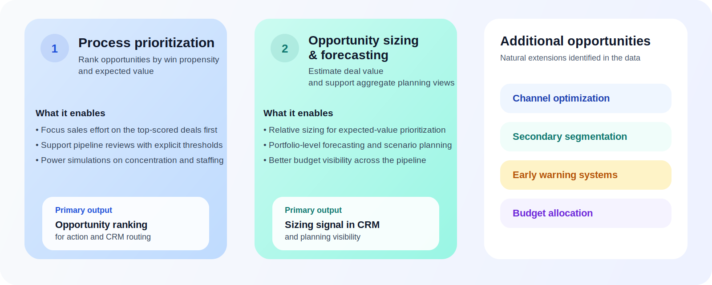{width=100%}

# Exploratory data analysis {background-color="#0F172A"}

## The data is sufficient for prioritization and directional forecasting, despite quality issues

::: {.columns}
::: {.column width="52%"}
- **Scale**: 78,025 sales opportunities and **19 variables** like:
  - at-start information: client-wise (size, past revenue) and deal-wise (product type, route, region, competitor).
  - sales process details: elapsed time, stage changes, days per stage, stage ratios, etc.
  - targets like amount and win/loss status.
- Validation removed duplicates and zero-amount opportunities prior to modelling; remaining data issues were intentionally retained.
- IDs and potential leakage variables like Client Size Deal (categorical) were not considered at all.
- For the modelling experiments shown here, the sample used **75,819 eligible rows** out of **78,025 total rows** with valid targets.
:::
::: {.column width="48%"}
###### Row counts per type of data quality issue:
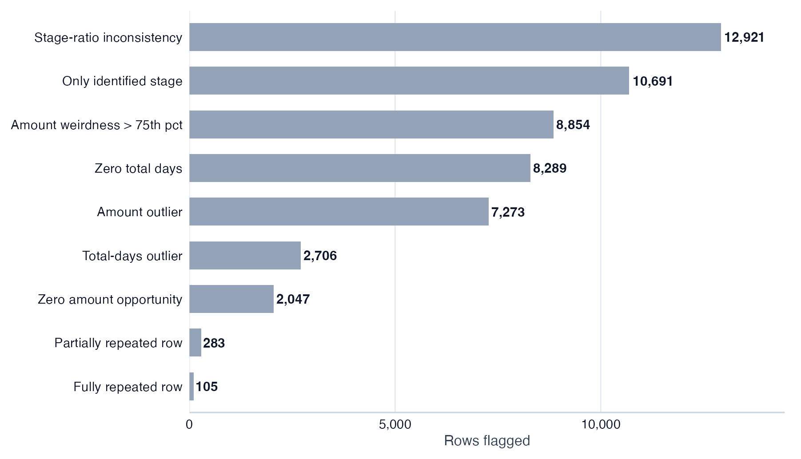{width=100%}
:::
:::

<!-- - **What the data is good for**: ranking opportunities, understanding portfolio mix, and producing aggregate forecasts.
- **What it is not**: a full event history of every sales-stage movement.
- The dataset should therefore be read as a **current-state commercial view** of the pipeline. -->

## Tailor commercial treatment by client size: scale small, focus high-value

::: {.columns}
::: {.column width="58%"}
###### Opportunity counts and win rates by client-size segment:
{width=100%}
:::
::: {.column width="42%"}
- Most volume is ≤100K → scale this segment
- Win rates are similar across sizes → use size for treatment, not targeting
- Larger deals drive value → prioritize high-value accounts
:::
:::

::: aside
Further causal work is needed to distinguish demand from historical sales focus.
:::

## Treat acquisition and expansion as distinct growth engines, each with its own playbook and resource model.

::: {.columns}
::: {.column width="42%"}
- **(Re)Acquisition** (no activity in 2 years): 69,208 opportunities, 17.3% win rate
- **Engagement / upselling**: 8,817 opportunities, 63.9% win rate
- A practical first split for segmenting sales efforts and tailoring playbooks, with different targeting, messaging, and resource allocation.
  - Also a good example of 80-20 rule in effect.

:::
::: {.column width="58%"}
###### Opportunity counts and win rates by funnel stage:
{width=100%}
:::
:::

::: aside
Further causal work is needed to distinguish demand from historical sales focus.
:::

## Performance differences are driven by product mix, not geography

::: {.columns}
::: {.column width="70%"}
###### Distribution of amount and win rates by type, subtype, and region:
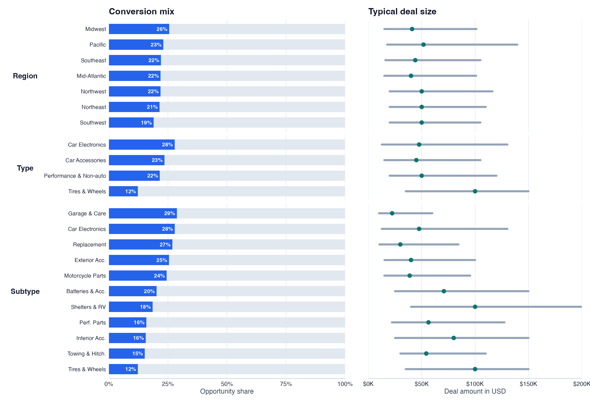{width=98%}

:::
::: {.column width="30%" style="font-size: 95%;"}
- Region is not a strong driver of conversion or deal size
- Type and subtype drive meaningful variation in both outcomes
- Prioritization should be product-driven, not geography-driven
- What other variables are driving those numbers? Is there an influence of marketing campaigns or/and specific salesmen capabilities?
:::
:::

::: aside
Further causal work is needed to distinguish demand from historical sales focus.
:::

## The strongest predictors of win and amount emerge in the IV analysis

::: {.columns}
::: {.column width="48%" style="text-align:center;"}
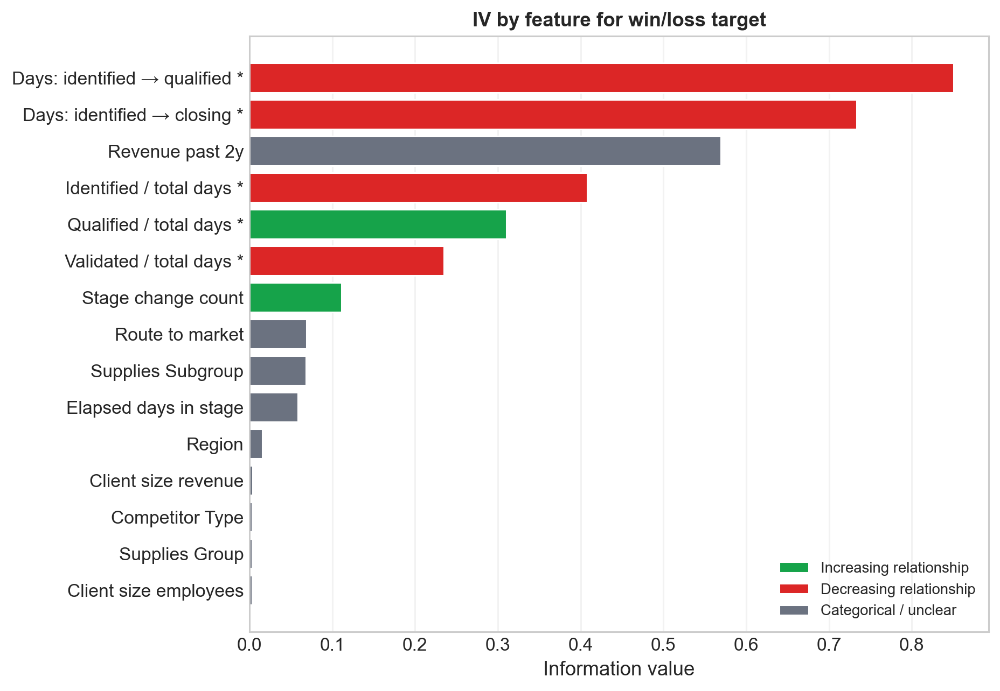{width=70%}
:::
::: {.column width="48%" style="text-align:center;"}
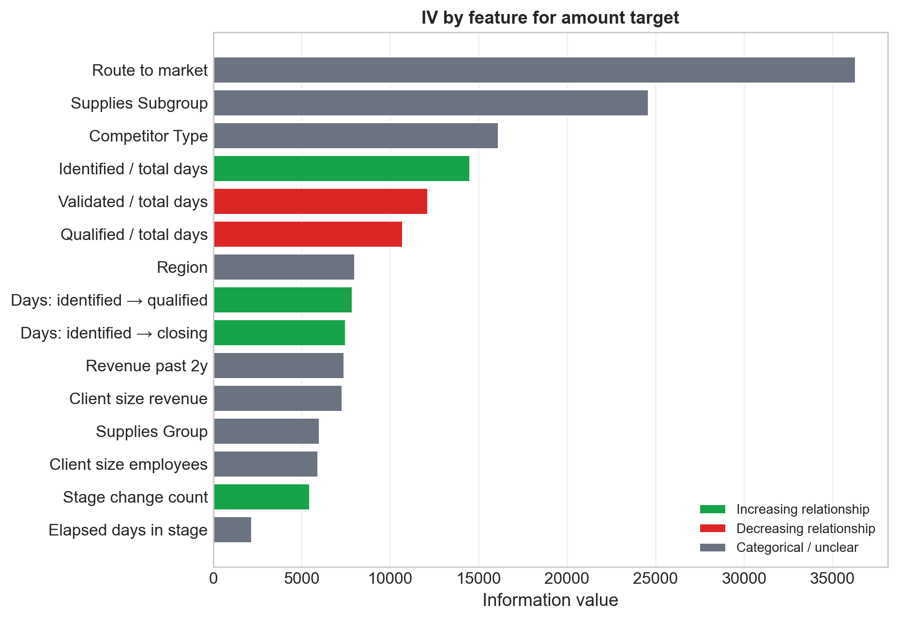{width=70%}
:::
:::

- The left chart shows IVs against the **win/loss target**, while the right chart shows IVs against the **amount target**, using the full set of variables that enter the models.
- Process-time variables and stage-ratio features remain among the strongest signals for classification, while the amount target includes product and client-size descriptors as strong predictors.

::: aside
Further causal work is needed to distinguish demand from historical sales focus.
:::

# Modelling {background-color="#0F172A"}

## We prioritize static models because snapshot timing is uncertain

::: {.columns}
::: {.column width="50%"}
### Static / pre-sales process model

- Used for **early decisions** at opportunity creation especially around prioritization and sizing.
- Uses only **at-creation variables**: product / route / region / client-size / past-revenue descriptors.
- **This is the setup used here.** It is the safer operational choice when we cannot verify when the snapshot was taken.
:::
::: {.column width="50%"}
### Dynamic / during sales process model

- Used for **ongoing re-prioritization and re-sizing** during the process.
- Uses the static variables **plus process-state variables**: elapsed time, stage changes, cumulative timing, and stage ratios.
- It scores much better, but it is more exposed to timing leakage if the dataset snapshot is close to closure.
- That version is kept in the **annex as a reference benchmark**.
:::
:::

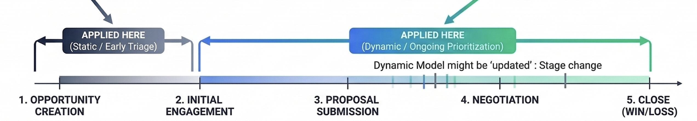

## Model performance was tested on a realistic held-out sample

::: {.columns}
::: {.column width="50%"}
- **Train / test split**: **70% / 30%**
  - Train: 53,073 | Test: 22,746
- Stratified on win/loss and amount, keeping outcome balance and deal mix stable
- 5-fold CV on train, final evaluation on hold-out
- Same split for fair evaluation
- Preprocessing included imputation, encoding (OHE), and scaling (Standard) and supervised binning.
  - No feature selection or engineering beyond the original **at-creation variables**.
:::
::: {.column width="46%"}
###### Set distribution treemap:
{width=100%}
:::
:::

## Static prioritization model supports earlier, safer reallocation of sales effort

::: {.columns}
::: {.column width="54%"}
- Target: **Opportunity Result**.
- Business use: **early prioritization** and ranking the pipeline by win propensity at opportunity creation.
  - Therefore we focused on ranking metrics such as ROC AUC and PR AUC.
- Selected final classifier: **Calibrated Balanced Random Forest over the classic preprocessed feature set** (`random_forest_classifier_balanced_calibrated`).
- This model has **moderate but usable** performance for early triage (**AUROC 73.6%, Accuracy 81.0% @ 54.5% threshold**) versus the baselines (**AUROC 50.0%, Accuracy 77.3%** for the always-false classifier).
:::
::: {.column width="50%"}
###### Classification model feature importances:
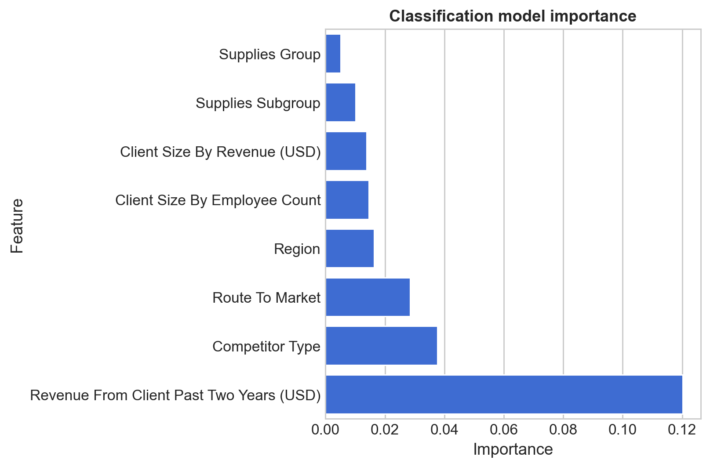{width=100%}
:::
:::

::: aside
Selected calibrated balanced random forest for stronger probability quality under the safer static feature set.
:::

## Static prioritization model supports earlier, safer reallocation of sales effort (cont., with performance metrics)

::: {.columns}
::: {.column width="57%"}
::: {style="font-size: 70%;"}

The following table shows the selected model's performance on both CV and held-out test, compared to random and simple baselines:

| Model | Split | ROC AUC | PR AUC | Accuracy | Precision | Recall | F1 |
| --- | --- | ---: | ---: | ---: | ---: | ---: | ---: |
| Selected | CV | 74.0% | 52.6% | 80.9% | 73.4% | 25.0% | 37.3% |
| Selected | Held-out test | 73.6% | 52.8% | 81.0% | 73.5% | 25.3% | 37.6% |
| Random baseline | Held-out test | 50.5% | 22.9% | 65.1% | 23.5% | 23.6% | 23.5% |
| Always false baseline | Held-out test | 50.0% | 22.7% | 77.3% | 0.0% | 0.0% | 0.0% |
| Always true baseline | Held-out test | 50.0% | 22.7% | 22.7% | 22.7% | 100.0% | 37.0% |

 

::: {style="font-size: 80%;"}
Conclusions:

- The model has enough ranking signal (**AUROC 73.6% on hold-out**) to support early screening, and it uses a more precision-oriented operating threshold because the business action is to focus scarce sales effort.
:::

:::
:::
::: {.column width="43%"}
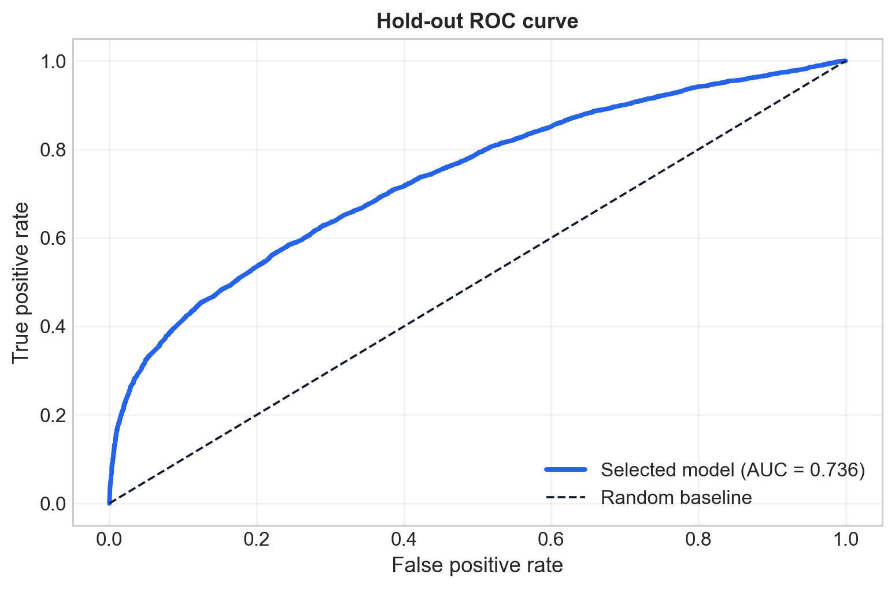{width=100%}
:::
:::

::: aside
Selected threshold is **54.5%** on training OOF predictions, chosen to maximize precision subject to at least **25% recall**; the old dynamic calibration and hold-out diagnostics are kept in the annex for reference.
:::

## Use the amount model for per-opportunity sizing and ranking, not deal-level precision

::: {.columns}
::: {.column width="54%"}
- Target: **Opportunity Amount USD**.
- Business use: **sizing and directional forecasting**.
  - Therefore we focused on error metrics such as MAE (Mean Absolute Error) and especially Median Absolute Percentage Error (MdAPE) since it is scale-invariant and better captures the relative error across the wide deal-size distribution.
- Selected final regression model: **Yeo-Johnson transformed XGBoost regressor** (`xgboost_yeojohnson`), selected by lowest CV Median APE.
- The model beats simple baselines on MAE and Median APE, **but with R² ≈ 0.04, MAE ≈ 66.7k USD, and Median APE ≈ 63%**, deal-level precision remains weak, so the best use case is directional sizing and ranking rather than exact deal-level forecasts.
:::
::: {.column width="46%"}
###### Amount model feature importances:
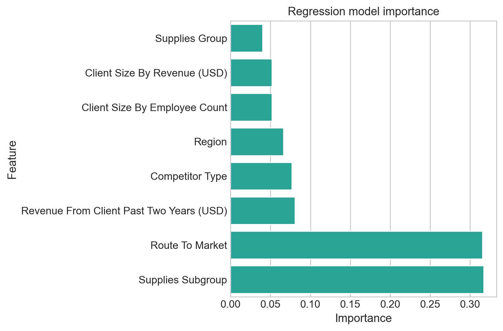{width=100%}
:::
:::

## Use the amount model for per-opportunity sizing and ranking, not deal-level precision (cont., with performance metrics)

::: {.columns}

::: {.column width="54%"}
::: {style="font-size: 80%;"}

The following table shows the selected model's performance on both CV and held-out test:

| Model | Split | R² | MAE | Median APE |
| --- | ---: | ---: | ---: | ---: |
| Selected | CV | 0.041 | 66.7k USD | 63.1% |
| Selected | Held-out test | 0.044 | 66.7k USD | 63.0% |
| Mean baseline | Held-out test | -0.000 | 84.9k USD | 88.3% |
| Median baseline | Held-out test | -0.108 | 74.9k USD | 75.0% |
| Random baseline | Held-out test | -0.972 | 113.4k USD | 90.1% |

  

###### Conclusions:

- Model is more useful for relative sizing and ranking than for exact portfolio totals, which remains the tradeoff from selecting by Median APE.
  - Aggregate actual amount: **2.138B USD** on the held-out test set.
  - Aggregate predicted amount: **1.279B USD** on the held-out test set.
  - Mean absolute error per opportunity: **66.7k USD**.

:::
:::

::: {.column width="46%"}
###### Forecast vs actual scatter plot:
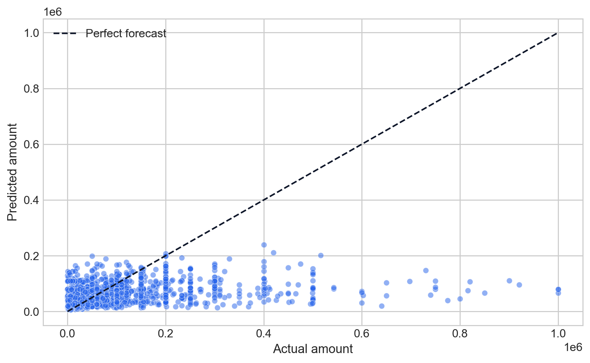{width=100%}

:::
:::

::: aside
The annex keeps the old dynamic validation artifacts for comparison; the main takeaway here is that the static amount model is still directional, not precise.
:::

# Application scenarios {background-color="#1E293B"}

## More than doubling conversion is achievable by focusing on the top 20% of opportunities, without increasing pipeline size

::: {.columns}
::: {.column width="44%"}
- Sales effort is currently spread across low-probability deals → concentrating on the top-scored opportunities can raise conversion efficiency.
  - **Top 20%** of opportunities: **51.7%** conversion vs **22.7%** baseline (**2.27× lift**).

::: aside
This simulation is based on held-out test-set predictions.
:::

:::
::: {.column width="56%"}
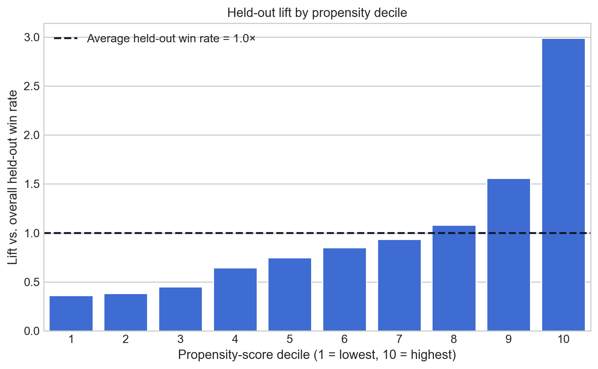{width=100%}
:::
:::

## Concentration (~38% value capture at top 10%) still makes expected-value prioritization useful

::: {.columns}
::: {.column width="56%"}
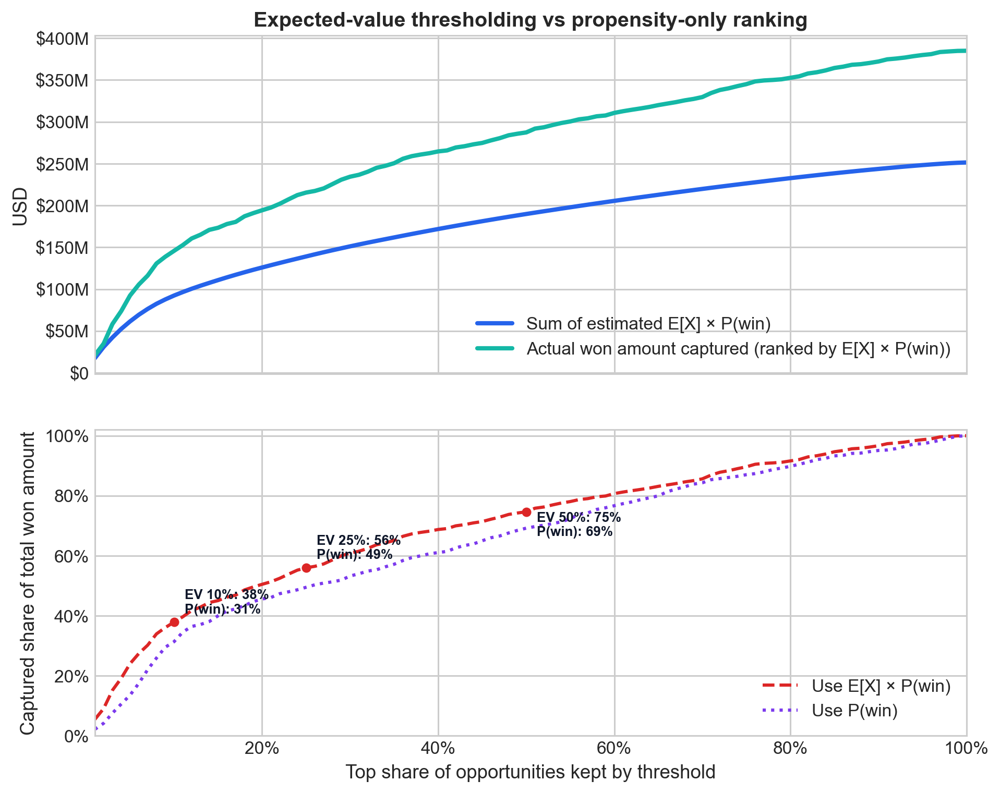{width=80%}
:::

::: {.column width="44%"}
- Rank the pipeline using expected value (E[Amount] × P(Win)), not just propensity especially under limited sales capacity.
  - At top 10%, expected-value ranking captures **37.9%** of won revenue vs **31.4%** with propensity-only.
  - By top 25%, expected-value ranking captures **56.0%** of won revenue, after which the curve starts to flatten.

:::
:::

::: aside
Based on held-out test-set predictions; assumes opportunity amount reflects final deal value, which may not hold.
:::

## Combining model outputs creates actionable commercial segments 

::: {.columns}
::: {.column width="62%"}
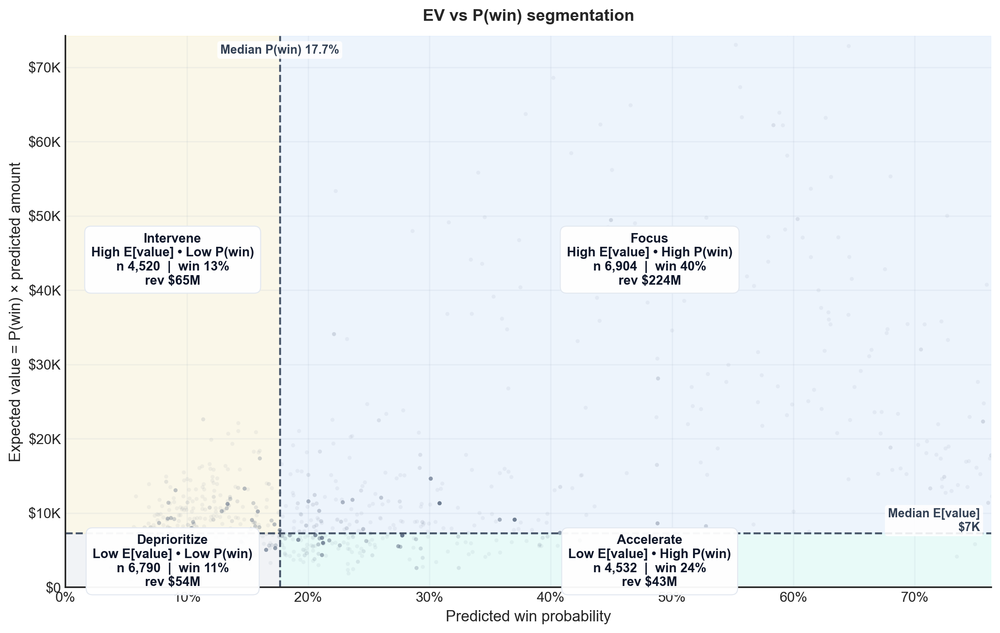{width=100%}
:::
::: {.column width="38%"}
- Simple split, still useful: Combining expected value and win probability separates opportunities into workable commercial tiers even with the weaker static model.
- Clear but more modest performance differences: each segment still shows different conversion rates and revenue contribution.
- Direct CRM translation: Segments map to actions like intervene, focus, accelerate, or deprioritize.
- Operational, not theoretical: This provides a practical decision layer for sales, not just model output.
:::
:::

::: aside
Based on held-out test-set predictions; assumes opportunity amount reflects final deal value, which may not hold. 
:::

## Model outputs should be automatically embedded in the CRM

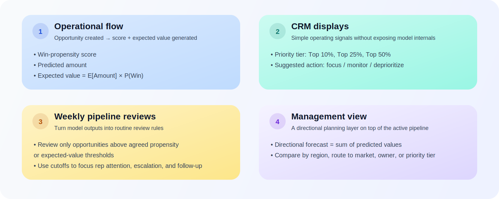{width=100%}

## Model outputs can inform broader commercial strategy

::: {.columns}
::: {.column width="58%"}
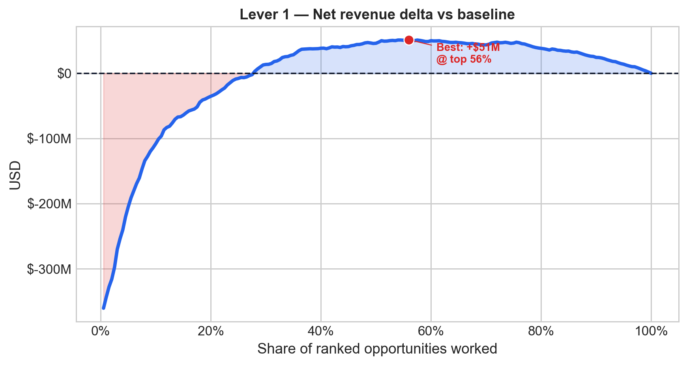{fig-align="center" width=50%}

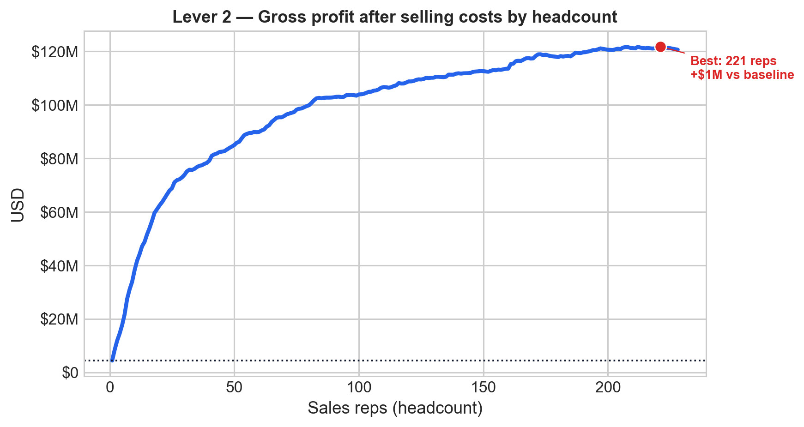{fig-align="center" width=50%}
:::
::: {.column width="42%"}
- **Lever 1, Focus the team**: Simulations show that focusing on a smaller share of opportunities (top **~56%**) can actually increase revenue, reaching $436M (+$51M vs. baseline).
- **Lever 2, Optimize salesforce size**: Slightly reducing to **~221 reps** maintains almost all revenue (99.7%) while improving profitability (~+$1.2M).
  - **Option to split teams**: one focused on high-value opportunities, another covering the rest.
:::
:::

::: aside
 Held-out predictions; Lever 1 uses a decaying focus gain (**2.0×→1.0×**), while Lever 2 uses a practical gross-profit-after-selling-costs formula with base+overhead rep cost, commission, acquisition, and serving costs.
:::

## These simulations show business potential, not final operating estimates

::: {.columns}
::: {.column width="52%"}
- **Simulations are based on held-out observational predictions**, so they are weaker than an actual backtest and/or experiment and they cannot capture the full causal impact of acting on model outputs.
- **Potentially relevant covariates are missing**: the dataset lacks important drivers such as richer account history, rep behavior, pricing context, and external market conditions.
:::
::: {.column width="48%"}
- **Dynamic results are kept in the annex as a benchmark**, because they are much stronger example of how the models could perform under ideal conditions, but also more exposed to timing leakage if the snapshot was taken late in the sales process.
- **Missing business context**: key factors such as sales capacity, cost structure, pricing, and CRM integration were not incorporated or validated with business stakeholders, limiting real-world applicability.
:::
:::

# Conclusions {background-color="#0F172A"}

## Key takeaways for commercial decision-making

- Prioritization is the highest-impact, low-effort lever
  - Propensity: Top 20% opportunities go from **~22.7% win rate (baseline) to ~51.7%**
  - Revenues: ~38% comes from top 10% opportunities, ~56% comes from top 25% opportunities
- Implications for commercial strategy:
  - Focus efforts on the best opportunities first
  - Treat bigger strategic levers cautiously until richer process-history data is available

## Next steps: how to operationalize model-driven sales

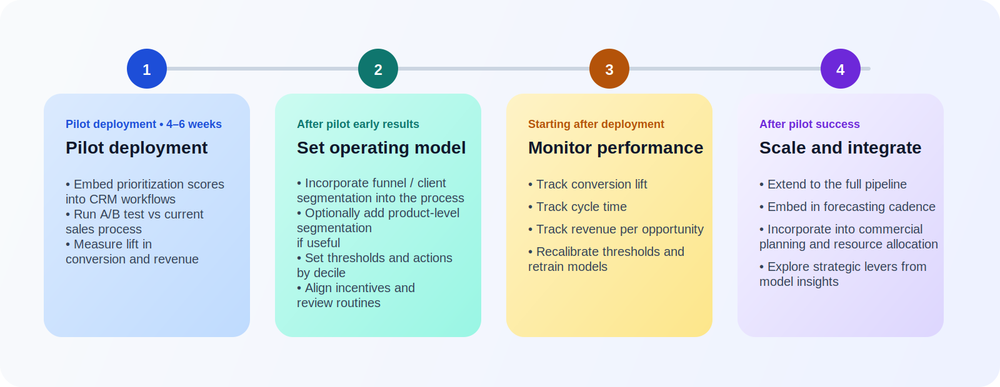{width=100%}

# Thank you {background-color="#0F172A"}
Questions, comments, and feedback are welcome!

# Annexes {background-color="#0F172A"}

## Annex: Team decisions

::: columns

::: column
**Business Development**  
- Non-linear pipeline  
- Value concentration  
- 2 use cases  
- Revenue-based outputs  
- Capacity-aware prioritization  

**Marketing / Sales**  
- Focus / Maintain / Deprioritize  
- Top 20–30% accounts  
- CRM prioritization  
- Rep-aligned thresholds  
:::

::: column
**Business Analytics**  
- Win rate & value skew  
- Key drivers identified  
- Data limitations flagged  

**Data Science**  
- BRF + XGBoost  
- Ranking model  
- 58.1% threshold  
- Business-driven evaluation  
:::

:::

## Annex: static classification CV leaderboard

::: {style="font-size: 80%;"}

| Model | ROC AUC | PR AUC | Accuracy | Precision | Recall | F1 |
| --- | ---: | ---: | ---: | ---: | ---: | ---: |
| random_forest_classifier_balanced_calibrated | **74.0% ± 0.6%** | **52.6% ± 1.3%** | **81.0% ± 0.4%** | 70.5% ± 1.8% | 28.0% ± 1.1% | 40.1% ± 1.4% |
| random_forest_classifier | 73.9% ± 0.7% | 52.5% ± 1.3% | 72.1% ± 0.4% | 41.9% ± 0.8% | **58.7% ± 1.3%** | **48.8% ± 0.9%** |
| random_forest_classifier_balanced | 73.9% ± 0.7% | 52.5% ± 1.3% | 72.1% ± 0.4% | 41.9% ± 0.8% | **58.7% ± 1.3%** | **48.8% ± 0.9%** |
| xgboost | 73.5% ± 0.6% | 51.8% ± 1.5% | 80.8% ± 0.5% | **71.5% ± 1.4%** | 26.4% ± 2.3% | 38.8% ± 2.6% |
| xgboost_balanced | 73.3% ± 0.8% | 51.7% ± 1.5% | 71.2% ± 0.7% | 40.3% ± 0.8% | 58.2% ± 1.6% | 47.6% ± 0.5% |
| logit_elasticnet_robust_scaler_balanced | 72.5% ± 0.5% | 50.9% ± 1.2% | 71.1% ± 0.7% | 40.4% ± 0.6% | 56.7% ± 2.4% | 47.1% ± 0.8% |
| logit_elasticnet_robust_scaler | 72.4% ± 0.5% | 50.9% ± 1.2% | 80.9% ± 0.4% | 70.9% ± 1.6% | 26.7% ± 1.7% | 38.8% ± 2.0% |
| classic_logit_robust_scaler | 72.4% ± 0.5% | 50.9% ± 1.2% | 80.9% ± 0.4% | 70.9% ± 1.6% | 26.8% ± 1.6% | 38.8% ± 1.9% |
| logit_elasticnet_binned_ohe_balanced | 72.4% ± 0.5% | 50.1% ± 0.9% | 70.5% ± 0.6% | 39.7% ± 0.5% | 57.3% ± 2.4% | 46.9% ± 0.7% |
| logit_binned_ohe_balanced | 72.4% ± 0.5% | 50.1% ± 0.9% | 70.5% ± 0.6% | 39.7% ± 0.5% | 57.4% ± 2.4% | 46.9% ± 0.7% |
| logit_binned_ohe_balanced_calibrated | 72.4% ± 0.5% | 50.1% ± 0.9% | 80.6% ± 0.3% | 68.2% ± 2.5% | 27.5% ± 3.1% | 39.0% ± 2.9% |
| logit_elasticnet_binned_ohe | 72.3% ± 0.4% | 50.1% ± 0.9% | 80.6% ± 0.4% | 68.3% ± 2.5% | 27.8% ± 3.3% | 39.4% ± 3.1% |
| logit_binned_ohe | 72.3% ± 0.4% | 50.1% ± 0.9% | 80.6% ± 0.4% | 68.2% ± 2.4% | 27.8% ± 3.2% | 39.4% ± 3.1% |
| logit_elastic_binned_woe_balanced | 71.2% ± 0.5% | 49.7% ± 0.8% | 69.5% ± 0.8% | 38.4% ± 0.6% | 56.7% ± 2.2% | 45.8% ± 0.3% |
| logit_elastic_binned_woe | 71.2% ± 0.5% | 49.7% ± 0.8% | 80.7% ± 0.4% | 68.3% ± 3.2% | 28.2% ± 4.3% | 39.7% ± 4.0% |
| logit_binned_woe | 71.2% ± 0.5% | 49.7% ± 0.8% | 80.6% ± 0.3% | 68.3% ± 3.2% | 28.2% ± 4.3% | 39.7% ± 4.0% |
| random_classifier | 50.2% ± 0.2% | 22.8% ± 0.1% | 65.4% ± 0.1% | 23.0% ± 0.3% | 22.4% ± 0.3% | 22.7% ± 0.3% |
| always_true_classifier | 50.0% ± 0.0% | 22.7% ± 0.0% | 22.7% ± 0.0% | 22.7% ± 0.0% | 100.0% ± 0.0% | 37.0% ± 0.0% |

Selected model in the current main deck: **random_forest_classifier_balanced_calibrated**.

:::

## Annex: static regression CV leaderboard

::: {style="font-size: 80%;"}

| Model | R² | MAE (USD) | MAPE | Median APE |
| --- | ---: | ---: | ---: | ---: |
| xgboost_yeojohnson | 0.041 ± 0.009 | 66.7k ± 1.5k | 158.4% ± 22.3% | 63.1% |
| xgboost_boxcox | 0.041 ± 0.009 | 66.7k ± 1.5k | 158.7% ± 23.9% | 63.1% |
| xgboost_log1p | -0.007 ± 0.009 | 67.6k ± 1.6k | 126.4% ± 19.5% | 63.5% |
| classic_linear_boxcox_robust_scaler | 0.031 ± 0.009 | 67.4k ± 1.5k | 173.5% ± 28.9% | 63.8% |
| classic_linear_yeojohnson_robust_scaler | 0.031 ± 0.009 | 67.4k ± 1.5k | 173.4% ± 28.9% | 63.8% |
| linear_power_scaler_binned_ohe | 0.029 ± 0.009 | 67.5k ± 1.5k | 176.8% ± 30.4% | 63.9% |
| classic_linear_log1p_robust_scaler | -0.017 ± 0.008 | 68.3k ± 1.6k | 144.6% ± 24.8% | 64.4% |
| median_regressor | -0.108 ± 0.002 | 75.0k ± 1.5k | 124.7% ± 28.4% | 74.6% |
| random_forest_regressor | 0.124 ± 0.009 | 74.2k ± 1.1k | 283.4% ± 44.4% | 77.5% |
| xgboost | 0.136 ± 0.008 | 73.8k ± 1.0k | 289.3% ± 46.0% | 78.6% |
| linear_binned_ohe | 0.127 ± 0.008 | 74.7k ± 1.0k | 298.7% ± 52.5% | 78.6% |
| classic_linear_robust_scaler | 0.128 ± 0.007 | 74.7k ± 1.1k | 295.1% ± 50.2% | 78.7% |
| linear_binned_woe_robust_scaler | 0.124 ± 0.008 | 74.8k ± 1.1k | 298.7% ± 56.6% | 79.1% |
| elastic_binned_woe | 0.124 ± 0.008 | 74.8k ± 1.1k | 298.7% ± 56.6% | 79.1% |
| mean_regressor | -0.000 ± 0.000 | 84.9k ± 1.3k | 235.0% ± 53.9% | 88.3% |
| random_regressor | -1.053 ± 0.057 | 115.0k ± 2.1k | 164.1% ± 65.3% | 90.4% |
| xgboost_pseudohubererror | -0.473 ± 0.011 | 92.3k ± 2.0k | 5.3% ± 1.2% | 96.1% |
| elasticnet_robust_scaler | 0.058 ± 0.003 | 80.2k ± 1.2k | 260.0% ± 54.5% | 99.0% |

Selected model in the current main deck: **xgboost_yeojohnson** by CV Median APE.

:::

## Annex: static hold-out calibration of the selected classifier

::: {.columns}
::: {.column width="58%"}
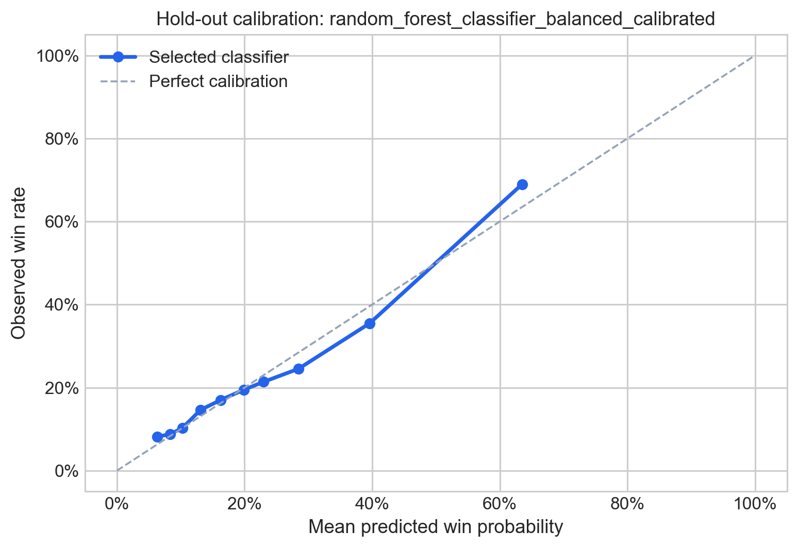{width=100%}
:::
::: {.column width="42%"}
- This chart shows the **selected static classifier** on the held-out set: the calibrated `random_forest_classifier_balanced_calibrated` versus its uncalibrated base `random_forest_classifier_balanced`.
- It compares each model's mean predicted win probability to the observed win rate across quantile bins.
- The closer a curve sits to the 45-degree reference, the more usable those probabilities are for thresholding and expected-value calculations; calibration should mainly improve that probability quality rather than ranking power.
:::
:::

## Annex: static hold-out classification report at the selected model's optimal threshold

::: {.smallest}

Threshold chosen on **training out-of-fold predictions** to maximize **precision subject to recall ≥ 25%** for the selected model: **54.5%** predicted win probability.

| Model | Threshold | Accuracy | Precision | Recall | F1 |
| --- | ---: | ---: | ---: | ---: | ---: |
| Selected @ optimal threshold | 54.5% | 81.0% | 73.5% | 25.3% | 37.6% |
| Random classifier | n/a | 65.1% | 23.5% | 23.6% | 23.5% |
| Always false | n/a | 77.3% | 0.0% | 0.0% | 0.0% |
| Always true | n/a | 22.7% | 22.7% | 100.0% | 37.0% |

| Model | TN | FP | FN | TP |
| --- | ---: | ---: | ---: | ---: |
| Selected @ optimal threshold | 17,104 | 472 | 3,860 | 1,310 |
| Random classifier | 13,597 | 3,979 | 3,951 | 1,219 |
| Always false | 17,576 | 0 | 5,170 | 0 |
| Always true | 0 | 17,576 | 0 | 5,170 |

Diagnostic note: the threshold is selected on train-side OOF predictions, then evaluated once on the untouched hold-out set shown here.

:::

## Annex: static regression error by amount bin on the hold-out set

::: {.columns}
::: {.column width="58%"}
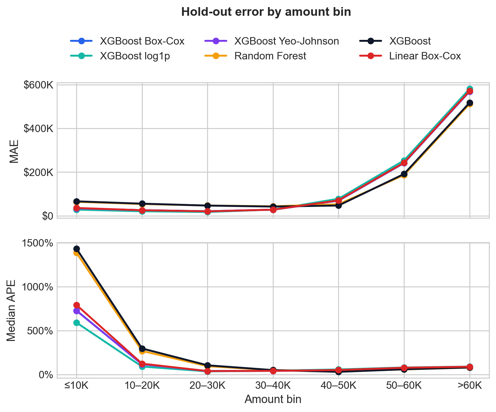{width=100%}
:::
::: {.column width="42%"}
- The comparison shows where model error changes most across deal-size bands, instead of averaging everything into one MAE figure.
- Under the static setup, the transformed XGBoost variants still lead the relative-error ranking, with **XGBoost Yeo-Johnson** narrowly selected overall.
- The main gain still comes from controlling typical proportional error, while the largest opportunities continue to create a gap between deal-level accuracy and total-portfolio forecasting.
:::
:::

## Annex: static held-out forecast bias of the selected amount model

::: {.columns}
::: {.column width="56%"}
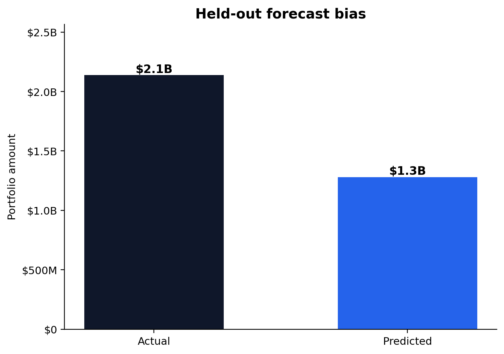{width=100%}
:::
::: {.column width="44%"}
- The selected static amount model under-forecasts the held-out portfolio: **$1.28B predicted** vs **$2.14B actual**.
- That is a gap of about **$859M**, or roughly **40% below** the realized total on the test set.
- This is why the main deck uses the amount model for **directional sizing and ranking**, not as a committed aggregate forecast without an explicit bias-correction layer.
- The same hold-out evaluation still supports the model for per-opportunity ordering because **MAE ≈ $66.7K** and **Median APE ≈ 63%** are judged at deal level, not portfolio-total calibration.
:::
:::

## Annex: data-quality issue profile from the validation notebook

::: {.columns}
::: {.column width="50%"}
{width=100%}
:::
::: {.column width="50%"}
{width=100%}
:::
:::

- Source of truth: `notebooks/1_data_validation_and_cleaning/01_basic_validation.ipynb`, which builds `problem_tags`, `problem_count`, and the row-level validation flags before exporting `cleaned_data.parquet`.
- The row-count distribution shows that most records have **0–1 detected issues**, while the issue-type breakdown shows that the main burden comes from **stage-ratio inconsistencies**, **amount weirdness**, and **only-identified-stage** records.
- This supports the data-prep choice used throughout the deck: remove clearly unusable rows (duplicates, invalid targets) but retain many imperfect rows with explicit flags because the modeling task is ranking and prioritization, not accounting-grade reconciliation.

## Annex: numeric variable correlation heatmap

::: {.columns}
::: {.column width="50%"}
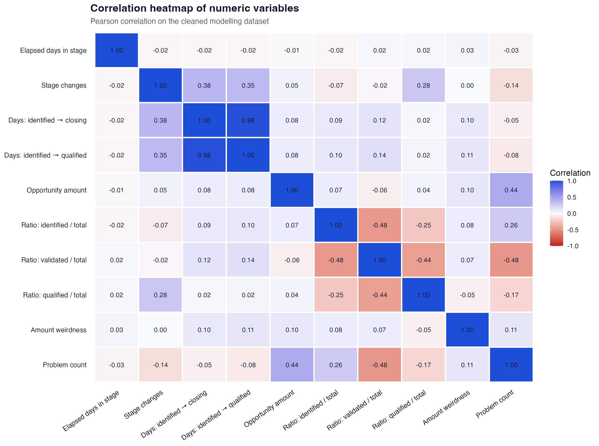{width=100%}
:::
::: {.column width="50%"}
- Most numeric relationships are weak, suggesting limited linear redundancy across variables.
- Process-duration variables are highly correlated (e.g. identified→closing vs identified→qualified), so they likely capture overlapping timing effects.
- Stage-ratio variables show expected inverse relationships, reflecting how progress through the funnel mechanically shifts the composition of stage shares.
:::
:::

## Annex: strategic lever 1 — focus the same team on fewer, better-ranked deals

::: {.columns}
::: {.column width="55%"}
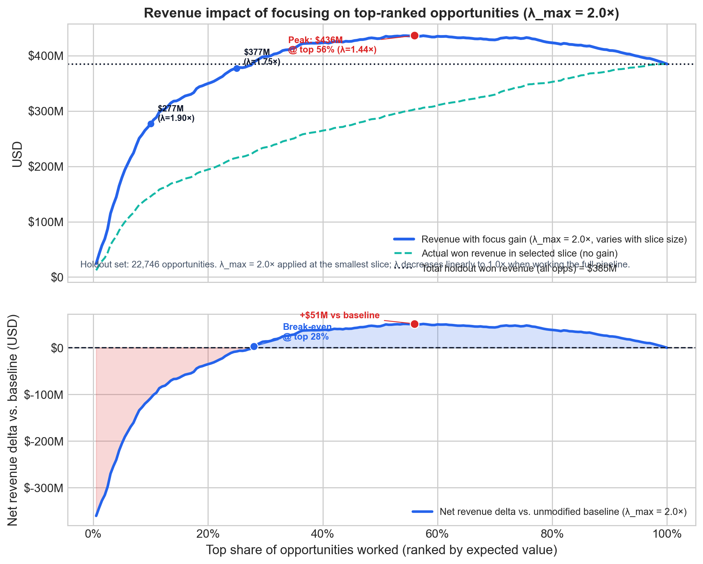{width=88%}
:::
::: {.column width="45%"}
- Same salesforce, fewer deals — dropped opportunities go unworked.
- Focus gain grows as the slice shrinks (λ_max = 2.0× at top slice → 1.0× at full pipeline).
- Break-even at **top ~28%**; optimal at **top ~56%** → **$436M** (+$51M vs. baseline).
:::
:::

::: aside
Focus-gain λ_max is a scenario assumption, not an empirically estimated causal effect. λ decays linearly from λ_max at the smallest slice to 1.0× at the full pipeline. Simulation uses held-out test-set predictions.
:::

## Annex: focus-gain sensitivity across λ values

::: {.columns}
::: {.column width="58%"}
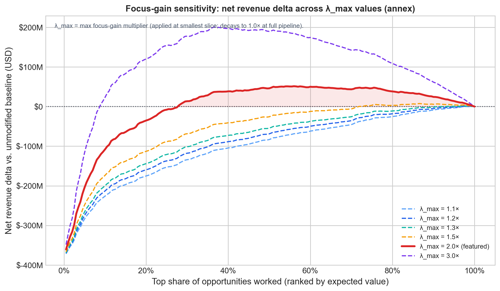{width=100%}
:::
::: {.column width="42%"}
- Each curve shows the **net revenue delta in USD** vs. the full-pipeline baseline for a given λ_max — dropped deals are simply unworked (zero revenue from them), so the only gain is the focus uplift on worked deals.
- λ decays linearly to 1.0× at the full pipeline — so the gain is highest when the team is most concentrated.
- Break-even shifts left as λ_max increases: under the static model, the base scenario breaks even at about **top 28%** of the ranked pipeline when **λ_max = 2.0**.
- The current static deck uses **λ_max = 2.00** as the base scenario.
:::
:::

## Annex: strategic lever 2 — practical gross-profit-after-selling-costs formula

::: {.smaller}

We replace the old `revenue − rep cost` shortcut with a more realistic gross-profit-after-selling-costs measure:

`GrossProfitAfterSellingCosts = RealizedRevenue × margin_pct − SalesEffortCost − CommissionCost − AcquisitionCost − ServingCost`

- **Realized revenue**: `amount_i` if won, else `0`
- **Margin %**: product-group proxy used as a COGS fallback
  - Car Accessories `68%`, Performance & Non-auto `62%`, Tires & Wheels `55%`, Car Electronics `58%`, default `63%`
- **Sales effort cost**: team base+overhead allocated from rep capacity
- **Commission cost**: `7%` of realized revenue
- **Acquisition cost**: route-to-market proxy
  - Fields Sales `2.4k`, Reseller `1.6k`, Telesales `0.85k`, Telecoverage `0.65k`, Other/default lower values
- **Serving cost**: `8%` of realized won amount

Why this matters: it keeps the earlier sales-effort framing, but separates fixed sales coverage from variable selling cost more cleanly, so the staffing curve is closer to how a B2B auto-parts sales team actually earns gross profit after selling costs.

:::

## Annex: Strategic lever 2: Reduce the salesforce and let the model pick the best opportunities

::: {.columns}
::: {.column width="55%"}
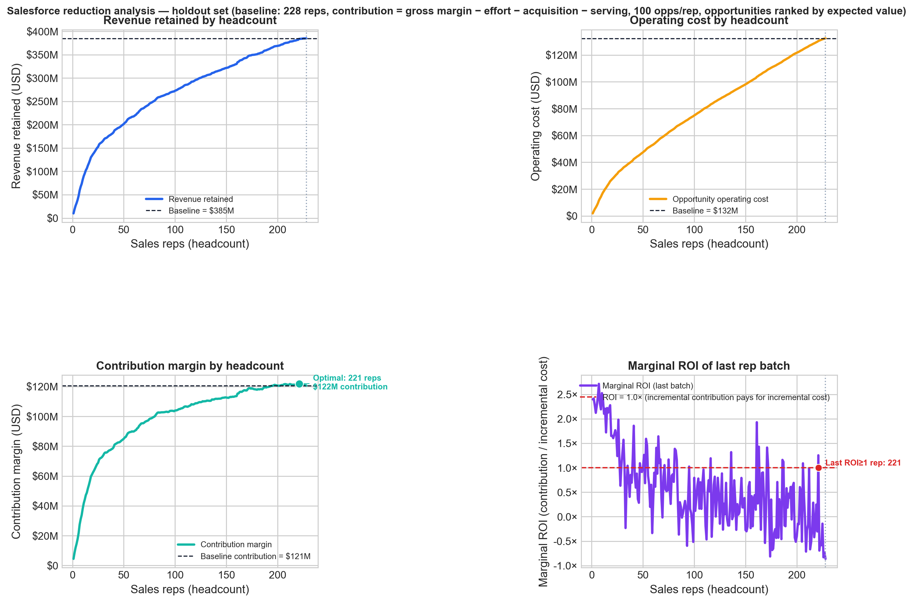{width=100%}
:::
::: {.column width="45%"}
- Baseline: **228 reps**, **$385M** realized revenue, and about **$121M** gross profit after selling costs, after base+overhead, commission, acquisition, and serving costs.
- Model ranks all opportunities by EV; each rep cut drops the lowest-ranked batch they covered.
- **Optimal headcount: 221 reps** → **$384M** revenue retained (99.7%) and **+$1.2M** gross profit after selling costs vs. baseline.
- Last individually positive rep batch is around **rep #221** — beyond that, incremental gross profit after selling costs no longer covers incremental operating cost.
:::
:::

::: aside
Headcount model assumes 100 opps/rep/period. Gross profit after selling costs uses product-margin proxies, **$135K base+overhead per rep**, **7% commission on realized revenue**, route-based acquisition-cost proxies, and an 8% serving-cost proxy. Simulation uses held-out test-set predictions.
:::

## Annex: salesforce reduction — marginal gross profit after selling costs per rep batch

::: {.columns}
::: {.column width="58%"}
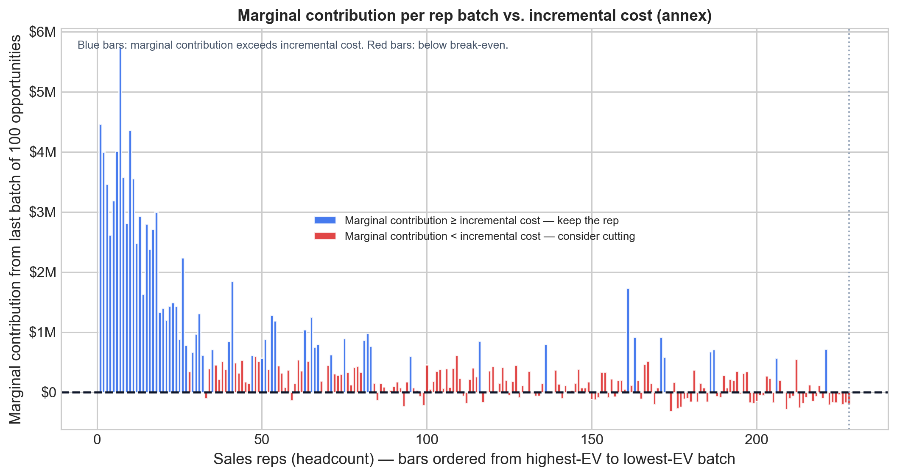{width=100%}

:::
::: {.column width="42%"}
- Each bar shows the **marginal gross profit after selling costs** contributed by a batch of ~12 reps (one 100-opp increment), sorted from highest- to lowest-value batch.
- The comparison line represents the **incremental operating cost** of the same batch, not a flat rep-cost shortcut.
- **Blue bars** are ROI-positive: the batch adds more gross profit after selling costs than cost. **Red bars** are ROI-negative: cutting those reps improves gross profit after selling costs.
- Under the static ranking, the crossover is still late in the curve, which is why the gross-profit-after-selling-costs upside from resizing remains modest.
:::
:::

## Annex: binning methods — easy explanation

::: {.smaller}

- **Binning** means replacing a raw variable with a small number of ranges.
- Instead of using exact values like `17 days`, `43 days`, `91 days`, the model can work with bands like:
  - **0–30 days**
  - **31–60 days**
  - **60+ days**
- This is useful when the signal comes from **thresholds** or **zones**, not from a perfectly smooth linear relationship.
- In practice, binning helps when variables are:
  - noisy
  - skewed
  - sensitive to outliers
  - easier to interpret in ranges than in raw units
- So the intuition is simple: **group similar values together before modeling**.

:::

## Annex: binning methods — what `optbinning` does

::: {.smaller}

- This project uses **supervised binning** with `optbinning`.
- “Supervised” means the bins are not chosen arbitrarily: they are learned using the **target**.
- The algorithm searches for cut points that make the bins as different as possible with respect to the prediction target.
- For classification, that means finding intervals where the **win/loss mix** is clearly different.
- For regression-style use, it means finding intervals that better separate the **amount behavior**.
- Compared with manual bucketing or equal-width bins, `optbinning` is trying to find **more informative splits**.
- In this repo, the wrapper is `NamedBinningProcess` in `notebooks/4_modelling/binning.py`, which keeps the output compatible with the sklearn pipelines used in the experiments.

:::

## Annex: binning methods — the 3 usage modes in this repo

::: {.smaller}

| Usage mode | What the pipeline outputs | Why use it |
| --- | --- | --- |
| `bin` | The learned bin labels themselves | Mainly useful for inspection / debugging / intermediate transforms |
| `bin_ohe` | The learned bins, then one-hot encoded into dummy columns | Keeps non-linear threshold effects while staying interpretable in linear/logistic models |
| `woe` | One WoE value per binned variable | Compresses each variable into a single monotonic signal and often stabilizes logistic-type models |

- **Selected classifier in the main deck:** `random_forest_classifier_balanced_calibrated`
- So the binning modes below describe the **logit-family alternatives** and supporting model variants, not the final chosen forest.
  - supervised bins are learned first
  - then the bins are one-hot encoded
  - then logistic regression is fit
  - then probabilities are calibrated
- **WoE pipelines** in the annex leaderboard use the same supervised binning step, but replace each bin with its **Weight of Evidence** value instead of a set of dummy columns.
- **WoE intuition:** positive WoE = more win-heavy than average; negative WoE = more loss-heavy than average.

:::

## Annex: how feature importance is calculated for tree models

::: {.smaller}

### Random Forest (sklearn)

- Uses **mean decrease in impurity** style importance.
- Each split gives credit to the feature that reduced impurity the most at that node.
- The forest-level importance is the **average impurity reduction across all trees**, then normalized so importances sum to 100%.

### XGBoost

- **Gain** *(default, usually the most useful)*: average reduction in prediction error when the feature is used in splits.

:::

## Annex: how to read IV charts — classification / win-loss

::: {.smaller}

- **Information Value (IV)** is a score used to rank how much predictive signal a variable carries against a target.
- For the **classification / win-loss** chart, IV is the classic binary-target version derived from **Weight of Evidence (WoE)**.

| IV range | Interpretation |
| --- | --- |
| < 0.02 | Useless |
| 0.02 to 0.10 | Weak |
| 0.10 to 0.30 | Medium |
| 0.30 to 0.50 | Strong |
| > 0.50 | Suspiciously high → check for leakage |

- **Colors** add direction, because IV itself is only a strength score:
  - **green** = direct relationship
  - **red** = inverse relationship
  - **gray** = categorical or unclear direction
- **Asterisk (`*`)** = strictly monotonic relationship across bins.
- Very high IV values for process variables can reflect genuinely strong signal, but they should always be checked for **timing leakage**.

:::

## Annex: how to read IV charts — regression / amount

::: {.smaller}

- The **regression / amount** chart does **not** use the same IV definition as the win/loss chart.
- It comes from `ContinuousOptimalBinning`, where IV is a **surrogate separation metric based on differences in bin means**.
- So the regression IV values are useful for **relative ranking within that chart**, but they should **not** be read with the binary-IV table and should **not** be compared numerically to the classification IV values.
- Practical reading rule:
  - use the **classification IV chart** with the standard heuristic bands
  - use the **regression IV chart** only to see which variables separate amount behavior the most within that chart
- This is why regression IV values can look numerically much larger: they are on a **different scale**, not evidence of impossible predictive power.

:::

## Annex: How IV is calculated (Regression)

1. Bin the variable into groups \(i\)

2. Compute mean target per bin:

$$
\mu_i = \text{mean}(y \mid \text{bin } i)
$$

3. Compare to overall mean:

$$
IV = \sum_i w_i \cdot \left| \mu_i - \mu \right|
$$

where:

- $w_i = \frac{n_i}{N}$ is the proportion of observations in bin $i$
- $\mu$ is the global mean of the target  

## Annex: How IV is calculated (classification)

1. Bin the variable into groups \(i\)

2. Compute distributions:

$$
\text{DistGood}_i = \frac{\text{Good}_i}{\text{Total Good}}, \quad
\text{DistBad}_i = \frac{\text{Bad}_i}{\text{Total Bad}}
$$

3. Weight of Evidence:

$$
WoE_i = \ln\left(\frac{\text{DistGood}_i}{\text{DistBad}_i}\right)
$$

4. Information Value:

$$
IV = \sum_i (\text{DistGood}_i - \text{DistBad}_i) \cdot WoE_i
$$

## Annex: original text version of the modelling use-cases slide

::: {.columns}
::: {.column width="52%"}
### Selected for this project

- **Process prioritization**: rank opportunities by win propensity and support decisions on where sales effort should focus first.
- **Opportunity sizing & forecasting**: estimate deal value and aggregate expected sales for planning, prioritization, and budget visibility.
:::
::: {.column width="48%"}
### Additional opportunities identified in the data

- **Channel optimization**: test what-if scenarios around route-to-market and engagement model choices.
- **Secondary market segmentation**: create actionable commercial segments from predicted value and conversion potential.
- **Early warning systems**: flag opportunities that are likely to deteriorate or stall.
- **Budget allocation**: guide sales effort and product-focus decisions across segments, regions, and product lines.
:::
:::

## Annex: original text version of the CRM embedding slide

::: {.columns}
::: {.column width="52%"}
### Operational flow

**Opportunity created** → **score + expected value generated**

- As soon as a new opportunity enters the CRM, the workflow generates:
  - **win-propensity score**
  - **predicted amount**
  - **expected value = E[Amount] × P(Win)**

### CRM displays

- **Priority tier**: Top 10%, Top 25%, Top 50%, etc.
- **Suggested action**: focus / monitor / deprioritize
- This gives frontline teams a simple operating signal without exposing model internals.
:::
::: {.column width="48%"}
### Weekly pipeline reviews

- Review only opportunities above agreed propensity or expected-value thresholds.
- Use those cutoffs to focus rep attention, escalation, and follow-up.

### Management view

- **Directional forecast = sum of predicted values** across the active pipeline.
- Management can compare it by region, route to market, owner, or priority tier.
:::
:::

## Annex: original text version of the Next steps slide

- Pilot deployment (4–6 weeks):
  - Embed prioritization scores into CRM workflows
  - Run A/B test vs. current sales process and measure lift in conversion and revenue
- Define operating model (after pilot early results):
  - Incorporate funnel/client segmentation into the process
  - Potentially include product-level segmentation if it makes sense.
  - Set clear thresholds and actions (e.g., top deciles = sales focus)
  - Align sales forces with incentives and pipeline reviews to make sure model outputs are used effectively
- Monitor performance (starting after deployment):
  - Track conversion lift, cycle time, and revenue per opportunity
  - Continuously recalibrate thresholds and retrain models
- Scale and integrate (after pilot success):
  - Extend to full pipeline and embed in forecasting cadence
  - Incorporate into commercial planning and resource allocation
  - Explore applying strategic levers such as pipeline optimization and salesforce adjustments based on model insights

## Annex: classification CV leaderboard

::: {style="font-size: 80%;"}

| Model | ROC AUC | PR AUC | Accuracy | Precision | Recall | F1 |
| --- | ---: | ---: | ---: | ---: | ---: | ---: |
| xgboost | **92.9% ± 0.4%** | **82.2% ± 0.5%** | **88.3% ± 0.4%** | **78.5% ± 0.9%** | 66.8% ± 1.2% | 72.2% ± 0.9% |
| xgboost_balanced | 92.8% ± 0.4% | 82.0% ± 0.6% | 86.2% ± 0.6% | 65.7% ± 1.3% | **82.0% ± 0.5%** | **72.9% ± 0.9%** |
| random_forest_classifier | 91.4% ± 0.4% | 77.3% ± 1.0% | 84.7% ± 0.6% | 62.6% ± 1.1% | 80.9% ± 0.6% | 70.6% ± 1.0% |
| random_forest_classifier_balanced | 91.4% ± 0.4% | 77.3% ± 1.0% | 84.7% ± 0.6% | 62.6% ± 1.1% | 80.9% ± 0.6% | 70.6% ± 1.0% |
| random_forest_classifier_balanced_calibrated | 91.2% ± 0.4% | 76.7% ± 1.2% | 86.9% ± 0.4% | 73.2% ± 1.1% | 66.6% ± 1.0% | 69.8% ± 0.8% |
| logit_elasticnet_binned_ohe_balanced | 88.1% ± 0.4% | 69.8% ± 0.5% | 79.4% ± 0.8% | 53.0% ± 1.2% | 81.8% ± 0.8% | 64.3% ± 1.1% |
| logit_binned_ohe_balanced | 88.1% ± 0.4% | 69.8% ± 0.5% | 79.4% ± 0.8% | 53.0% ± 1.1% | 81.8% ± 0.8% | 64.3% ± 1.0% |
| logit_binned_ohe_balanced_calibrated | 88.1% ± 0.4% | 69.8% ± 0.5% | 84.0% ± 0.3% | 71.1% ± 0.7% | 50.1% ± 1.2% | 58.8% ± 1.0% |
| logit_binned_ohe | 88.1% ± 0.4% | 70.0% ± 0.5% | 84.2% ± 0.3% | 71.1% ± 0.9% | 51.3% ± 1.3% | 59.6% ± 1.1% |
| logit_elasticnet_binned_ohe | 88.1% ± 0.4% | 70.0% ± 0.5% | 84.2% ± 0.3% | 71.3% ± 0.8% | 51.0% ± 1.2% | 59.4% ± 1.0% |
| logit_elastic_binned_woe_balanced | 87.7% ± 0.4% | 69.2% ± 0.3% | 79.0% ± 0.6% | 52.4% ± 0.9% | 80.9% ± 0.6% | 63.6% ± 0.7% |
| logit_elastic_binned_woe | 87.7% ± 0.4% | 69.3% ± 0.4% | 83.8% ± 0.2% | 71.7% ± 0.9% | 47.3% ± 1.1% | 57.0% ± 0.9% |
| logit_binned_woe | 87.7% ± 0.4% | 69.3% ± 0.4% | 83.8% ± 0.2% | 71.8% ± 0.8% | 47.3% ± 0.9% | 57.0% ± 0.8% |
| logit_elasticnet_robust_scaler_balanced | 86.8% ± 0.6% | 66.9% ± 1.1% | 78.7% ± 0.7% | 52.0% ± 1.0% | 79.6% ± 1.1% | 62.9% ± 1.1% |
| logit_elasticnet_robust_scaler | 86.8% ± 0.6% | 67.5% ± 1.1% | 82.8% ± 0.2% | 68.4% ± 0.6% | 45.5% ± 1.1% | 54.6% ± 0.8% |
| classic_logit_robust_scaler | 86.8% ± 0.6% | 67.5% ± 1.1% | 82.8% ± 0.2% | 68.4% ± 0.6% | 45.5% ± 1.1% | 54.7% ± 0.8% |
| random_classifier | 50.2% ± 0.2% | 22.8% ± 0.1% | 65.4% ± 0.1% | 23.0% ± 0.3% | 22.4% ± 0.3% | 22.7% ± 0.3% |
| always_true_classifier | 50.0% ± 0.0% | 22.7% ± 0.0% | 22.7% ± 0.0% | 22.7% ± 0.0% | 100.0% ± 0.0% | 37.0% ± 0.0% |

Selected model in main deck: **random_forest_classifier_balanced_calibrated**.

:::

## Annex: regression CV leaderboard

::: {style="font-size: 80%;"}

| Model | R² | MAE (USD) | MAPE | Median APE |
| --- | ---: | ---: | ---: | ---: |
| xgboost_boxcox | 0.062 ± 0.010 | 65.1k ± 1.5k | 164.1% ± 31.2% | 61.7% |
| xgboost_log1p | 0.015 ± 0.009 | 65.9k ± 1.5k | 131.3% ± 26.1% | 61.8% |
| xgboost_yeojohnson | 0.062 ± 0.010 | 65.1k ± 1.5k | 165.2% ± 32.3% | 61.8% |
| linear_power_scaler_binned_ohe | 0.043 ± 0.009 | 66.7k ± 1.4k | 180.5% ± 37.7% | 63.6% |
| classic_linear_yeojohnson_robust_scaler | 0.041 ± 0.007 | 66.8k ± 1.4k | 176.1% ± 34.3% | 63.8% |
| classic_linear_boxcox_robust_scaler | 0.041 ± 0.007 | 66.8k ± 1.4k | 176.2% ± 34.3% | 63.9% |
| classic_linear_log1p_robust_scaler | -0.006 ± 0.006 | 67.7k ± 1.5k | 148.3% ± 30.7% | 64.1% |
| median_regressor | -0.108 ± 0.002 | 75.0k ± 1.5k | 124.7% ± 28.4% | 74.6% |
| random_forest_regressor | 0.147 ± 0.009 | 72.7k ± 0.9k | 292.2% ± 65.4% | 75.5% |
| xgboost | 0.156 ± 0.008 | 72.3k ± 0.9k | 294.6% ± 54.5% | 77.8% |
| xgboost_pseudohubererror | -0.477 ± 0.012 | 92.7k ± 1.5k | 458.8% ± 94.4% | 96.9% |
| classic_linear_robust_scaler | 0.134 ± 0.006 | 74.3k ± 1.1k | 297.1% ± 54.9% | 78.9% |
| linear_binned_ohe | 0.134 ± 0.007 | 74.3k ± 1.0k | 300.4% ± 55.2% | 78.9% |
| elastic_binned_woe | 0.131 ± 0.008 | 74.3k ± 1.1k | 298.7% ± 58.7% | 79.3% |
| linear_binned_woe_robust_scaler | 0.131 ± 0.008 | 74.3k ± 1.1k | 298.7% ± 58.7% | 79.3% |
| mean_regressor | -0.000 ± 0.000 | 84.9k ± 1.3k | 235.0% ± 53.9% | 88.3% |
| random_regressor | -1.053 ± 0.057 | 115.0k ± 2.1k | 164.1% ± 65.3% | 90.4% |
| elasticnet_robust_scaler | 0.066 ± 0.003 | 79.7k ± 1.3k | 260.6% ± 58.1% | 97.6% |

Selected model in main deck: **xgboost_boxcox** by CV Median APE, tie-broken by MAE.

:::

## Annex: hold-out calibration of the selected classifier

::: {.columns}
::: {.column width="58%"}
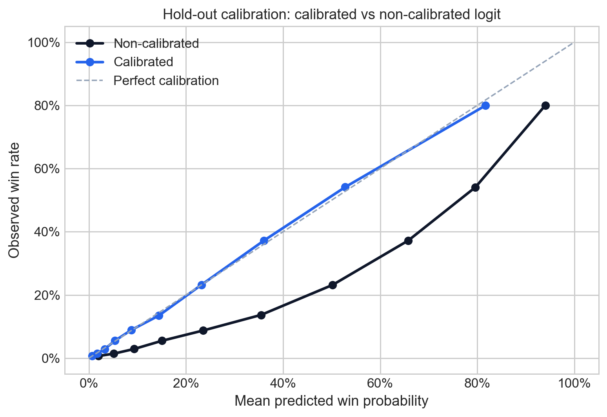{width=100%}
:::
::: {.column width="42%"}
- This chart shows the **selected classifier itself** on the held-out set: `random_forest_classifier_balanced_calibrated`.
- It compares the model's mean predicted win probability to the observed win rate across quantile bins.
- The closer the curve sits to the 45-degree reference, the more usable the probabilities are for thresholding and expected-value calculations.
:::
:::

## Annex: hold-out classification report at the selected model's optimal threshold

::: {.smallest}

Threshold chosen on **training out-of-fold predictions** by maximizing **F1** for the selected model: **37.8%** predicted win probability.

| Model | Threshold | Accuracy | Precision | Recall | F1 |
| --- | ---: | ---: | ---: | ---: | ---: |
| Selected @ optimal threshold | 37.8% | 85.8% | 66.8% | 74.7% | 70.5% |
| Random classifier | n/a | 65.1% | 23.5% | 23.6% | 23.5% |
| Always false | n/a | 77.3% | 0.0% | 0.0% | 0.0% |
| Always true | n/a | 22.7% | 22.7% | 100.0% | 37.0% |

| Model | TN | FP | FN | TP |
| --- | ---: | ---: | ---: | ---: |
| Selected @ optimal threshold | 15,751 | 1,825 | 1,359 | 3,811 |
| Random classifier | 13,597 | 3,979 | 3,951 | 1,219 |
| Always false | 17,576 | 0 | 5,170 | 0 |
| Always true | 0 | 17,576 | 0 | 5,170 |

Diagnostic note: the threshold is selected on train-side OOF predictions, then evaluated once on the untouched hold-out set shown here.

:::

## Annex: regression error by amount bin on the hold-out set

::: {.columns}
::: {.column width="58%"}
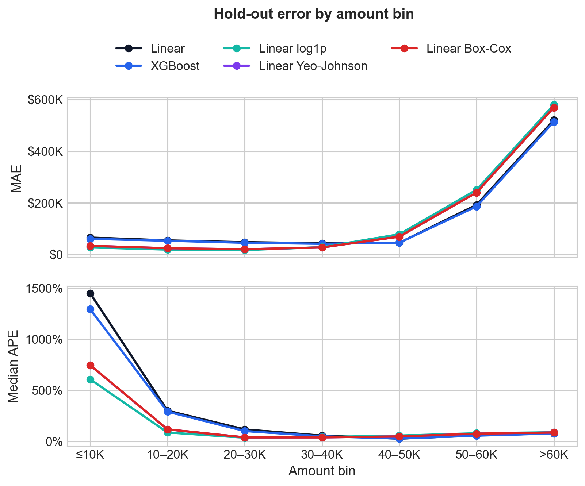{width=100%}
:::
::: {.column width="42%"}
- The comparison shows where model error changes most across deal-size bands, instead of averaging everything into one MAE figure.
- The transformed XGBoost variants dominate the relative-error ranking, with **XGBoost Box-Cox** narrowly leading overall.
- The main gain comes from reducing typical proportional error, while the largest opportunities still drive a gap between per-deal accuracy and total-portfolio forecasting.
:::
:::

## Annex: held-out forecast bias of the selected amount model

::: {.columns}
::: {.column width="56%"}
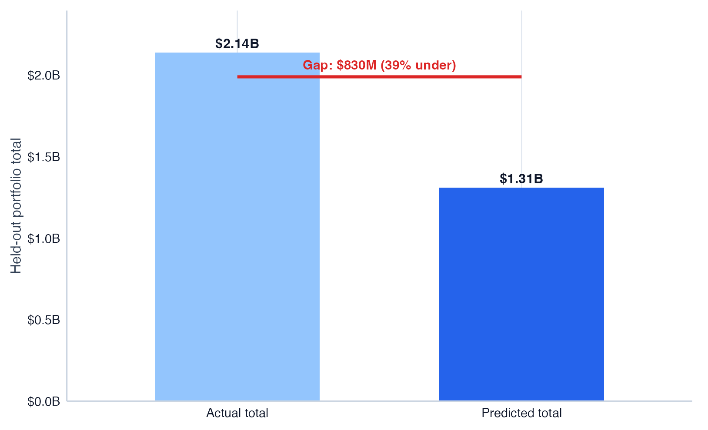{width=100%}
:::
::: {.column width="44%"}
- The selected amount model under-forecasts the held-out portfolio: **$1.31B predicted** vs **$2.14B actual**.
- That is a gap of about **$830M**, or roughly **39% below** the realized total on the test set.
- This is why the main deck uses the amount model for **directional sizing and ranking**, not as a committed aggregate forecast without an explicit bias-correction layer.
- The same hold-out evaluation still supports the model for per-opportunity ordering because **MAE ≈ $65K** and **Median APE ≈ 61%** are judged at deal level, not portfolio-total calibration.
:::
:::

## Annex: strategic lever 1 — focus the same team on fewer, better-ranked deals

::: {.columns}
::: {.column width="55%"}
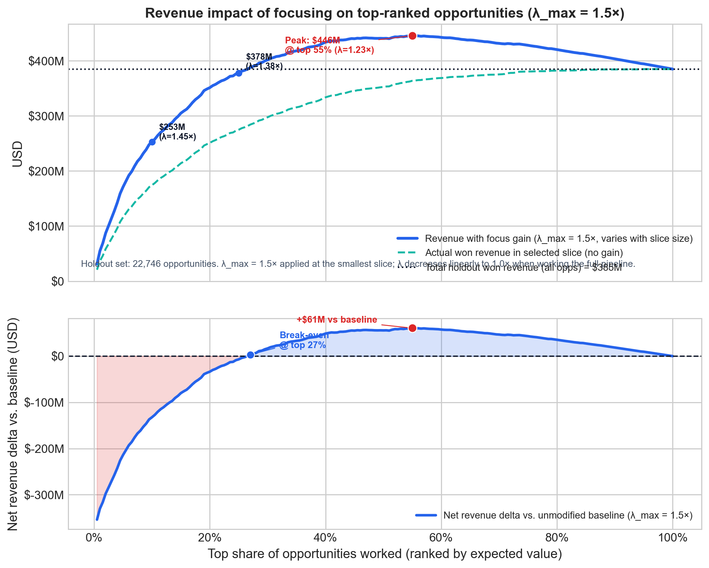{width=88%}
:::
::: {.column width="45%"}
- Same salesforce, fewer deals — dropped opportunities go unworked.
- Focus gain grows as the slice shrinks (λ_max = 2.0× at top slice → 1.0× at full pipeline).
- Break-even at **top ~12%**; optimal at **top ~42%** → **$566M** (+$181M vs. baseline).
:::
:::

::: aside
Focus-gain λ_max is a scenario assumption, not an empirically estimated causal effect. λ decays linearly from λ_max at the smallest slice to 1.0× at the full pipeline. Simulation uses held-out test-set predictions.
:::

## Annex: focus-gain sensitivity across λ values

::: {.columns}
::: {.column width="58%"}
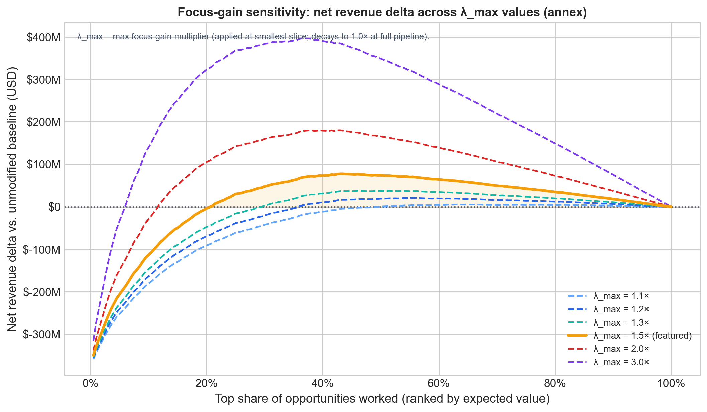{width=100%}
:::
::: {.column width="42%"}
- Each curve shows the **net revenue delta in USD** vs. the full-pipeline baseline for a given λ_max — dropped deals are simply unworked (zero revenue from them), so the only gain is the focus uplift on worked deals.
- λ decays linearly to 1.0× at the full pipeline — so the gain is highest when the team is most concentrated.
- Break-even shifts left as λ_max increases: with the rerun dynamic classifier, the base scenario breaks even at about **top 12%** of the ranked pipeline when **λ_max = 2.0**.
- The current simulation uses **λ_max = 2.00** as the base scenario.
:::
:::

## Annex: Strategic lever 2: Reduce the salesforce and let the model pick the best opportunities

::: {.columns}
::: {.column width="55%"}
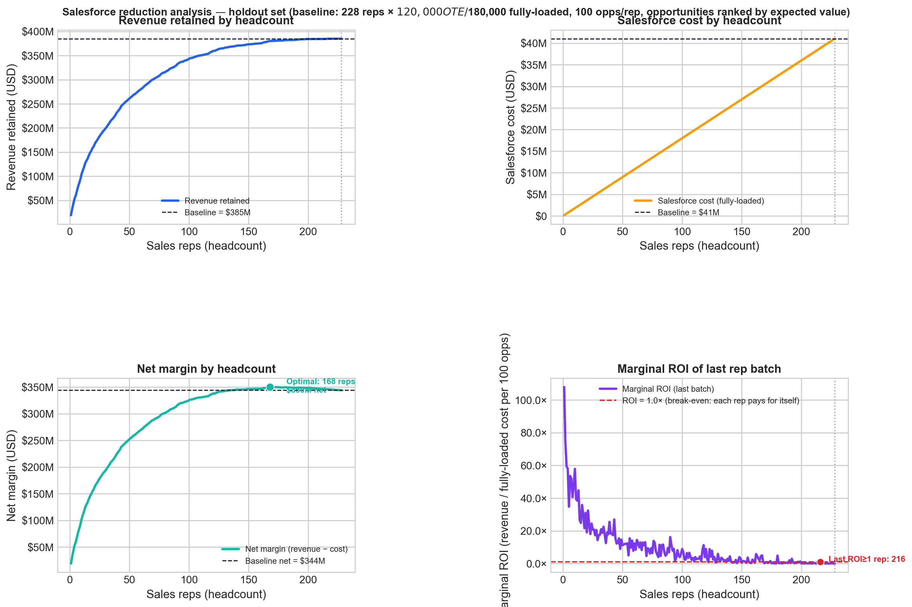{width=100%}
:::
::: {.column width="45%"}
- Baseline: **228 reps**, **$385M** realized revenue, and about **$121M** gross profit after selling costs, after base+overhead, commission, acquisition, and serving costs.
- Model ranks all opportunities by EV; each rep cut drops the lowest-ranked batch they covered.
- **Optimal headcount: 100 reps** → **$361M** revenue retained (93.8%) and **+$29.5M** gross profit after selling costs vs. baseline.
- Last individually positive rep batch is around **rep #82** — after that point, incremental gross profit after selling costs no longer covers incremental operating cost.
:::
:::

::: aside
Same gross-profit-after-selling-costs formula as the static version, but applied to the stronger dynamic ranking. Simulation uses held-out test-set predictions.
:::

## Annex: salesforce reduction — marginal gross profit after selling costs per rep batch

::: {.columns}
::: {.column width="58%"}
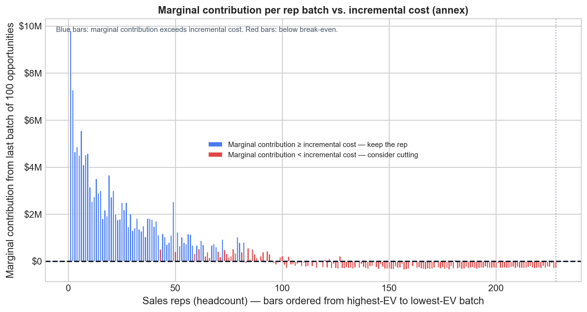{width=100%}

:::
::: {.column width="42%"}
- Each bar shows the **marginal gross profit after selling costs** contributed by a batch of ~12 reps (one 100-opp increment), sorted from highest- to lowest-value batch.
- The comparison line represents the **incremental operating cost** of the same batch.
- **Blue bars** are ROI-positive: the batch adds more gross profit after selling costs than cost. **Red bars** are ROI-negative: cutting those reps improves gross profit after selling costs.
- With the stronger dynamic ranking, the crossover happens much earlier, around **rep #82**, which is why the resized team becomes much smaller under this richer formula.
:::
:::
