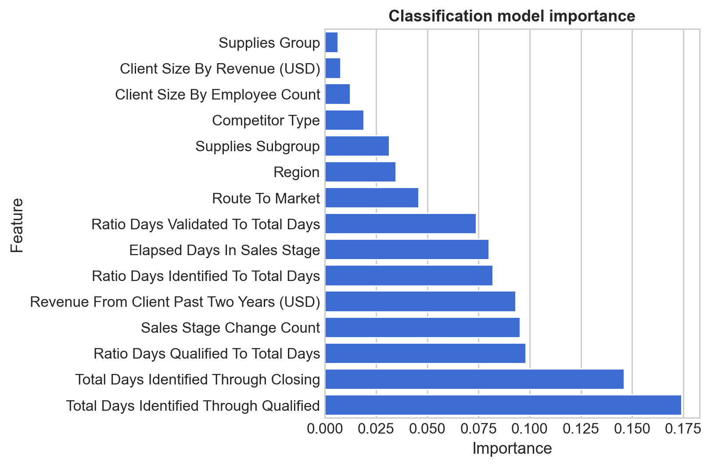
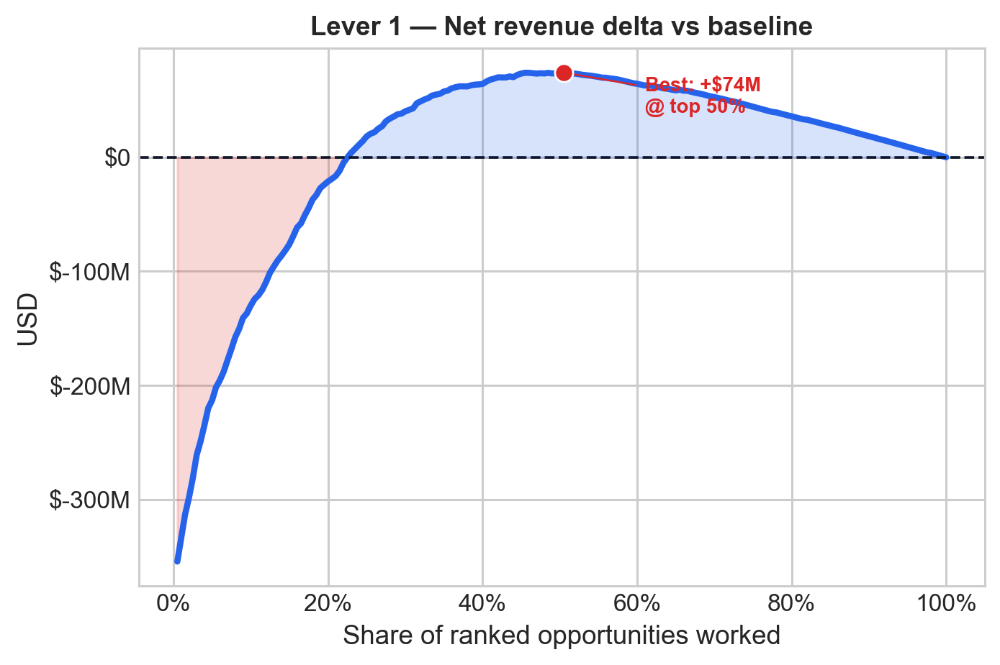
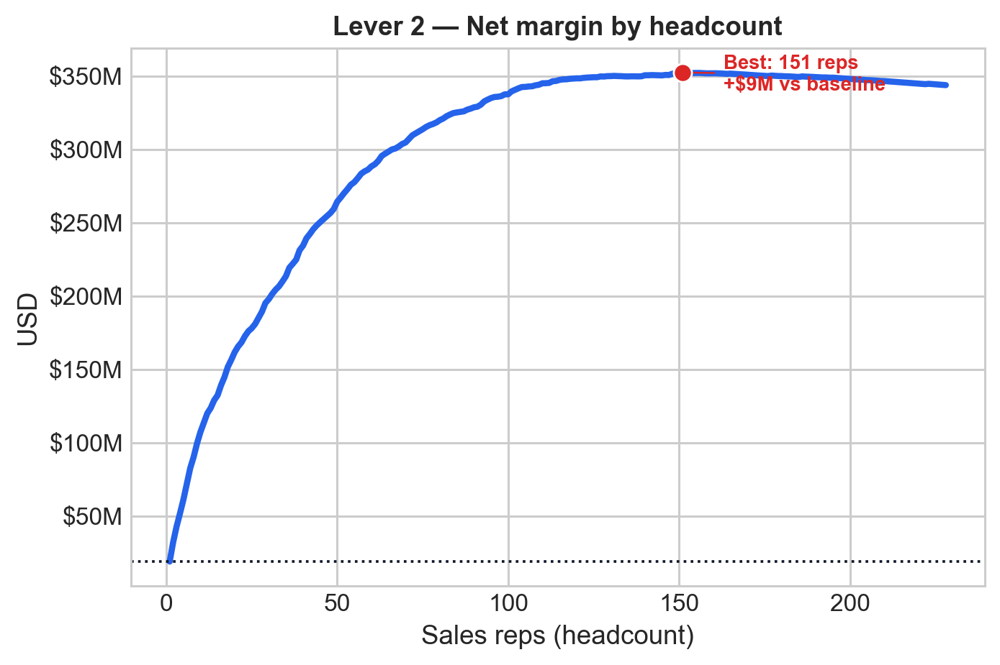

## Executive Summary

- This analysis examines an auto-parts sales opportunity pipeline, identifying structural inefficiencies (i.e. CRM input errors, lack of prioritization, and inaccurate forecasting) that drive a structurally low 22.7% conversion rate.
- We propose two models: a win/loss classifier (**AUROC 91.2%**) for opportunity prioritization, and a regression model for deal sizing and aggregate forecasting (reliable at portfolio level, not per deal).
- Focusing on the top 20% of opportunities lifts conversion from 22.7% to ~74%; the top 10% captures ~46% of total pipeline value.
- We recommend embedding scores in the CRM at opportunity creation, piloting via A/B test, and setting clear thresholds to operationalize prioritization in sales workflows.
- We also simulate strategic levers such as pipeline optimization and salesforce adjustments to show how model-driven prioritization can improve commercial efficiency.

## Agenda

1. Business framing and process assumptions
2. Dataset and target overview
3. EDA findings that matter for prioritization and forecasting
4. Modelling approach and model outputs
5. Application simulations
6. Conclusions and next steps

# Business framing {background-color="#0F172A"}

## The sales process is non-linear, and the data captures its current state

::: {.columns}
::: {.column width="56%"}
- The current sales process tracks auto-parts opportunities across both new leads and existing customers.
- Opportunities transition between the stages Data entry → Identified / Qualifying →  Qualified / Validating, and Validated / Gaining Agreement → Closed (Win/Loss). 
  - Opportunities can move between stages in either direction, and they can also stall within a stage for extended periods.
  - Each opportunity ultimately resolves as either a win or a loss.
  - Sales teams maintain an estimated deal value, which is updated as the opportunity progresses.
:::
::: {.column width="44%"}
{width=100%}
:::
:::

## Most value sits in a small share of opportunities making prioritization an important growth lever

::: {.columns}
::: {.column width="56%"}
###### Conversion and value concentration across the pipeline:
{width=94%}
:::
::: {.column width="44%"}
- The pipeline is high-volume but low-yield: only 22.7% of opportunities convert, meaning most effort is currently misallocated.
- Value is highly concentrated: the majority of opportunities are low-amount, but win rates increase materially with deal size, signaling where commercial focus should shift.
- This creates a clear opportunity: → Move from volume-driven selling to value-driven prioritization, combining win propensity + deal size.
- The implication is direct: → Not all opportunities should be pursued equally — targeting the right deals can lift conversion and revenue without increasing pipeline size.
:::
:::

## Therefore, we propose two modelling use cases: prioritization and forecasting, plus additional data-driven commercial opportunities.

{width=100%}

# Exploratory data analysis {background-color="#0F172A"}

## The dataset was analyzed and prepared with the two use cases in mind, which shaped the EDA focus and modelling choices

::: {.columns}
::: {.column width="52%"}
- **Scale**: 78,025 sales opportunities and **19 variables** like:
  - at-start information: client size, opportunity type, product category, region, etc.
  - sales process details: elapsed time, stage changes, stage ratios, etc.
  - targets like amount and win/loss status.
- Validation removed duplicates and zero-amount opportunities prior to modelling; remaining data issues were intentionally retained.
- For the modelling experiments shown here, the sample used **75,819 eligible rows** out of **78,025 total rows** with valid targets.
:::
::: {.column width="48%"}
###### Row counts per type of data quality issue:
{width=100%}
:::
:::

<!-- - **What the data is good for**: ranking opportunities, understanding portfolio mix, and producing aggregate forecasts.
- **What it is not**: a full event history of every sales-stage movement.
- The dataset should therefore be read as a **current-state commercial view** of the pipeline. -->

## Align coverage and service models to client size, focusing scalable playbooks on small clients and dedicated effort on high-value accounts.

::: {.columns}
::: {.column width="58%"}
###### Opportunity counts and win rates by client-size segment:
{width=100%}
:::
::: {.column width="42%"}
- The portfolio is heavily concentrated in **100K or less** clients, so this segment should drive base operating playbooks and coverage models.
- Conversion is relatively similar across most size bands, which means client size is more useful for **commercial treatment and value management** than for win-rate targeting alone.
- Larger accounts still matter because deal economics improve materially with size, so client-size segmentation should inform account prioritization, service model, and sales effort allocation.
:::
:::

## Treat acquisition and expansion as distinct growth engines, each with its own playbook and resource model.

::: {.columns}
::: {.column width="42%"}
- **(Re)Acquisition** / no business in the past two years: 69,208 opportunities with a **17.3%** observed win rate.
- **Engagement / upselling**: 8,817 opportunities with a **63.9%** observed win rate.
- This is a practical first-layer funnel split for go-to-market operations because it separates low-history acquisition work from higher-propensity expansion opportunities.
:::
::: {.column width="58%"}
###### Opportunity counts and win rates by funnel stage:
{width=100%}
:::
:::

## Performance differences are driven by product mix, not geography

::: {.columns}
::: {.column width="70%"}
###### Distribution of amount and win rates by type, subtype, and region:
{width=98%}

:::
::: {.column width="30%" style="font-size: 82%;"}
- Region is not a strong driver of conversion or deal size
- Type and subtype drive meaningful variation in both outcomes
- Prioritization should be product-driven, not geography-driven
  - Challenging experiments should be run because this may reflect historical sales focus rather than true underlying demand differences.
:::
:::

## Eventually an automated IV ranking was ran to identify the strongest predictors for both win/loss and amount

::: {.columns}
::: {.column width="52%"}
{width=100%}
:::
::: {.column width="48%"}
{width=100%}
:::
:::

- The left chart shows IVs against the **win/loss target**, while the right chart shows IVs against the **amount target**, using the full set of variables that enter the models.
- Process-time variables and stage-ratio features remain among the strongest signals for classification, while the amount target keeps a broader but still process-heavy IV profile.

# Modelling {background-color="#0F172A"}

## We have two modelling setups in mind for different stages of the sales process but just the most complete one is shown here

::: {.columns}
::: {.column width="50%"}
### Static / pre-sales process model

- Used for **early decisions** at opportunity creation especially around prioritization and sizing.
- Uses only **at-creation variables**: product / route / region / client-size / past-revenue descriptors.
- Best for **early triage** before any stage history exists.
:::
::: {.column width="50%"}
### Dynamic / during sales process model

- Used for **ongoing re-prioritization and re-sizing** during the process.
- Uses the static variables **plus process-state variables**: elapsed time, stage changes, cumulative timing, and stage ratios.
- **This is the setup used here.**
:::
:::

::: aside
Both setups would improve with better covariates, especially  outcomes and process variables from previous process runs for the same client.
:::

## For both classification and regression, we used an stratified train/test split to ensure realistic evaluation

::: {.columns}
::: {.column width="50%"}
- **Train / test split**: **70% / 30%**
  - Train: **53,073** rows
  - Test: **22,746** rows
- The split was **stratified jointly** on:
  - win/loss target
  - amount buckets
- This keeps both outcome balance and deal-size mix stable across train and test.
- In the final models, different preprocessing techniques were used for both the X and the y, but the same train/test split was used for a fair performance estimate.
- All models were trained with 5-fold cross-validation on the train set, and the final selected models were evaluated on the held-out test set for a realistic performance estimate.
:::
::: {.column width="46%"}
###### Set distribution treemap:
{width=100%}
:::
:::

## Prioritization classification model enables immediate and precise reallocation of sales effort

::: {.columns}
::: {.column width="54%"}
- Target: **Opportunity Result**.
- Business use: **process prioritization** and ranking the pipeline by win propensity.
  - Therefore we focused on ranking metrics such as ROC AUC and PR AUC.
- We used all the variables except for the amount target and deal size.
- Selected final classifier: **Balanced Random Forest over the classic preprocessed feature set** (`random_forest_classifier_balanced`).
- This model has strong performance (**AUROC 91.2%, Accuracy 86.1% @ 58.1% threshold**) versus the baselines (**AUROC 50.0%, Accuracy 77.3%** for the always-false classifier).
:::
::: {.column width="50%"}
###### Classification model feature importances:
{width=100%}
:::
:::

::: aside
We selected the balanced random forest because it combines top-tier ranking performance with the strongest thresholded operating profile among the models we tested, accepting less interpretability than the logistic alternatives.
:::

## Prioritization classification model enables immediate and precise reallocation of sales effort (cont., with performance metrics)

::: {.columns}
::: {.column width="57%"}
::: {style="font-size: 70%;"}

The following table shows the selected model's performance on both CV and held-out test, compared to random and simple baselines:

| Model | Split | ROC AUC | PR AUC | Accuracy | Precision | Recall | F1 |
| --- | --- | ---: | ---: | ---: | ---: | ---: | ---: |
| Selected | CV | 91.4% | 77.3% | 86.4% | 68.6% | 74.4% | 71.4% |
| Selected | Held-out test | 91.2% | 76.9% | 86.1% | 68.0% | 73.8% | 70.8% |
| Random baseline | Held-out test | 50.5% | 22.9% | 65.1% | 23.5% | 23.6% | 23.5% |
| Always false baseline | Held-out test | 50.0% | 22.7% | 77.3% | 0.0% | 0.0% | 0.0% |
| Always true baseline | Held-out test | 50.0% | 22.7% | 22.7% | 22.7% | 100.0% | 37.0% |

 

::: {style="font-size: 80%;"}
Conclusions:

- The model has strong ranking performance (**AUROC 91.2% on hold-out**) and good precision/recall balance at the selected threshold, which makes it a good candidate for prioritization.
:::

:::
:::
::: {.column width="43%"}
{width=100%}
:::
:::

::: aside
The annex contains more details about model selection, calibration, threshold selection, and the full classification report at the selected threshold. Best threshold for the selected model = 58.1%, chosen on train out-of-fold predictions. Baselines are computed at the observed base win rate.
:::

## Use the amount model for per-opportunity sizing and ranking, not deal-level precision

::: {.columns}
::: {.column width="54%"}
- Target: **Opportunity Amount USD**.
- Business use: **sizing and directional forecasting**.
  - Therefore we focused on error metrics such as MAE and especially MAPE since it is scale-invariant and better captures the relative error across the wide deal-size distribution.
- We used all the variables except for the win/loss target and the deal-size descriptors.
- Selected final regression model: **Box-Cox transformed XGBoost regressor** (`xgboost_boxcox`), selected by lowest CV Median APE.
- The model beats simple baselines on MAPE and MAE, **but with R² ≈ 0.06, MAE ≈ 65k USD, and Median APE ≈ 62%**, deal-level precision remains weak, so the best use case is for directional sizing and ranking rather than exact deal-level forecasts.
:::
::: {.column width="46%"}
###### Amount model feature importances:
{width=100%}
:::
:::

## Use the amount model for per-opportunity sizing and ranking, not deal-level precision (cont., with performance metrics)

::: {.columns}
::: {.column width="54%"}
::: {style="font-size: 80%;"}

The following table shows the selected model's performance on both CV and held-out test:

| Model | Split | R² | MAE | Median APE |
| --- | ---: | ---: | ---: | ---: |
| Selected | CV | 0.062 | 65.1k USD | 61.7% |
| Selected | Held-out test | 0.067 | 65.0k USD | 61.5% |
| Mean baseline | Held-out test | -0.000 | 84.9k USD | 88.3% |
| Median baseline | Held-out test | -0.108 | 74.9k USD | 75.0% |
| Random baseline | Held-out test | -0.972 | 113.4k USD | 90.1% |

  

::: {style="font-size: 90%;"}
###### Conclusions:

- Model is more useful for relative sizing than for exact portfolio totals, which is the tradeoff from selecting by Median APE.
  - Aggregate actual amount: **2.138B USD** on the held-out test set.
  - Aggregate predicted amount: **1.309B USD** on the held-out test set.
  - Mean absolute error per opportunity: **65.0k USD**.
- We propose using this prediction as a sizing input for prioritization and scenario analysis, but not as a committed portfolio forecast without a separate bias-correction step.

:::

:::
:::
::: {.column width="46%"}
###### Forecast vs actual scatter plot:
{width=100%}

:::
:::

::: aside
The annex contains more details about model selection, and per bin performance metrics.
:::

# Applications {background-color="#1E293B"}

## Tripling conversion is achievable by focusing on the top 20% of opportunities, without increasing pipeline size

::: {.columns}
::: {.column width="44%"}
- Sales effort is currently spread across low-probability deals → concentrating on the top-scored opportunities can materially raise conversion efficiency.
  - **Top 20%** of opportunities: **74.3%** conversion vs **22.7%** baseline (**3.27× lift**).
- We propose to automatically embed this in the CRM at opportunity creation to prioritize high-propensity deals (e.g. top 1-2 deciles) and set clear thresholds for pipeline reviews and resource allocation.

::: aside
This simulation is based on held-out test-set predictions.
:::

:::
::: {.column width="56%"}
{width=100%}
:::
:::

## Concentration (~46% value capture at top 10%) makes expected-value prioritization a key revenue lever

::: {.columns}
::: {.column width="56%"}
{width=80%}
:::

::: {.column width="44%"}
- Rank the pipeline using expected value (E[Amount] × P(Win)), not just propensity especially under limited sales capacity.
- At top 10%, expected-value ranking captures 45.7% of won revenue vs 31.2% with propensity-only.
  - This expected-value ranking should be read as a directional prioritization tool rather than a revenue commitment.
  - After 25% threshold, the incremental value capture flattens.
- We propose to set clear thresholds (e.g., top 10% = high priority) and embed in the CRM to guide sales focus with a more economically relevant ranking than win propensity alone.

:::
:::

::: aside
This simulation is based on held-out test-set predictions. This analysis assumes that the opportunity amount is actually related to the final deal amount, which is not necessarily the case.
:::

## Model outputs should be automatically embedded in the CRM

::: {.columns}
::: {.column width="52%"}
### Operational flow

**Opportunity created** → **score + expected value generated**

- As soon as a new opportunity enters the CRM, the workflow generates:
  - **win-propensity score**
  - **predicted amount**
  - **expected value = E[Amount] × P(Win)**

### CRM displays

- **Priority tier**: Top 10%, Top 25%, Top 50%, etc.
- **Suggested action**: focus / monitor / deprioritize
- This gives frontline teams a simple operating signal without exposing model internals.
:::
::: {.column width="48%"}
### Weekly pipeline reviews

- Review only opportunities above agreed propensity or expected-value thresholds.
- Use those cutoffs to focus rep attention, escalation, and follow-up.

### Management view

- **Directional forecast = sum of predicted values** across the active pipeline.
- Management can compare it by region, route to market, owner, or priority tier.
:::
:::

## Model outputs can also be used for strategic decision-making

::: {.columns}
::: {.column width="58%"}
{fig-align="center" width=50%}

{fig-align="center" width=50%}
:::
::: {.column width="42%"}
- **Lever 1, Focus the team:** Assuming higher effort on top-ranked opportunities improves conversion, we might achieve better results per deal. Best simulated point is **top ~51%** of the ranked pipeline, reaching **$459M** in revenue, or **+$74M vs. baseline**.
- **Lever 2, Optimize salesforce size:** With better prioritization, we might achieve higher efficiency. Best simulated point is **151 reps**, retaining **$380M** of revenue (98.6%) and improving net margin by **+$9M** vs. full staffing.
  - Another option is segmenting the salesforce, with a specialized team focused on high-value opportunities/accounts and another team managing the rest.
:::
:::

::: aside
Both simulations use held-out test-set predictions. Lever 1 assumes a focus-gain multiplier that decays from λ_max = 1.5× at the smallest slice to 1.0× at the full pipeline; Lever 2 uses $120K OTE as the label, $180K fully-loaded cost per rep in the economics and assumes a rep can do 100 opportunities from the holdout set.
:::

## The previous simulations are subject to constraints and are intended as a demonstration of potential business uses and impacts

::: {.columns}
::: {.column width="52%"}
- **No true pre-process static model is shown here**: due to time constraints, current models used in the simulation use evolving lifecycle features; an early-stage model is still needed.
- **Potentially relevant covariates are missing**: the dataset lacks important drivers such as richer account history, rep behavior, pricing context, and external market conditions.
- **Snapshot data limits process interpretation**: the dataset reflects a single recorded state, without full event history or detailed timing of interactions.
:::
::: {.column width="48%"}
- **Simulations are based on held-out observational predictions**, results are based on held-out predictions, so they are weaker than an actual backtest and/or experiment and they cannot capture the full causal impact of acting on model outputs.
- **Missing business context**: factors like sales capacity, operational constraints, and CRM integration are not missing and we're not able to consult them to business stakeholders, affecting real-world applicability.
:::
:::

# Conclusions {background-color="#0F172A"}

## Key takeaways for commercial decision-making

- Prioritization is the highest-impact use case
  - Win/loss model (**AUROC 91.2%**) improves sales focus.
  - Top 20% of opportunities → conversion ~22.7% → ~74%.
- Use the amount model as a directional sizing layer, not as a committed forecast
  - Amount model is not reliable per deal, and it under-forecasts the held-out portfolio by roughly 39%, so it needs bias correction before forecast use.
- Expected value is the strongest prioritization lever
  - Combines win propensity × deal size.
- Value is concentrated: ~46% in top 10%, ~76% in top 25%.
- Recommendation
  - Pilot prioritization first (embed in CRM).
  - Use the amount model for sizing and ranking first.
  - Then combine into expected-value prioritization to guide focus and resource allocation.
  - Post-pilot, consider strategic levers such as pipeline optimization and salesforce adjustments to improve commercial efficiency.

## Next steps: how to operationalize model-driven sales

- Pilot deployment (4–6 weeks):
  - Embed prioritization scores into CRM workflows
  - Run A/B test vs. current sales process and measure lift in conversion and revenue
- Define operating model (after pilot early results):
  - Incorporate funnel/client segmentation into the process
  - Potentially include product-level segmentation if it makes sense.
  - Set clear thresholds and actions (e.g., top deciles = sales focus)
  - Align sales forces with incentives and pipeline reviews to make sure model outputs are used effectively
- Monitor performance (starting after deployment):
  - Track conversion lift, cycle time, and revenue per opportunity
  - Continuously recalibrate thresholds and retrain models
- Scale and integrate (after pilot success):
  - Extend to full pipeline and embed in forecasting cadence
  - Incorporate into commercial planning and resource allocation
  - Explore applying strategic levers such as pipeline optimization and salesforce adjustments based on model insights

# Thank you {background-color="#0F172A"}
Questions, comments, and feedback are welcome!

# Annex {background-color="#0F172A"}

## Annex: classification CV leaderboard

::: {style="font-size: 80%;"}

| Model | ROC AUC | PR AUC | Accuracy | Precision | Recall | F1 |
| --- | ---: | ---: | ---: | ---: | ---: | ---: |
| random_forest_classifier | **91.7% ± 0.4%** | 78.4% ± 0.9% | **87.2% ± 0.2%** | **77.8% ± 0.7%** | 61.1% ± 1.1% | 68.5% ± 0.8% |
| random_forest_classifier_balanced | 91.4% ± 0.4% | 77.3% ± 1.1% | 84.7% ± 0.6% | 62.7% ± 1.1% | 81.0% ± 0.7% | **70.7% ± 1.0%** |
| xgboost_balanced | 91.2% ± 0.3% | 78.3% ± 0.7% | 83.0% ± 0.5% | 58.8% ± 1.0% | **83.9% ± 0.4%** | 69.1% ± 0.7% |
| xgboost | 91.2% ± 0.3% | **78.6% ± 0.6%** | 87.1% ± 0.3% | 77.6% ± 0.8% | 60.9% ± 1.1% | 68.2% ± 0.8% |
| logit_elasticnet_binned_ohe_balanced | 88.1% ± 0.4% | 69.8% ± 0.5% | 79.4% ± 0.8% | 53.0% ± 1.2% | 81.8% ± 0.8% | 64.3% ± 1.1% |
| logit_binned_ohe_balanced | 88.1% ± 0.4% | 69.8% ± 0.5% | 79.4% ± 0.8% | 53.0% ± 1.1% | 81.8% ± 0.8% | 64.3% ± 1.0% |
| logit_binned_ohe_balanced_calibrated | 88.1% ± 0.4% | 69.8% ± 0.5% | 84.0% ± 0.3% | 71.1% ± 0.7% | 50.1% ± 1.2% | 58.8% ± 1.0% |
| logit_binned_ohe | 88.1% ± 0.4% | 70.0% ± 0.5% | 84.2% ± 0.3% | 71.1% ± 0.9% | 51.3% ± 1.3% | 59.6% ± 1.1% |
| logit_elasticnet_binned_ohe | 88.1% ± 0.4% | 70.0% ± 0.5% | 84.2% ± 0.3% | 71.3% ± 0.8% | 51.0% ± 1.2% | 59.4% ± 1.0% |
| logit_elastic_binned_woe_balanced | 87.7% ± 0.4% | 69.2% ± 0.3% | 79.0% ± 0.6% | 52.4% ± 0.9% | 80.9% ± 0.6% | 63.6% ± 0.7% |
| logit_elastic_binned_woe | 87.7% ± 0.4% | 69.3% ± 0.4% | 83.8% ± 0.2% | 71.7% ± 0.9% | 47.3% ± 1.1% | 57.0% ± 0.9% |
| logit_binned_woe | 87.7% ± 0.4% | 69.3% ± 0.4% | 83.8% ± 0.2% | 71.8% ± 0.8% | 47.3% ± 0.9% | 57.0% ± 0.8% |
| logit_elasticnet_robust_scaler_balanced | 86.8% ± 0.6% | 66.9% ± 1.1% | 78.7% ± 0.7% | 52.0% ± 1.0% | 79.6% ± 1.1% | 62.9% ± 1.1% |
| logit_elasticnet_robust_scaler | 86.8% ± 0.6% | 67.5% ± 1.1% | 82.8% ± 0.2% | 68.4% ± 0.6% | 45.5% ± 1.1% | 54.6% ± 0.8% |
| classic_logit_robust_scaler | 86.8% ± 0.6% | 67.5% ± 1.1% | 82.8% ± 0.2% | 68.4% ± 0.6% | 45.5% ± 1.1% | 54.7% ± 0.8% |
| random_classifier | 50.2% ± 0.2% | 22.8% ± 0.1% | 65.4% ± 0.1% | 23.0% ± 0.3% | 22.4% ± 0.3% | 22.7% ± 0.3% |
| always_true_classifier | 50.0% ± 0.0% | 22.7% ± 0.0% | 22.7% ± 0.0% | 22.7% ± 0.0% | 100.0% ± 0.0% | 37.0% ± 0.0% |

Selected model in main deck: **random_forest_classifier_balanced**.

:::

## Annex: regression CV leaderboard

::: {style="font-size: 80%;"}

| Model | R² | MAE (USD) | MAPE | Median APE |
| --- | ---: | ---: | ---: | ---: |
| xgboost_boxcox | 0.062 ± 0.010 | 65.1k ± 1.5k | 164.1% ± 31.2% | 61.7% |
| xgboost_log1p | 0.015 ± 0.009 | 65.9k ± 1.5k | 131.3% ± 26.1% | 61.8% |
| xgboost_yeojohnson | 0.062 ± 0.010 | 65.1k ± 1.5k | 165.2% ± 32.3% | 61.8% |
| linear_power_scaler_binned_ohe | 0.043 ± 0.009 | 66.7k ± 1.4k | 180.5% ± 37.7% | 63.6% |
| classic_linear_yeojohnson_robust_scaler | 0.041 ± 0.007 | 66.8k ± 1.4k | 176.1% ± 34.3% | 63.8% |
| classic_linear_boxcox_robust_scaler | 0.041 ± 0.007 | 66.8k ± 1.4k | 176.2% ± 34.3% | 63.9% |
| classic_linear_log1p_robust_scaler | -0.006 ± 0.006 | 67.7k ± 1.5k | 148.3% ± 30.7% | 64.1% |
| median_regressor | -0.108 ± 0.002 | 75.0k ± 1.5k | 124.7% ± 28.4% | 74.6% |
| random_forest_regressor | 0.147 ± 0.009 | 72.7k ± 0.9k | 292.2% ± 65.4% | 75.5% |
| xgboost | 0.156 ± 0.008 | 72.3k ± 0.9k | 294.6% ± 54.5% | 77.8% |
| xgboost_pseudohubererror | -0.477 ± 0.012 | 92.7k ± 1.5k | 458.8% ± 94.4% | 96.9% |
| classic_linear_robust_scaler | 0.134 ± 0.006 | 74.3k ± 1.1k | 297.1% ± 54.9% | 78.9% |
| linear_binned_ohe | 0.134 ± 0.007 | 74.3k ± 1.0k | 300.4% ± 55.2% | 78.9% |
| elastic_binned_woe | 0.131 ± 0.008 | 74.3k ± 1.1k | 298.7% ± 58.7% | 79.3% |
| linear_binned_woe_robust_scaler | 0.131 ± 0.008 | 74.3k ± 1.1k | 298.7% ± 58.7% | 79.3% |
| mean_regressor | -0.000 ± 0.000 | 84.9k ± 1.3k | 235.0% ± 53.9% | 88.3% |
| random_regressor | -1.053 ± 0.057 | 115.0k ± 2.1k | 164.1% ± 65.3% | 90.4% |
| elasticnet_robust_scaler | 0.066 ± 0.003 | 79.7k ± 1.3k | 260.6% ± 58.1% | 97.6% |

Selected model in main deck: **xgboost_boxcox** by CV Median APE, tie-broken by MAE.

:::

## Annex: calibration comparison for the logit variants

::: {.columns}
::: {.column width="58%"}
{width=100%}
:::
::: {.column width="42%"}
- The calibrated and non-calibrated logit variants have almost identical ROC / PR ranking performance, but calibration changes how raw probabilities line up with observed win rates.
- The calibrated curve tracks the 45-degree reference more closely through the middle probability range, which is the part used most often for thresholding and expected-value calculations.
- This remains useful as a benchmark for probability quality, even though the main-deck selected classifier is now the balanced random forest.
:::
:::

## Annex: hold-out classification report at the selected model's optimal threshold

::: {.smallest}

Threshold chosen on **training out-of-fold predictions** by maximizing **F1** for the selected model: **58.1%** predicted win probability.

| Model | Threshold | Accuracy | Precision | Recall | F1 |
| --- | ---: | ---: | ---: | ---: | ---: |
| Selected @ optimal threshold | 58.1% | 86.1% | 68.0% | 73.8% | 70.8% |
| Random classifier | n/a | 65.1% | 23.5% | 23.6% | 23.5% |
| Always false | n/a | 77.3% | 0.0% | 0.0% | 0.0% |
| Always true | n/a | 22.7% | 22.7% | 100.0% | 37.0% |

| Model | TN | FP | FN | TP |
| --- | ---: | ---: | ---: | ---: |
| Selected @ optimal threshold | 15,780 | 1,796 | 1,356 | 3,814 |
| Random classifier | 13,597 | 3,979 | 3,951 | 1,219 |
| Always false | 17,576 | 0 | 5,170 | 0 |
| Always true | 0 | 17,576 | 0 | 5,170 |

Diagnostic note: the threshold is selected on train-side OOF predictions, then evaluated once on the untouched hold-out set shown here.

:::

## Annex: regression error by amount bin on the hold-out set

::: {.columns}
::: {.column width="58%"}
{width=100%}
:::
::: {.column width="42%"}
- The comparison shows where model error changes most across deal-size bands, instead of averaging everything into one MAE figure.
- The transformed XGBoost variants dominate the relative-error ranking, with **XGBoost Box-Cox** narrowly leading overall.
- The main gain comes from reducing typical proportional error, while the largest opportunities still drive a gap between per-deal accuracy and total-portfolio forecasting.
:::
:::

## Annex: held-out forecast bias of the selected amount model

::: {.columns}
::: {.column width="56%"}
{width=100%}
:::
::: {.column width="44%"}
- The selected amount model under-forecasts the held-out portfolio: **$1.31B predicted** vs **$2.14B actual**.
- That is a gap of about **$830M**, or roughly **39% below** the realized total on the test set.
- This is why the main deck uses the amount model for **directional sizing and ranking**, not as a committed aggregate forecast without an explicit bias-correction layer.
- The same hold-out evaluation still supports the model for per-opportunity ordering because **MAE ≈ $65K** and **Median APE ≈ 61%** are judged at deal level, not portfolio-total calibration.
:::
:::

## Annex: data-quality issue profile from the validation notebook

::: {.columns}
::: {.column width="50%"}
{width=100%}
:::
::: {.column width="50%"}
{width=100%}
:::
:::

- Source of truth: `notebooks/1_data_validation_and_cleaning/01_basic_validation.ipynb`, which builds `problem_tags`, `problem_count`, and the row-level validation flags before exporting `cleaned_data.parquet`.
- The row-count distribution shows that most records have **0–1 detected issues**, while the issue-type breakdown shows that the main burden comes from **stage-ratio inconsistencies**, **amount weirdness**, and **only-identified-stage** records.
- This supports the data-prep choice used throughout the deck: remove clearly unusable rows (duplicates, invalid targets) but retain many imperfect rows with explicit flags because the modeling task is ranking and prioritization, not accounting-grade reconciliation.

## Annex: strategic lever 1 — focus the same team on fewer, better-ranked deals

::: {.columns}
::: {.column width="55%"}
{width=88%}
:::
::: {.column width="45%"}
- Same salesforce, fewer deals — dropped opportunities go unworked.
- Focus gain grows as the slice shrinks (λ_max = 1.5× at top slice → 1.0× at full pipeline).
- Break-even at **top ~23%**; optimal at **top ~51%** → **$459M** (+$74M vs. baseline).
:::
:::

::: aside
Focus-gain λ_max is a scenario assumption, not an empirically estimated causal effect. λ decays linearly from λ_max at the smallest slice to 1.0× at the full pipeline. Simulation uses held-out test-set predictions.
:::

## Annex: focus-gain sensitivity across λ values

::: {.columns}
::: {.column width="58%"}
{width=100%}
:::
::: {.column width="42%"}
- Each curve shows the **net revenue delta in USD** vs. the full-pipeline baseline for a given λ_max — dropped deals are simply unworked (zero revenue from them), so the only gain is the focus uplift on worked deals.
- λ decays linearly to 1.0× at the full pipeline — so the gain is highest when the team is most concentrated.
- Break-even shifts left as λ_max increases: at λ_max = 1.5 the top ~23% of the pipeline already matches full-pipeline revenue; at λ_max = 3.0 even a very small slice generates a large surplus.
- The main deck uses **λ_max = 1.50** as the base scenario.
:::
:::

## Annex: Strategic lever 2: Reduce the salesforce and let the model pick the best opportunities

::: {.columns}
::: {.column width="55%"}
{width=100%}
:::
::: {.column width="45%"}
- Baseline: **228 reps** × $120K OTE = **$41M** fully-loaded salesforce cost, covering 22,746 opportunities.
- Model ranks all opportunities by EV; each rep cut drops the lowest-ranked batch they covered.
- **Optimal headcount: 151 reps** → $380M revenue retained (98.6%) at $27M cost → net margin **+$9M** vs. full staffing.
- Last individually break-even rep batch: **rep #223** — reps 224–228 generate less revenue than their fully-loaded cost.
:::
:::

::: aside
Headcount model assumes 100 opps/rep/period. $120K OTE per rep; fully-loaded cost estimated at $180K (1.5× OTE, including benefits, payroll taxes, tech stack, and overhead). Simulation uses held-out test-set predictions.
:::

## Annex: salesforce reduction — marginal revenue per rep batch

::: {.columns}
::: {.column width="58%"}
{width=100%}

:::
::: {.column width="42%"}
- Each bar shows the **marginal revenue** contributed by a batch of ~12 reps (one 100-opp increment), sorted from highest- to lowest-value batch.
- The dashed line marks the **cost of one rep batch** (~$1.44M at $120K OTE).
- **Blue bars** are ROI-positive: the batch earns more than it costs. **Red bars** are ROI-negative: cutting those reps improves net margin.
- The crossover point is around rep #223 — reps beyond that generate less revenue than their **fully-loaded cost** ($180K), making reduction unambiguously value-accretive.
:::
:::

## Annex: binning methods — easy explanation

::: {.smaller}

- **Binning** means replacing a raw variable with a small number of ranges.
- Instead of using exact values like `17 days`, `43 days`, `91 days`, the model can work with bands like:
  - **0–30 days**
  - **31–60 days**
  - **60+ days**
- This is useful when the signal comes from **thresholds** or **zones**, not from a perfectly smooth linear relationship.
- In practice, binning helps when variables are:
  - noisy
  - skewed
  - sensitive to outliers
  - easier to interpret in ranges than in raw units
- So the intuition is simple: **group similar values together before modeling**.

:::

## Annex: binning methods — what `optbinning` does

::: {.smaller}

- This project uses **supervised binning** with `optbinning`.
- “Supervised” means the bins are not chosen arbitrarily: they are learned using the **target**.
- The algorithm searches for cut points that make the bins as different as possible with respect to the prediction target.
- For classification, that means finding intervals where the **win/loss mix** is clearly different.
- For regression-style use, it means finding intervals that better separate the **amount behavior**.
- Compared with manual bucketing or equal-width bins, `optbinning` is trying to find **more informative splits**.
- In this repo, the wrapper is `NamedBinningProcess` in `notebooks/4_modelling/binning.py`, which keeps the output compatible with the sklearn pipelines used in the experiments.

:::

## Annex: binning methods — the 3 usage modes in this repo

::: {.smaller}

| Usage mode | What the pipeline outputs | Why use it |
| --- | --- | --- |
| `bin` | The learned bin labels themselves | Mainly useful for inspection / debugging / intermediate transforms |
| `bin_ohe` | The learned bins, then one-hot encoded into dummy columns | Keeps non-linear threshold effects while staying interpretable in linear/logistic models |
| `woe` | One WoE value per binned variable | Compresses each variable into a single monotonic signal and often stabilizes logistic-type models |

- **Selected classifier in the main deck:** `random_forest_classifier_balanced`
- So the binning modes below describe the **logit-family alternatives** and supporting model variants, not the final chosen forest.
  - supervised bins are learned first
  - then the bins are one-hot encoded
  - then logistic regression is fit
  - then probabilities are calibrated
- **WoE pipelines** in the annex leaderboard use the same supervised binning step, but replace each bin with its **Weight of Evidence** value instead of a set of dummy columns.
- **WoE intuition:** positive WoE = more win-heavy than average; negative WoE = more loss-heavy than average.

:::

## Annex: how to read IV charts — classification / win-loss

::: {.smaller}

- **Information Value (IV)** is a score used to rank how much predictive signal a variable carries against a target.
- For the **classification / win-loss** chart, IV is the classic binary-target version derived from **Weight of Evidence (WoE)**.

| IV range | Interpretation |
| --- | --- |
| < 0.02 | Useless |
| 0.02 to 0.10 | Weak |
| 0.10 to 0.30 | Medium |
| 0.30 to 0.50 | Strong |
| > 0.50 | Suspiciously high → check for leakage |

- **Colors** add direction, because IV itself is only a strength score:
  - **green** = increasing relationship
  - **red** = decreasing relationship
  - **gray** = categorical or unclear direction
- **Asterisk (`*`)** = strictly monotonic relationship across bins.
- Very high IV values for process variables can reflect genuinely strong signal, but they should always be checked for **timing leakage**.

:::

## Annex: original text version of the modelling use-cases slide

::: {.columns}
::: {.column width="52%"}
### Selected for this project

- **Process prioritization**: rank opportunities by win propensity and support decisions on where sales effort should focus first.
- **Opportunity sizing & forecasting**: estimate deal value and aggregate expected sales for planning, prioritization, and budget visibility.
:::
::: {.column width="48%"}
### Additional opportunities identified in the data

- **Channel optimization**: test what-if scenarios around route-to-market and engagement model choices.
- **Secondary market segmentation**: create actionable commercial segments from predicted value and conversion potential.
- **Early warning systems**: flag opportunities that are likely to deteriorate or stall.
- **Budget allocation**: guide sales effort and product-focus decisions across segments, regions, and product lines.
:::
:::

## Annex: how to read IV charts — regression / amount

::: {.smaller}

- The **regression / amount** chart does **not** use the same IV definition as the win/loss chart.
- It comes from `ContinuousOptimalBinning`, where IV is a **surrogate separation metric based on differences in bin means**.
- So the regression IV values are useful for **relative ranking within that chart**, but they should **not** be read with the binary-IV table and should **not** be compared numerically to the classification IV values.
- Practical reading rule:
  - use the **classification IV chart** with the standard heuristic bands
  - use the **regression IV chart** only to see which variables separate amount behavior the most within that chart
- This is why regression IV values can look numerically much larger: they are on a **different scale**, not evidence of impossible predictive power.

:::
