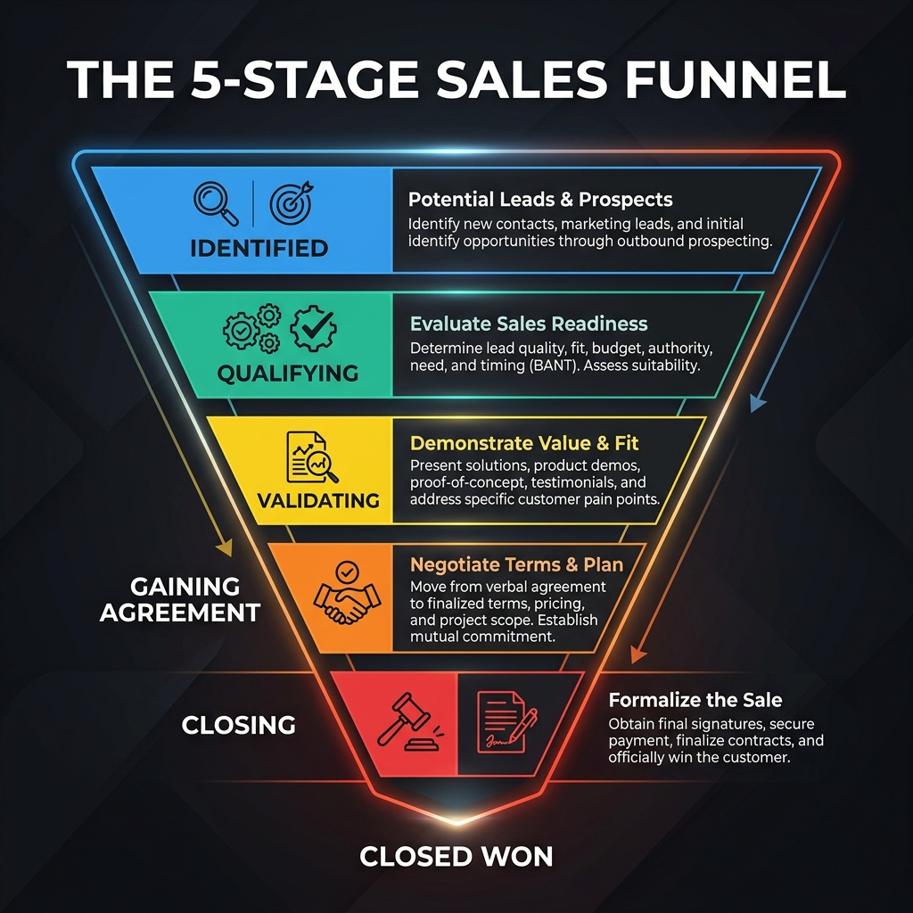
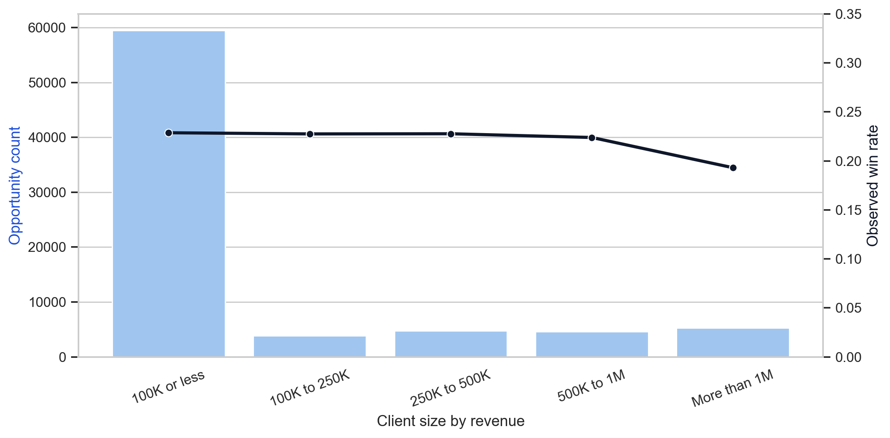
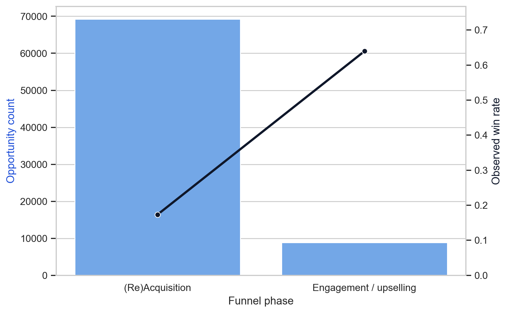
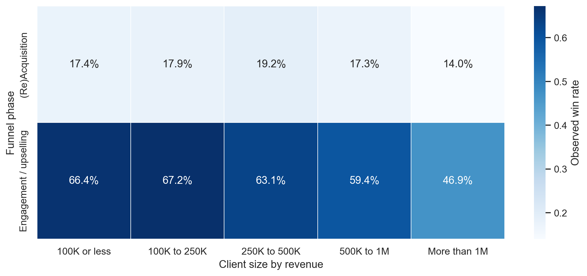
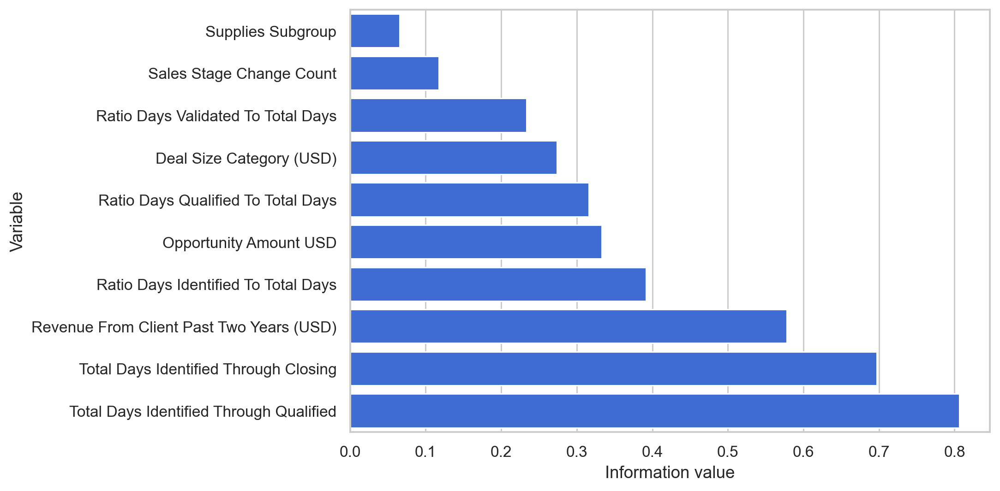
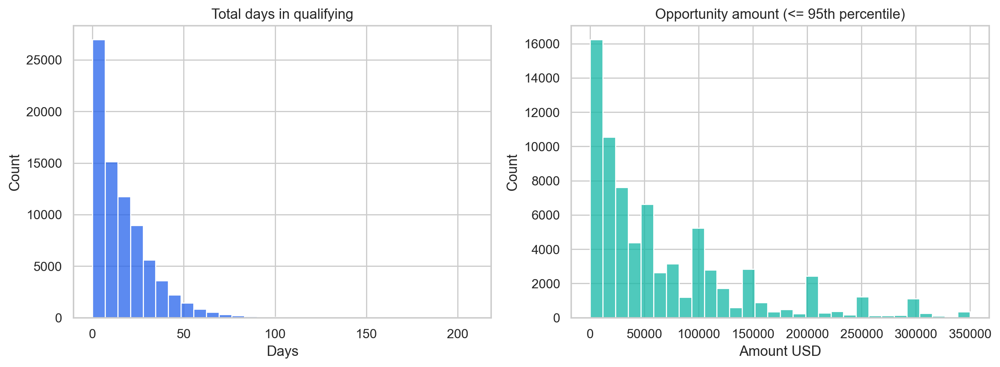
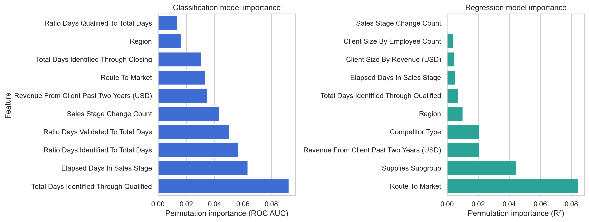
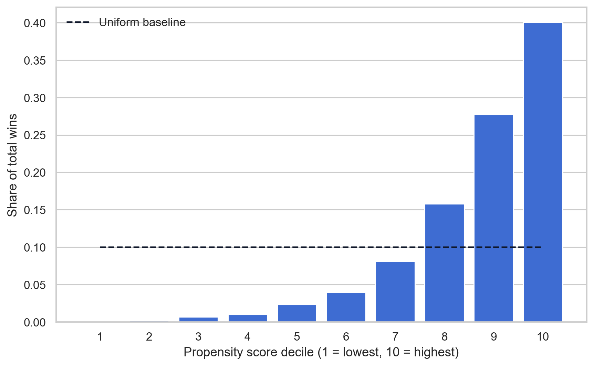
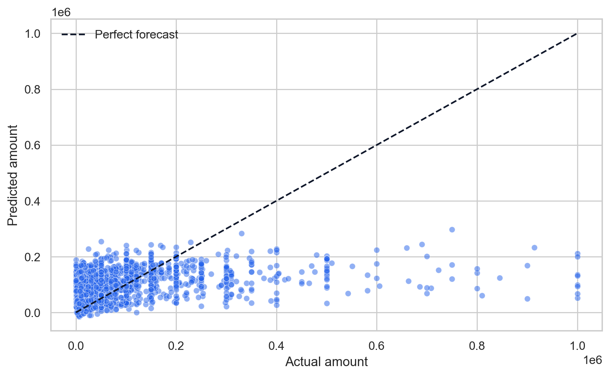

## Agenda

1. Business framing and process assumptions
2. Dataset and target overview
3. EDA findings that matter for prioritization and forecasting
4. Modelling approach and model outputs
5. Application simulations
6. Conclusions and next steps

# Business framing {background-color="#0F172A"}

## The sales process is non-linear, and the data captures its current state

::: {.columns}
::: {.column width="56%"}
- Opportunities move back and forth across **Identified / Qualifying**, **Qualified / Validating**, and **Validated / Gaining Agreement**.
- Because the dataset mostly stores the latest record per opportunity, we can use **aggregate time-in-stage variables**, but not full path dynamics.
- That is why the modelling work uses **all available snapshot variables**, especially the process-time fields that summarize where an opportunity currently stands.
:::
::: {.column width="44%"}
{width=100%}
:::
:::

## The opportunity set is broader than the two use cases developed in this project

::: {.columns}
::: {.column width="52%"}
### Selected for this project

- **Process prioritization**: rank opportunities by win propensity and support decisions on where sales effort should focus first.
- **Opportunity sizing & forecasting**: estimate deal value and aggregate expected sales for planning, prioritization, and budget visibility.
:::
::: {.column width="48%"}
### Additional opportunities identified in the data

- **Channel optimization**: test what-if scenarios around route-to-market and engagement model choices.
- **Secondary market segmentation**: create actionable commercial segments from predicted value and conversion potential.
- **Early warning systems**: flag opportunities that are likely to deteriorate or stall.
- **Budget allocation**: guide sales effort and product-focus decisions across segments, regions, and product lines.
:::
:::

# Exploratory data analysis {background-color="#0F172A"}

## The dataset was analyzed and prepared with the two use cases in mind, which shaped the EDA focus and modelling choices

::: {.columns}
::: {.column width="52%"}
- **Scale**: 78,025 sales opportunities and **19 variables**.
- Validation checks flagged duplicates and process-consistency issues before modelling. Key preparation findings:
  - **196 duplicated opportunity IDs** (removed)
  - ** zero amount opportunities** (removed)
  - **12,921 rows** where stage ratios do not sum closely to 1 (kept)
- For the modelling experiments shown here, the sample used **75,819 eligible rows** out of **78,025 total rows** with valid targets.
:::
::: {.column width="48%"}
TO PUT A PLOT/TABLE WITH DATA HERE.
:::
:::

<!-- - **What the data is good for**: ranking opportunities, understanding portfolio mix, and producing aggregate forecasts.
- **What it is not**: a full event history of every sales-stage movement.
- The dataset should therefore be read as a **current-state commercial view** of the pipeline. -->

## Client size matters more for deal economics than for raw win rate

::: {.columns}
::: {.column width="58%"}
{width=100%}
:::
::: {.column width="42%"}
- The portfolio is dominated by **100K or less** clients (59.5k opportunities).
- Win rate is relatively flat across most size bands (~22% to 23%), then drops for **More than 1M** clients (~19.3%).
- The large-client segment still matters because median deal size rises materially, so segmentation matters more for **economics** than for raw conversion alone.
:::
:::

## Prior business history is the clearest commercial split in the pipeline

::: {.columns}
::: {.column width="42%"}
- **(Re)Acquisition** / no business in the past two years: 69,208 opportunities with a **17.3%** observed win rate.
- **Engagement / upselling**: 8,817 opportunities with a **63.9%** observed win rate.
- This is the clearest business split in the analysis and should be treated as a first-order segmentation for prioritization.
:::
::: {.column width="58%"}
{width=100%}
:::
:::

## Funnel phase explains more than client size inside the phase × segment matrix

::: {.columns}
::: {.column width="58%"}
{width=100%}
:::
::: {.column width="42%"}
- In `(Re)Acquisition`, win rates stay low across client sizes (**14%–19%**).
- In **Engagement / upselling**, win rates stay much higher (**47%–67%**).
- The main implication is operational: whether the client has recent business matters more than client-size granularity for triage.
:::
:::

## Process-time variables carry most of the predictive signal

::: {.columns}
::: {.column width="52%"}
{width=100%}
:::
::: {.column width="48%"}
{width=100%}
:::
:::

- The strongest IV signals for win/loss come from **Total Days Identified Through Qualified**, **Elapsed Days In Sales Stage**, and the stage-ratio variables.
- Both time-to-close and amount distributions are skewed, so the analysis should avoid over-interpreting averages without context.

# Modelling {background-color="#0F172A"}

## For the selected use cases, we built two models with different targets and purposes

::: {.columns}
::: {.column width="50%"}
### Process prioritization: Win/loss classification model

- Target: **Opportunity Result**.
- Business use: **process prioritization** and ranking the pipeline by win propensity.
- Uses the full dynamic snapshot, including process timing and stage-ratio variables.
:::
::: {.column width="50%"}
### Opportunity Sizing and forecasting: Amount regression model

- Target: **Opportunity Amount USD**.
- Business use: **sizing and aggregate forecasting**.
- Also uses the full dynamic snapshot, so amount estimates reflect both customer context and current process state.
:::
:::

 
 

**Variables used for both models:** client size, route to market, region, competitor, supplies / supplies subgroup, prior client revenue, sales-stage change count, elapsed days, total days, total Siebel days, and stage-ratio variables.

## Data preparation and modelling sample

::: {.column width="46%"}
- **Train / test split**: **70% / 30%**
  - Train: **53,073** rows
  - Test: **22,746** rows
- The split was **stratified jointly** on:
  - win/loss target
  - amount buckets
- This keeps both outcome balance and deal-size mix stable across train and test.
- Numeric data was scaled previously for linear and logistic regressions while categorical data was encoded appropriately.
:::
:::

## Win/loss classification is the stronger operational model

::: {.columns}
::: {.column width="54%"}
- Best-performing model: **XGBoost**.
- Cross-validated metrics:
  - **ROC AUC: 0.926**
  - **PR AUC: 0.814**
  - **Accuracy: 0.882**
  - **F1 (at 0.5 threshold): 0.718**
- Main drivers are process-time variables, which is consistent with your instruction that the model should be **dynamic** and use all available variables.
:::
::: {.column width="46%"}
{width=100%}
:::
:::

## Amount regression supports planning, but is weaker than classification

- Best-performing model: **classic_linear_standard_scaler**.
- Cross-validated metrics:
  - **R²: 0.134**
  - **MAE: 74.3k USD**
  - **MAPE is unstable / high (over 200%)**, so relative percentage error should be treated carefully for small deals.
- The strongest predictors are **Route To Market**, **Supplies Subgroup**, **Revenue From Client Past Two Years (USD)**, **Competitor Type**, and **Region**.
- This is usable for directional comparisons and aggregate forecasting, but it is not as decision-ready as a precise result model.

# Application simulation {background-color="#1E293B"}

## Prioritization simulation: the top decile captures 40.1% of historical wins

::: {.columns}
::: {.column width="44%"}
- The model ranking is highly concentrated:
  - **Top decile** captures **40.1%** of all wins.
  - **Top two deciles** capture **59.9%** of all wins.
- This supports a **process-prioritization** use case: sales effort can be focused on a much smaller slice of the pipeline.
- This simulation is based on held-out prediction outputs from the modelling workflow, not a mocked lift curve.
:::
::: {.column width="56%"}
{width=100%}
:::
:::

## Forecast simulation: predicted total sales closely matches the observed aggregate total

::: {.columns}
::: {.column width="56%"}
{width=100%}
:::
::: {.column width="44%"}
- Aggregate actual amount: **4.997B USD**.
- Aggregate predicted amount: **5.000B USD**.
- Mean absolute error per opportunity: **74.3k USD**.
- The forecasting story is therefore strongest at the **portfolio level**, not at the individual-opportunity level.
:::
:::

# Conclusions {background-color="#0F172A"}

## What this means for commercial decision-making

- The two selected targets are explicit:
  - **Result model** for prioritization
  - **Amount model** for sizing and forecasting
- The two selected models are explicit throughout the project narrative:
  - **Dynamic win/loss classification** for prioritization
  - **Dynamic amount regression** for sizing and forecasting
- The main recommendation is to pilot the **result model first**, while treating amount forecasting as an aggregate planning aid built from the same dynamic feature set.

---

### Thank you
Questions, caveats, and next steps
